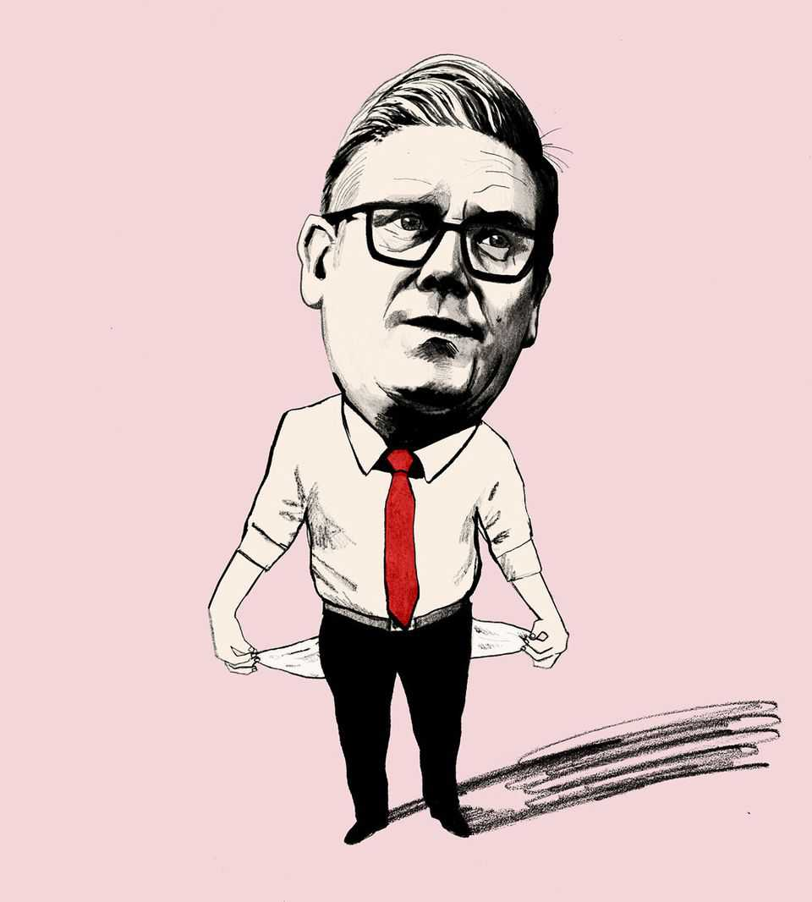

Leaders | Broken or just broke?
Britain is slowly going bust
Even with a huge majority and plenty of time, Labour is drifting towards a fiscal crisis
September 25th 2025

AT HOME AND abroad, Britain’s economy is in the dog house. Inflation is sticky, debts and deficits are high, and productivity growth is low. Yields on long-term government debt are above those in any other big rich economy. Four in five Britons say the government is mismanaging the economy; Ray Dalio, a hedge-fund manager, says the country is in a “debt doom loop”. As we report, the infrastructure and housing projects that were supposed to be the engine of growth are turning out to be a sorry disappointment. Some of the doomsaying is overdone. Britain is not in a recession. Critics say the government crushed the private sector with tax increases in 2024, but the economy grew faster in the first half of 2025 than any other in the G7 group of big rich countries. Retail sales have been solid; unemployment

remains low; and the service sector is strong. Britain’s structural strengths— its best universities, the City of London and the English language—are enduring. In many ways, including its birth rate and artificial-intelligence research, Britain can look to continental Europe and count its blessings.

Except, that is, for the public finances. Britain’s net public debts have risen from 35% of GDP in 2005 to 95%. Financial crises and the pandemic caused much of the increase but even today, when there is no emergency, the government is borrowing over 4% of GDP a year. America and France also have big debts and deficits, but borrow in deep currency blocs. Britain is alone, with higher interest rates and a rising welfare bill.

In one sense the problem is eminently fixable. At current bond yields and growth rates, the belt-tightening needed to stabilise debts is about 2% of GDP, some of which is already budgeted for. This would take Britain to a surplus on the primary balance, which excludes interest payments, of less than 0.5%. By historical standards, it is not a demanding target. Since 1990 Italy has on average run a primary surplus of about 1% of GDP. In 1999, during a drive to slash debts, Canada’s primary surplus reached nearly 6% of GDP.

Fixability would normally be a good sign. However, in Britain, as in France, the inability of the political system to grapple with a solvable problem is itself a symptom of decline. The Labour government is led by technocrats with a working majority of 157 in Parliament. It has forgiving budget rules and as long as four years until the next election. If it cannot put the budget on a sound footing, then who will?

The political failure is all the greater because it is abundantly clear that the fiscal adjustment should start with pensions and the welfare budget. Britain spends about 6% of GDP supporting pensioners, up by over a third this century. Generous, automatic increases to the state pension have become unaffordable. So have benefits to the 15% of Britain’s working-age population who now claim jobless allowances, after a surge in disability claims since the pandemic. The scale of the increase is impossible to justify. The system has been gamed.

Labour knows this, and has tried to act. But this year it has bungled attempts to reduce spending on pensioners and welfare. In both cases it has U-turned on reform plans after a political outcry, including from within the party. It appeared not to expect the backlash, let alone prepare for it. So it has backed down, twice.

That leaves tax. The government has already raised taxes once (though its predecessor had cut taxes just before the election). And tax revenue is already on course to rise to 38% of GDP, a historical high for Britain, even if it is still lowish by European standards.

The trouble is that Labour promised before it was elected not to raise broad- based taxes on income and consumption. The hunt for alternatives is a risky business. Many bad ideas have been hinted at, from taxing pension contributions to imposing capital-gains tax on primary residences. Taxes on narrower bases cause more distortion, because the rates must be higher. The party’s left flank wants heavier taxes on capital. That might deter investors, including those who buy Britain’s government debt. As well as risking economic damage, creating a concentrated group of big losers can be politically fraught. Some backbenchers fantasise about throwing fiscal caution to the wind. If ministers overplay their hand, they could find themselves making a third U-turn.

Investors’ anxiety about Labour is aggravated by the lack of anyone else who would do better. Andy Burnham, the mayor of Greater Manchester, is manoeuvring to challenge Sir Keir Starmer, the prime minister, for the top job. He is for “rolling back the 1980s”. But in the decade before Margaret Thatcher, Britain was the sick man of Europe and had to be bailed out by the IMF. Labour could lose power to Nigel Farage’s populist Reform UK party. It claims that changes to interest payments at the Bank of England could generate oodles of cash. But its sums are wildly optimistic and fail to account for how that would harm the banking system. Reform also wants tax cuts that are unaffordable. Whoever is in power faces more ageing, pressure for increased defence spending and the costs of managing big debts. They also run the risk of facing another serious crisis like the pandemic, for which the country, this time, is not fiscally prepared.

Some speculate that Britain could be compelled to turn to the IMF for a second time. That is the wrong comparison. Back in 1976 the country needed dollars to help manage its currency. It now has a fully floating exchange rate and minimal foreign-currency obligations.

A better parallel is the market panic that followed Liz Truss’s irresponsible “mini budget” in 2022. This caused violent moves in gilts, exposed vulnerabilities in the financial system and imposed a lasting risk premium on British debt. The difference between her cavalier leap and today’s cautious drift is a lot smaller than it looks. If Britain cannot budget responsibly by choice, then markets will force it to do so by necessity—thereby damaging the entire economy. ■

For subscribers only: to see how we design each week’s cover, sign up to our weekly Cover Story newsletter.

This article was downloaded by zlibrary from [https://www.economist.com//leaders/2025/09/25/britain-is-slowly-going-bust](https://www.economist.com//leaders/2025/09/25/britain-is-slowly-going-bust)

Letters

How can Britain compete in artificial intelligence?