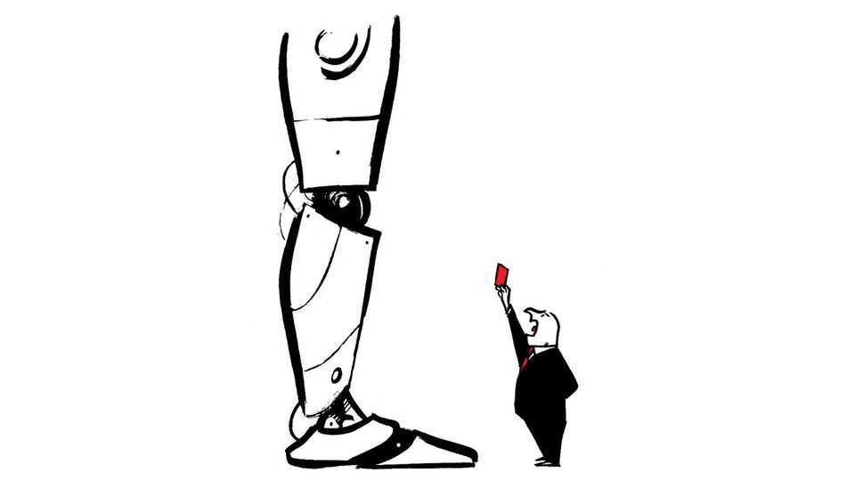

Letters | A selection of correspondence
How can Britain compete in artificial intelligence?
Also this week, the impact of fertility on public finances, paying attention, the decline in reading
September 25th 2025

Letters are welcome via email to letters@economist.comFind out more about how we process your letter How can Britain compete in artificial intelligence, you ask (“Meet Isambard AI”, September 6th)? Britain cannot match America’s $320bn spending spree this year alone, or China’s deep AI ecosystem. Britain’s unique AI advantage is in safety and security. The question is whether it can leverage its distinctive position to shape the global AI ecosystem in ways that serve both British interests and those of the world at large.

The narrative of inevitable American and Chinese dominance ignores a crucial dynamic. As AI systems become more powerful, questions of governance, safety and democratic integrity become more pressing. Britain’s leadership lies not in computational brute force but in shaping the global agenda to advance the quality, safety and security of the technology amid an industry dynamic that deprioritises these critical factors.

Britain brought China and the United States to an AI safety summit at Bletchley Park in 2023, an impressive diplomatic feat. The subsequent AI summits around the world and the establishment of AI safety institutes in Canada, Japan and South Korea, are validation of British moral entrepreneurship. Britain’s own AI Security Institute represents something genuinely novel, a state-backed institution focused on public-interest safety and security that commands international credibility and collaboration from foreign firms.

This matters strategically. Britain can export expertise in AI auditing, quality evaluation and AI’s responsible deployment while reinforcing its position as an essential mediator between AI superpowers. Britain should continue defining its success in creating the trusted benchmark for responsible innovation and being the indispensable bridge-builder in an increasingly fragmented technological landscape.

Kayla BlomquistSam HoggOxford China Policy LabOxford

You noted the vast capital tied up in data centres and specialised chips for artificial intelligence (”The $3trn bet on AI”, September 13th). I suggest calling this the ”data-centre industrial complex”, a techno-economic dependency in which the architecture of graphics processing units unlocked large language models and an appetite for memory and bandwidth that has in turn forced colossal capital spending on high-bandwidth memory and interconnect.

This lock-in has pushed AI innovation down a path where switching to small language models, neuromorphic chips or edge-compute paradigms becomes prohibitively expensive. That said I’d argue that Europe and Britain, unable to match America’s LLM or data-centre scale, has an opportunity to lead in

novel semiconductors and leaner model architectures that break this dependency.

Michael HutsonAssociate fellowUniversity of Oxford

You presented an optimistic argument about why we shouldn’t worry about declining fertility rates (“Shrinking without sinking”, September 13th). Individuals may well remain prosperous, even if populations decrease, as income per head rises. But the real strain will fall on public finances. Tax bases will shrink while obligations for pensions, health care and debt service stay fixed. Those most reliant on transfers, from European pensioners to recipients of subsidies in poorer economies, will feel the pain first. Japan has shown that stability is possible, but only at the cost of stagnation. Few others can carry such a burden. Nor are savings safe. Deficits financed through inflation or financial repression will dilute pensions and retirement accounts. Productivity is no panacea either; you can double the output of a car factory, but not of a nurse. The world economy was built for expansion. Managing contraction will be unprecedented. Optimism should be tempered.

Szabolcs MihalikVienna

Although past declines in fertility may have been driven by socioeconomic factors, future birth rates may be influenced by personal experience. Unlike the large families of the past, many children today have no siblings and so lack the experience of dealing with larger family groups. Many of those people may consider their own upbringing as a single child to be the ideal, and so will naturally expect their own future family to reflect this. Small families will in this way become a self-perpetuating norm.

David ScottPort St Mary, Isle of Man

I very much enjoyed the briefing on population change. However, I was surprised by the absence of questioning about why anyone would persist in investing in children rather than the stockmarket. Procreation has become an expensive cost with little hope of return beyond the emotional. Continued expenditure on having any children at all, never mind at a replacement rate, has to be explained in non-rational terms (commitment to continuing a

family life, the enjoyment factor of having a child rather than a pet or a luxury car), or just because it is what we have always done.

An effective policy needs to recognise that population levels do not translate into individual incentives, and that attempts to encourage birth rates need to consider the motivations and how this varies culturally and by class, such as having children as conspicuous consumption or for patriotism.

Alan SmartProfessor emeritusDepartment of Anthropology and ArchaeologyUniversity of Calgary

You gave a sensible global overview on declining populations. For Europe, however, the outlook is more sobering. The continent’s welfare systems were designed for a demographic reality that has vanished. Pursuing immigration at the scale required to sustain these systems is proving politically impossible, creating significant social friction that governments can no longer ignore. The real challenge for Europe is not merely adapting to fewer people, but undertaking the fundamental, and politically painful, reform of a welfare state that its future tax base can no longer support.

Attila BécsiOslo

The Free exchange column on the economics of attention (September 13th) reminded me of the amount of attention I use in my job as an urban train driver. As new employees we had to complete a specific concentration attention test that assessed our ability to maintain concentration on routine tasks. Seventeen years later I can fully appreciate the test and how it revealed the level of attention that can be sustained for as long as eight hours for repeated, monotonous tasks. It keeps us alert for any misbehaviour from machine (the train), infrastructure (signals, overhead lines and rail tracks) and passengers. I’d like to think I’m behaving like a machine, with a human side to respond to my passengers.

And may I assure you that this was written on my phone when I had a break and not while driving the train.

EUGENE ANTHONYApplecross, Australia

I am part of a coalition of “attention activists” who are pushing back against the commodification of human attention (what we call “human fracking”) at the heart of the attention economy. There are good reasons to treat attention as a resource, because it is a resource (in a certain, limited sense) and it needs to be used wisely.

But much of our work as attention activists is about resisting the narrow definition of attention as a commodity. True human attention is far richer and more complex, and cannot be measured in full by econometrics. Consider Simone Weil’s insight: “Attention, taken to its highest degree, is the same thing as prayer. It presupposes faith and love.” Try modelling that kind of attention, and you will come up short in ways that do all of us a disservice.

PETER SCHMIDTProgramme directorStrother School of Radical AttentionNew York

You reported on the decline in reading (“The perils of book-spurning”, September 6th). Perhaps one way to increase engagement lies in the books by Charles Dickens you alluded to, which were published in serial form. Could bite-size book releases hook readers in the manner of the feuilletons by Honoré de Balzac and Alexandre Dumas?

Yacov ArnopolinNew York

Most of the Harry Potter books were more than 600 pages long and over 500m copies have been sold. The fantasy series, “A Song of Ice and Fire”, had one book running at more than 1,000 pages and sold more than 90m copies. Some of your complaints about the decline of reading seem to be gripes about what people (especially the young) have chosen to read.

Thomas FullerSantander, Spain

Your article on the decline in reading and the decrease in average sentence length in modern literature made me think of my duties serving as lector at my church, in which one of the biggest challenges, more difficult than difficult-to-pronounce names and places, is reading from the Pauline epistles, known for their long sentences, which require me to prepare the week before by first reading the passage to understand it myself, and then re- reading the passage, now understanding the syntax and underlying message, in a way that will allow my audience to gain the same understanding.

Robert ShanahanUrbana, Illinois

Although I agreed with the points you made on shrinking rates of reading, I could not help but notice the AI summary button conveniently located at the top of the article that offered me a “quick, smart overview of stories before reading”.

Evan NebelFalls Church, Virginia

Your article about the lessening of an interest in reading is a concern for anyone who cares about the world as we move forward. I am a retired teacher of maths and physics, and I have for years included in the signature line of my emails a quote attributed to Arthur Schopenhauer, “Reading is thinking with someone else’s head instead of one’s own”. A subtle reminder to my students. On a side note, rarely a week goes by that I do not have to scurry to the dictionary, yes, a book, not the internet, to look up a word or two. STEPHEN COONEY Pottstown, Pennsylvania

Modern readers value brevity. Your editors seem to agree.

Robert RoseLos Altos, California

This article was downloaded by zlibrary from https://www.economist.com//letters/2025/09/25/how-can-britain-compete-in- artificial-intelligence

By Invitation

Yulia Navalnaya on why Europe needs a better Russia strategy Two scholars ask whether democracy can survive if AI does all the jobs