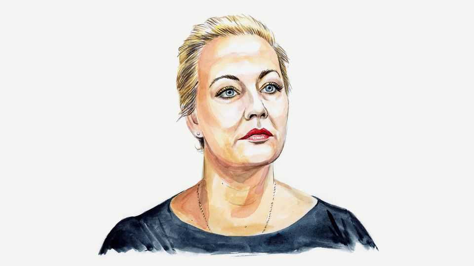

By Invitation | Uniting against Putin
Yulia Navalnaya on why Europe needs a better Russia strategy
Despite all the sanctions and strong words, thinking has been lamentably short-term, writes Alexei Navalny’s widow
September 25th 2025

WHAT IS EUROPE’S strategy towards Russia? Beyond immediate responses to the Kremlin’s actions, what broader vision does it have for Russia’s place in the world—and what principles should guide the building of a long-term relationship with our country? A year ago, addressing European politicians at the Bled Strategic Forum, I explained why the absence of a longer-term strategy would carry disastrous consequences. Sadly, since then scant progress has been made in formulating one. How did we end up here? When the Soviet Union collapsed, the world had no clear understanding of how to engage with the new Russia. There was a

naive belief that after shedding its Soviet past, Russia would naturally blossom into a liberal democracy. Based on this assumption, alarming signs —including the impoverishment of tens of millions by botched economic reforms and corrupt privatisation—were largely ignored.

After the collapse of the Soviet system, power and property quickly fell into the hands of former party bureaucrats and security-service officers. But the return of authoritarianism did not come out of nowhere. It came step by step, through the dismantling of democratic institutions—the rigged elections in 1996, then the behind-the-scenes transfer of power from Boris Yeltsin and his circle to Vladimir Putin in 1999.

Then followed two long decades of Putinism during which the West watched the consolidation of a dictatorship and remained largely passive—even after the annexation of Crimea in 2014, the downing of Malaysia Airlines flight MH17, and the poisonings and political assassinations.

It cannot be said that nothing changed over all these years. After 2014, for example, ordinary Russians found it much harder to obtain residency in Europe or open bank accounts. Bring €10,000 to a bank, and you face endless questions. But bring €20m, and there are none—London or Zurich will welcome you warmly.

So every time I hear people say that everything became clear about Putin in February 2022, when he ordered the full-scale invasion of Ukraine, I struggle to contain my anger. Some, like my husband, Alexei Navalny, understood him from the very start. Even for those without Alexei’s political instincts, by the early 2010s it should have been clear where Putin was leading Russia.

Unfortunately, after the invasion of Ukraine, alongside the West’s long- overdue condemnation of Putin’s regime, it became common to blame all Russians for failing to stop him; in 2023 Estonia’s prime minister lamented the Russian people’s “common crime”. But how could they have stopped him, when for over 20 years he systematically destroyed every avenue of political resistance—without facing any serious international consequences?

I recall all this not to assign blame, but to urge Western policymakers to think: what can be done today to prevent the mistakes of the past from repeating themselves? What is required is a Russia strategy that looks decades, not months, ahead. The system Putin built will inevitably fall into crisis. It is crucial that all of us—Russian civil society first and foremost, but also the West—be ready to help our country transform for the better.

It would be a huge mistake to accept as legitimate a successor to Putin from within his own regime—someone who would make at most cosmetic reforms. The West needs a democratic, free Russia. It already has strong partners in working towards this goal: the full spectrum of Russian civil society. Together, we can develop a strategy for our relations, create a plan of joint action and fulfil it.

It is in Europe’s interest to support Russian civil society, independent media, human-rights defenders and all structures that unite opponents of Putin’s dictatorship, both inside Russia and in exile. It is also in Europe’s interest to distinguish between Putin and Russia, between the Putinist dictatorship and Russian language and culture, and between those complicit in Putin’s crimes and ordinary Russian citizens. Above all, it is in Europe’s interest to communicate its perspective on global affairs to Russians and show them how they can be part of a free Europe.

It is equally clear what must not be done. Do not support those who promote hatred of all Russians—it only benefits Putin and weakens the resolve of those Russians ready to resist him. Do not normalise his regime, overlook its crimes or treat its officials as legitimate representatives of the Russian people. Do not forget: Russia hasn’t seen free elections in over 30 years. These are not elected representatives; they are merely people who seized power.

It is also crucial to stop viewing the destinies of all the countries and peoples of the former Soviet Union through a single lens. Putin’s war against Ukraine once again demonstrates that Russia and Ukraine are not two feuding pieces of a single whole, as Kremlin propagandists would have it— they are two different countries with different destinies.

Putin’s aggression towards Ukraine underscores that, contrary to his dreams, our two countries have no shared future. Ukraine’s future must be discussed with Ukrainians alone—whether the questions concern membership of international organisations or customs policy. But Russia also has its own future and it must likewise be discussed with Russians—with politicians and civil-society leaders who do not wish their country harm, poverty or disintegration. Among those who oppose Putin, they are the only ones with a chance of being heard by the wider Russian population.

We all need to unite in the fight against Putin. Only by listening to and supporting one another can we win it—and only then can the world look forward to a future of peace, stability and security. We have the power to make that happen. ■

Yulia Navalnaya is the chairwoman of the Human Rights Foundation and of the advisory board of the Anti-Corruption Foundation.

This article was downloaded by zlibrary from https://www.economist.com//by-invitation/2025/09/24/yulia-navalnaya-on-why-europe- needs-a-better-russia-strategy