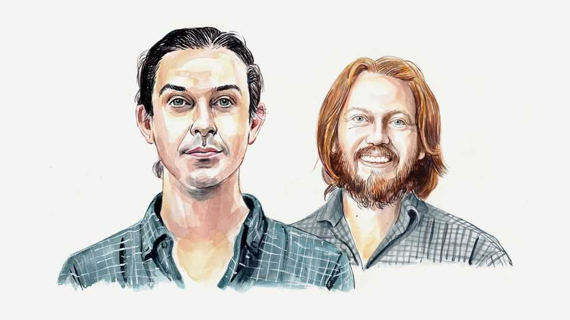

By Invitation | Fade against the machine
Two scholars ask whether democracy can survive if AI does all the jobs
Without taxation there may be no representation, conclude Raymond Douglas and David Duvenaud
September 25th 2025

An ENDURING MYTH of modern democracy is that the principles of equality and justice are self-evident—that sufficiently enlightened societies naturally converge on universal suffrage. But a cynical glance through history tells a different story. Most often, democratic rights were ceded to groups with economic influence, traded for military mobilisation or claimed in violent revolutions. It’s easy to forget what it took to reach the status quo. Enter AI. In just a few years the world has gone from AIs that can barely write sentences to those that are writing a quarter of the code at Google.

Dario Amodei, the boss of Anthropic, an AI lab, recently warned that within a few years half of all entry-level white-collar jobs could vanish.

Of course, this wouldn’t be the first time new technology killed lots of jobs. The industrial revolution automated away weaving, washing and much of agriculture, for instance. This boost in efficiency is what allowed people to move into higher-skilled jobs, and what enabled a growing middle class to campaign for liberal democracy.

But the industrial revolution was characterised by automation of specific tasks. AI, by contrast, is broad and general. What if, at some point, there’s little to no demand for human labour? It might take decades, but there is no physical reason why computers and robots can’t eventually become more efficient and capable than humans, and the constant demand for progress in this direction makes such a development seem inevitable.

Perhaps this would be a luxury. Sam Altman of OpenAI, another lab, has been writing for years about how AI could create a world where no one need work, and about how clever taxes and some form of universal basic income (UBI) might help redistribute the enormous gains of AI progress to everyone.

But labour automation isn’t just an economic problem; it’s also a political one. Right now, democratic governments depend on their citizens financially. But in a world of AI-powered UBI, the opposite would be true. Imagine a world in which citizens are burdensome dependants of a state that no longer needs them for anything.

In fact, we don’t have to imagine: we can look at countries like Saudi Arabia that formed around enormous resource wealth. Citizens receive health care, education and subsidies, but don’t get meaningful political power. The state can more or less choose how repressive to be. It turns out that the classic logic of the American revolution—no taxation without representation— works just as well in reverse.

The right to vote is the most visible sign of human influence over the state. But consider all the other levers of influence that come from economic power, such as lobbying, protesting and striking, which would also be

eroded by mass automation. Indeed, mass automation would not be confined to the private sector: the promise of efficient and reliable AI labour would also undercut human discretion in the running of the state. And as states automate their security apparatuses, even the prospect of revolution as a last resort could crumble in the face of mass surveillance and autonomous drones. Across history, suffrage has been less a source of political power than a symptom of it.

Even the most repressive states depend on their citizens for something. The average North Korean farmer has almost no power over the state, but they are still useful. The state can’t function unless it feeds its citizens. In an era of general automation, even this minimal duty of care will go.

This may sound extreme, but it would be foolish to think that general- purpose AI could transform the economy with only modest political consequences. Democracies are still quite young, and were made possible only by technologies that made liberal, pluralistic societies globally competitive. We’re fortunate to have lived through this great confluence of human flourishing and state power, but we can’t take it for granted.

The good news is that democracies still have a lot of power. In particular, they host enough of the leading-edge AI companies that they might be able to co-ordinate to avoid bad outcomes. The game is theirs to lose. Norway serves as an example of a country that stumbled upon enormous resource wealth with mature enough democratic norms to use that surplus for the public good.

But even if we can handle the risks from AI that the companies themselves warn about—of power-seeking or terrorist-enabling AIs—integrating the technology into society will mean a permanent loss of bargaining power for humans negotiating with their most powerful institutions.

So what’s to be done? Total pause? Grand plan? Muddle through? Part of the problem is that it is not clear who to listen to. The people best positioned to shape AI’s development—tech leaders and government officials—are also the most likely to benefit from concentration of AI-powered wealth and influence.

Leaders of AI labs often mention the need for a “societal conversation” about what kind of economic system could make sense for humans as artificial general intelligence takes hold. But even if such an economic system exists, it is not clear that even Western political systems would listen to and apply the lessons that emerged from that conversation. So far, we humans have been steering our civilisation on easy mode—wherever people went, they were indispensable. Now we have to hit a dauntingly narrow target: to create a civilisation that will care for us indefinitely—even when it doesn’t need us.■

Raymond Douglas is a research affiliate at the University of Toronto and David Duvenaud is an associate professor at the University of Toronto.

This article was downloaded by zlibrary from https://www.economist.com//by-invitation/2025/09/18/two-scholars-ask-whether- democracy-can-survive-if-ai-does-all-the-jobs

Briefing

North Korea is becoming even more repressive and threatening Can Donald Trump muzzle America’s press?