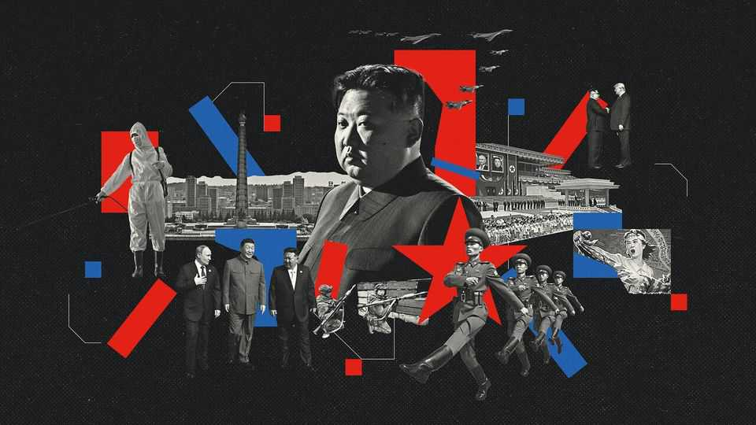
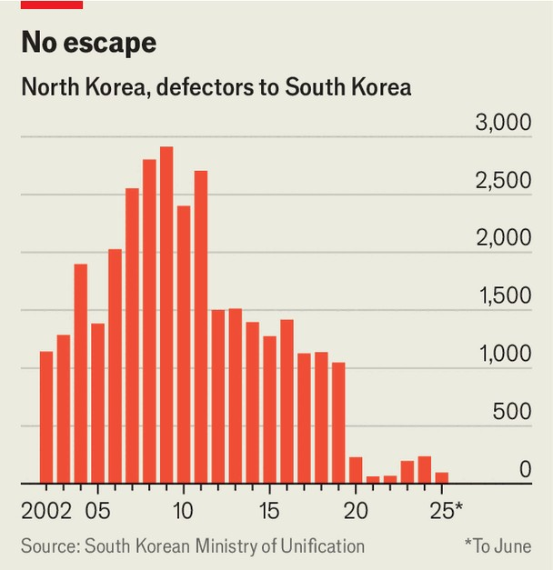
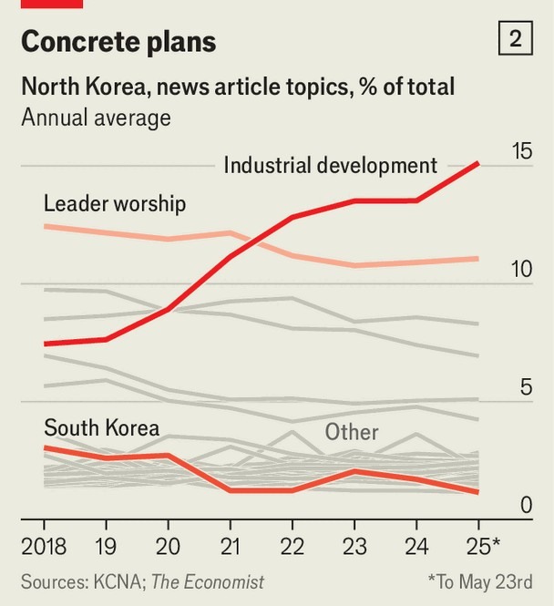
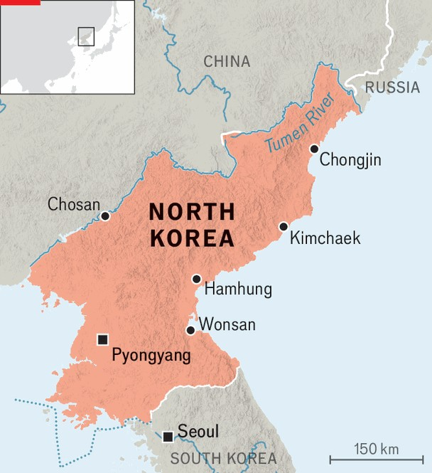

Briefing | Intensifying menace
North Korea is becoming even more repressive and threatening
Kim Jong Un is in a much stronger position than when Donald Trump last wooed him
September 25th 2025

The mood music is building to a crescendo. This week Kim Jong Un, North Korea’s dictator, spoke to his rubber-stamp parliament about his “fond memories” of meeting Donald Trump, with whom he held three inconclusive summits during Mr Trump’s first term as America’s president. Two days later South Korea’s new left-wing president, Lee Jae Myung, laid out a vision of “peaceful coexistence” with the North at the United Nations. Mr Trump, too, has been airing magnanimous thoughts about the Koreas. “I have a great relationship with Kim Jong Un,” he boasted while hosting Mr Lee at the White House last month. “I’d like to meet him this year.”

But if the overtures sound similar to those of Mr Trump’s first term, the circumstances have changed dramatically. Since the last round of negotiations, Mr Kim has steadily expanded his nuclear arsenal and ramped up his missile testing. He has also further entrenched his regime, making the state even more repressive, closed and controlling of the economy than it was before. Internationally, a new partnership with Russia has also strengthened Mr Kim’s hand. He has supported Russia’s war against Ukraine with ammunition and troops, and in return gained food, fuel, technology and the ability to play Russia off against China, North Korea’s other main patron.

In early September Mr Kim hobnobbed with Xi Jinping and Vladimir Putin, his Chinese and Russian counterparts, at an event in Beijing. Whereas seven years ago the young autocrat signalled his openness to the West by clapping along to a performance by k-pop stars in the North’s capital, Pyongyang, this summer he underlined his country’s new alignment by presiding over a gig by Shaman, a Russian pop star. As the singer roused the crowd with patriotic ballads about heroic soldiers, a North Korean and a Russian flag in either hand, Mr Kim looked on regally, cigarette in hand. Should talks between America and the North resume, his enhanced sense of security will presumably make him less susceptible than ever to Mr Trump’s baubles and blandishments.

Sokeel Park of Liberty in North Korea, a non-profit organisation, calls the regime’s recent overhaul the “North Korea-fication of North Korea”. It began in the wake of the failed talks with Mr Trump and accelerated during the covid-19 pandemic. Like much of the world, North Korea imposed a strict lockdown. Unlike the rest of the world, it has never really lifted it. “For over five years, people in the Democratic People’s Republic of Korea have been living in absolute isolation,” reports Elisabeth Salmón, the United Nations’ special rapporteur on North Korean human rights.

The first step involved cutting ties with the outside world. Foreign diplomats were forced out; only a handful of embassies, most notably China’s and Russia’s but also Poland’s and Sweden’s, have been allowed to resume normal operations. Aid workers were also kicked out and kept out: international staff from the UN have not been allowed back into the country since 2020. Even a privately funded group that helped North Korea fight

tuberculosis until 2019 and wants to continue doing so has not been invited back (North Korea has among the highest tuberculosis levels in the world). Last year no South Korean humanitarian aid made it into the North for the first time since the South began sending official aid nearly three decades ago.

Mr Kim has also tightened the country’s borders to keep the 26m North Koreans in. New fences and walls line the border with China. The flow of escapers leaving North Korea has slowed to a trickle. From 2015 to 2019 an average of 1,201 North Korean refugees reached South Korea each year. From 2020 to 2024 the annual average fell to just 158 (see chart 1). Moreover, many of those had left before the pandemic and spent time in China or Russia on the way to the South. This isolation not only makes life more miserable for North Koreans, but it also makes the country ever more of a black box to the outside world, since escapees had offered a crucial source of fresh information, notes Hanna Song of the Database Centre for North Korean Human Rights, a South Korean NGO.

The North Korean regime has also cracked down on information entering the country. In recent decades South Korean TV shows, movies and music had become widely shared. “There’s hardly a young person who hasn’t seen K-dramas,” says Kang Gyuri, a 20-something who escaped North Korea

with her family by boat in late 2023. In a survey of more than 6,000 escapees conducted by South Korea’s government in 2023, more than 80% reported having watched Chinese, South Korea or other foreign videos before leaving the North. Such content offers not only entertainment, but also a window onto the world beyond state propaganda, with its tales of the horrors of life under capitalism. “You could say we opened our eyes through TV,” says Ms Kang, who credits K-dramas with helping inspire her escape.

That makes information a threat to the regime. Mr Kim, the third generation in a hereditary dictatorship, seems especially worried about losing the loyalty of the young. “South Korean culture is like a drug—North Korean youngsters are addicted to it,” says Thae Yong Ho, a North Korean diplomat who defected in 2016. Although hardly any North Koreans can get online, friends and relatives share smuggled content on USB drives and memory cards. “When boys and girls start dating, they might also exchange what they’ve been watching,” Ms Kang says. South Korean haircuts and accents became markers of cool among the young.

Mr Kim has introduced several laws intended to stop all this. The “Law on Rejecting Reactionary Thought and Culture” of 2020 imposes severe penalties for distribution and consumption of foreign information. The “Youth Education Guarantee Law” of 2021 prohibits copying foreign hair and clothing styles, and requires parents to ensure their children uphold socialist morals. The “Pyongyang Cultural Language Protection Law” of 2023 bans the use of South Korean slang, such as women referring to their boyfriends or husbands as oppa (older brother).

These restrictions have been reinforced by Mr Kim’s repeated insistence since late 2023 that North Korea no longer seeks reunification with the South but instead considers it an enemy. That broke with decades of rhetoric, stretching back to North Korea’s founding father (and Mr Kim’s grandfather), Kim Il Sung. One reason for the change may have been to justify the crackdown on South Korean culture, including the music Mr Kim himself applauded in 2018. North Korean media are paying less attention to South Korea. The Economist used a machine-learning algorithm to analyse thousands of North Korean propaganda articles and found a significant decrease in content related to the South in 2020-25 compared with the previous five-year period (see chart 2).

Enforcement of the new laws is increasingly severe. DailyNK, a South Korean news site that maintains a network of sources inside the North, recently smuggled a North Korean smartphone out of the country and found that it came loaded with Orwellian state-developed software. It automatically takes screenshots that only the authorities can access. It also autocorrects ideologically suspect expressions: oppa becomes “comrade” and South Korea is changed to “puppet state”. South Korean hairstyles or fashions have become cause for “inspection on the street”, Ms Kang says. “They’d say pants are too baggy…They’d measure everything, the length of my hair, how long or short it was…Whenever we would go out, our hearts

were always pounding.” Violations can earn drastic punishments. Ms Kang told a recent UN gathering that three of her friends, including a 19-year-old, were executed for sharing South Korean TV shows.

This year, the North Korean regime has received a hand in its effort to close the window to the outside world from the American and South Korean governments. For decades both countries funded radio broadcasts into North Korea. But following Mr Trump’s cuts to American public broadcasters, two of the main networks, Voice of America and Radio Free Asia, have gone off air. Under Mr Lee, the new South Korean president, radio stations linked to the South Korean government have gone quiet as well.

According to an analysis by Martyn Williams of the Stimson Centre, an American think-tank, the number of hours of foreign broadcasting aimed at North Korea fell by almost 80% between May and July. And that was before South Korea shut down one of the most active remaining stations. Independent organisations such as Unification Media Group (UMG), which runs one of the four remaining stations broadcasting to North Korea, have also been hurt by drastic cuts to America’s foreign-aid budget.

Yet try as he might, Mr Kim cannot keep North Koreans from searching for alternative views. “If you have to resort to such extreme punishment, it shows the ideological education is not sufficient to stop people from seeking it out,” says Lee Kwang-baek, the head of DailyNK and of UMG. North Koreans still watch K-dramas—they simply do so with greater caution and among smaller circles of friends. As Lee Chae Eun, a North Korean escapee journalist at DailyNK, puts it, “Once you have the taste for it, it’s hard to stop.”

A great leap backwards is also taking place in North Korea’s economy. Following widespread famine due to failures of central planning in the 1990s, North Korea began permitting the spread of private markets, or jangmadang, which came to play an outsize role in the economy in the ensuing decades. By the early 2010s North Korea had progressed from “extreme socialism” to “market socialism”, says Kim Byung-yeon of Seoul National University (SNU). North Koreans who came of age after the famine are often referred to as the “jangmadang generation”.

After taking power in 2011, Mr Kim tried to harness rather than suppress market forces, giving more autonomy to farmers and factory bosses and allowing jangmadang to grow. Now he is “trying to reverse that progression”, says Mr Kim of SNU. According to DailyNK, merchants are being hit with surprise inspections and higher fees for permits, and many markets have been closed or seen their hours shortened. “Border controls during the pandemic became controls over trade too,” says Ha Yuna, DailyNK’s editor-in-chief, reducing the goods available.

The regime seems especially keen to bring sales of staples back under state control. “There was one point where orders came out suddenly to get rid of individual vendors of certain items,” Ms Kang recalls. “Suddenly no one was allowed to privately sell rice.” The authorities are also cracking down on money-changers who provide the foreign currency that fuels the informal economy, says Peter Ward of the Sejong Institute, a South Korean think- tank.

The crackdown on markets is part of a broader reassertion of state control over daily life. “He seems to regard markets as an enemy,” Mr Kim adds. “In his mindset, markets and South Korean culture are one and the same: markets are the place where South Korean culture is traded and nurtured inside North Korea.”

The state is also trying to become more of a provider. Civil servants used to be paid almost nothing relative to the prices in jangmadang. “I never paid attention to payday,” Mr Thae says. So lowly were salaries that many did not bother to collect them. Instead, Mr Thae explains, the person in charge of distributing them would keep the cash in a drawer to be used for funeral offerings. What mattered more were bureaucrats’ rations of rice, oil, and sugar, which could be sold. Between late 2023 and mid-2024, however, state salaries rose at least ten-fold.

As the country emerged from the pandemic, the government’s focus shifted from survival mode to domestic development. Earlier this summer Mr Kim inaugurated a new beach resort at Wonsan, a city on the east coast (see map), aimed in part at a growing coterie of consumers. In Pyongyang he has embarked on a building spree, announced in a speech in early 2021 entitled “Let Us Renovate Our Capital City Splendidly Once Again by Building 50,000 Flats”. Satellite images reveal many new high-rises.

The centrepiece of the new economic agenda is Mr Kim’s “20x10 policy for regional development”. Hoping to raise living standards in the poorest regions, Mr Kim in 2024 decreed the construction of industrial plants producing goods for daily life, from garments to foodstuffs, in 20 cities each year for the ensuing ten years. North Korean state media have pumped out laudatory coverage. In The Economist’s analysis, industrial development has emerged as the main theme of state propaganda over the past five years.

Mr Kim will struggle to claw back complete control of the economy. Previous attempts to unwind market reforms in North Korea, such as more liberal currency rules under his father, Kim Jong Il, failed miserably. Rolling back liberalisation in centrally planned economies typically requires brutal force. Stalin managed to reverse the Soviet Union’s tolerance of petty capitalism in the 1920s only through forced collectivisation and mass

repression. And the role of private enterprise in North Korea is enormous: Mr Kim of SNU estimates that in the Soviet Union in 1969-90 the share of household income from informal markets was just 16%, whereas in North Korea it has reached more than 70%.

In the meantime, Mr Kim’s meddling is creating disruptions. With salaries rising but the supply of goods constrained, inflation has spiked. The black- market won-to-dollar exchange rate has leapt about five-fold in five years. Inequality seems to be growing, with defectors reporting a big gap in the provision of public services between Pyongyang and everywhere else. Some South Korean officials suspect Mr Kim’s new apartments may be Potemkin high-rises, with unfinished interiors.

That Mr Kim has so far avoided a crisis is thanks in large part to support from Russia and China, notes Andrei Lankov of Kookmin University in Seoul. Both countries help prop up North Korea’s economy through trade and aid. North Korean workers have been sent to earn hard currency for the regime on construction sites and assembly lines in Russia. China buys the vast majority of the primitive goods North Korea exports (according to official trade statistics, its biggest earner is human hair, to make wigs). Russia is sending lots of oil, in violation of UN sanctions, and in early 2024 forced the closure of the UN body that was supposed to be on the lookout for such breaches. Mr Kim desperately sought relief from sanctions during his previous talks with Mr Trump, Mr Lankov notes, but now “he definitely feels he has more leverage and power”.

The Kim dynasty has long hoped that the world would eventually, begrudgingly accept North Korea’s nuclear status, and it seems to be inching closer to that goal. Russia used to oppose its nuclear-weapons programme and support diplomatic efforts to rein it in. But this summer Sergei Lavrov, Russia’s foreign minister, declared after visiting Mr Kim aboard his yacht, “We respect North Korea’s aspirations and understand the reasons why it is pursuing nuclear development.” China’s official summary of Mr Xi’s meeting with Mr Kim in Beijing made no mention of nuclear disarmament, in contrast to the public account of their previous meeting in 2019. Mr Trump has taken to speaking of North Korea as “a nuclear power”. In his speech this week Mr Kim said he would meet Mr Trump only if he abandons America’s “absurd obsession with denuclearisation”.

Mr Kim’s growing confidence is also evident in his apparent succession planning. His entourage in Beijing included a young girl often seen by his side. Though the regime has never confirmed her identity, she is believed to be his daughter, Kim Ju Ae. She also appeared with her father at recent missile launches and at the opening of the resort in Wonsan. South Korean spies reckon she is being groomed to become the fourth generation of the family to rule.

When Mr Kim first came to power, many observers predicted his regime’s swift collapse. Instead he appears to have become more internally secure, more threatening to the world through weapons development, less isolated diplomatically and more resilient economically. A reckoning may yet come: Bashar al-Assad’s recent fall in Syria shows how quickly brutal dictatorships can crumble. But in the meantime North Korea’s regime has become even more menacing both to the world and its own people. ■

This article was downloaded by zlibrary from https://www.economist.com//interactive/briefing/2025/09/25/north-korea-is-becoming- even-more-repressive-and-threatening