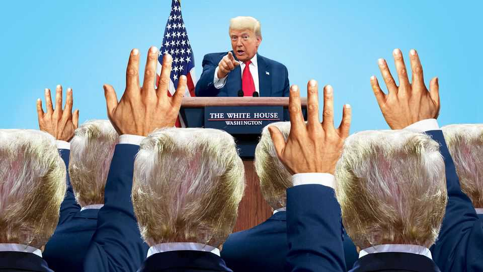
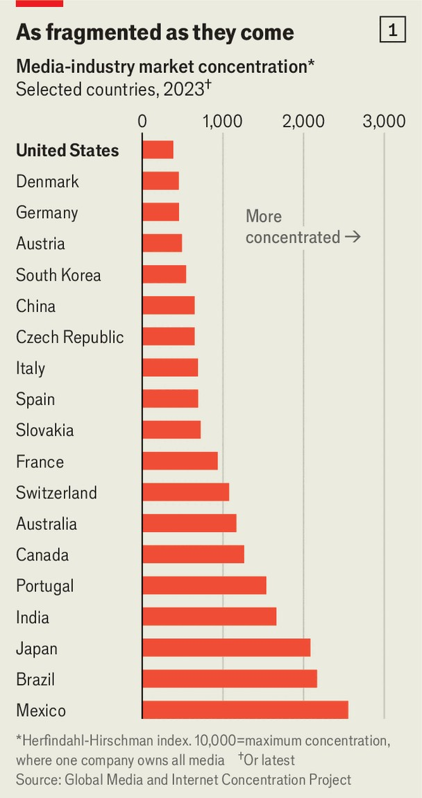
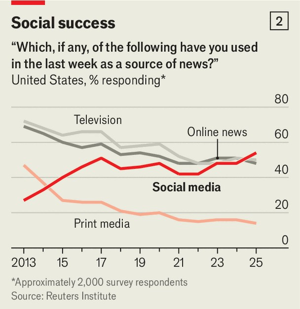
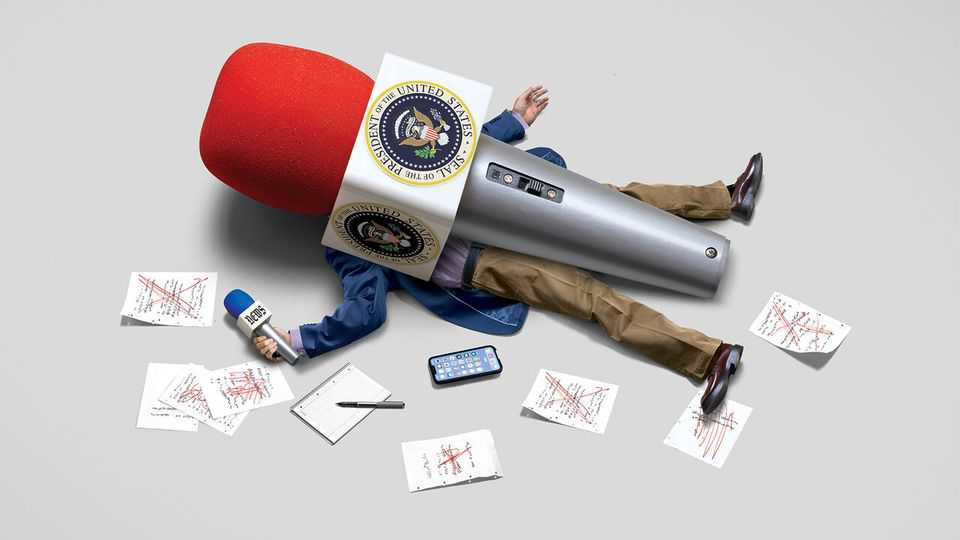

Briefing | Making media great again
Can Donald Trump muzzle America’s press?
He has bullied some outlets, but intimidating them all is a daunting task
September 25th 2025

In ONE RESPECT the 170m Americans who use TikTok can breathe a sigh of relief: they should soon be able to scroll freely without any risk that the Chinese government meddles with what they see. On September 19th President Donald Trump said that he and his Chinese counterpart, Xi Jinping, had agreed in principle for a group of American investors to buy a controlling stake in the video app’s US operations. The deal fulfils the requirements of a law passed last year to protect Americans from “foreign adversary controlled applications”. To shield TikTok from government interference, it is to be put in American hands. Some may detect an irony in that. In the very week that Mr Trump delivered TikTok from the threat of manipulation by the Chinese government, he

intensified his own government’s efforts to control America’s media. “They give me only bad publicity…I would think maybe their licence should be taken away,” he said of America’s broadcast television networks. It was not idle talk. The previous day the Trump-appointed head of the Federal Communications Commission (FCC), which issues such licences, had threatened to investigate Jimmy Kimmel, a chat-show host, for making “truly sick” remarks about the murder of Charlie Kirk, a pro-Trump activist. Shortly afterwards Disney, Mr Kimmel’s employer, took him off air.

Print media are also under fire. The president is suing three newspapers for their coverage of him (one dared to publish an opinion poll suggesting that he might lose a state in last year’s elections). On September 20th the Department of Defence said reporters must sign a pledge not to obtain or use unauthorised material, on pain of having their press credentials revoked. It is not quite the Chinese Communist Party. Nor, however, is it the vibrant free press that once thrilled European observers like Alexis de Tocqueville. In a recent press-freedom ranking by Reporters Without Borders, a pressure group, America came 57th, below most of Europe.

Worse, the structure of the media happens to be shifting just as Mr Trump attempts to impose his will, giving him added opportunity to bully and cajole. As Americans’ viewing, listening and reading habits change, the firms that provide them with news and entertainment are restructuring and consolidating in response. Since government officials have to approve many of the resulting transactions, Mr Trump finds himself with extra leverage. And yet in the long run, the rapid evolution of the media, and especially the rise of social-media platforms, with their profusion of ideas and opinions, makes America’s media dauntingly hard to control.

Mr Trump’s relationship with the press has long been turbulent. In the past decade he or his businesses have been involved in at least 34 media or defamation lawsuits, according to a tally by Axios, a news organisation (and one of many defendants). Nor is his threatening language new: during his previous term as president and during last year’s election campaign he often threatened reprisals for unflattering coverage and encouraged supporters to hector reporters at his events.

Yet a few things make his attacks more effective now than in the past. One is a shift in public attitudes. Polls show that Americans’ faith in journalists has eroded. In 2016, when Mr Trump was first elected president, 76% of Americans said they trusted national news organisations, according to the Pew Research Centre. Today the figure is 67%; among conservative Republicans it has fallen below half. This means not only that there is less public opposition to Mr Trump’s broadsides against the media (a recent poll found that Mr Kimmel, for example, is trusted by only 52% of Americans). It also suggests that his speculative lawsuits, designed mainly to harass critics, have more bite than they used to. Libel trials in America are typically heard by juries. Cases heard in conservative jurisdictions like Florida, where Mr Trump files many of his, can expect a more hostile jury (and, often, judge) than they would have got a decade ago.

The crisis of trust is also dissuading some newspapers from criticising politicians. Citing polarisation among their readers, McClatchy, Gannett and Alden Global Capital—three of the biggest newspaper chains—have reduced or removed political editorials from their titles. In 2008 all but eight of America’s 100 highest-circulation newspapers endorsed a presidential candidate, according to Harvard University’s Nieman Journalism Lab. Last year around three-quarters stayed quiet.

Mr Trump is also being empowered by changes in media ownership. Hollywood media firms are rapidly pairing up in order to achieve the scale needed to survive the so-called streaming wars. Disney bought most of 21st Century Fox in 2019. Amazon swallowed Metro-Goldwyn-Mayer in 2022. In August Paramount Global merged with Skydance, a company controlled by the Ellison family. The Ellisons are now said to be preparing a bid for Warner Bros Discovery, which would create one of the largest companies in Hollywood.

These mergers give Mr Trump a powerful lever. Big acquisitions need the blessing of the Federal Trade Commission (FTC), an antitrust regulator whose boss is appointed by the president. Deals involving broadcast TV also need permission from the FCC. The federal government thus has a veto over big media mergers, which seems to be helping Mr Trump win editorial concessions. Skydance’s merger with Paramount was delayed until Paramount paid Mr Trump $16m to settle his complaint about an episode of

CBS News’s “60 Minutes”, which he argued (preposterously) had been edited in a biased way. Disney took Mr Kimmel’s show off the air after Nexstar and Sinclair, two of its affiliate networks, said they would not broadcast the show. Nexstar is seeking the FCC’s approval to buy Tegna, a rival; Sinclair is said to be exploring mergers that would also require the FCC’s permission.

Media firms are walking a tightrope between provoking Mr Trump and angering the liberal-leaning “talent” on whom they depend. Mr Kimmel’s suspension proved a step too far for Disney: after hundreds of celebrities signed a letter of protest and Bob Iger, Disney’s boss, faced sudden hostility in liberal Hollywood (“Neville Chamberlain in a cashmere sweater” was one of the more polite insults), Mr Kimmel was reinstated on September 22nd. Others are trying to pre-empt trouble. Paramount is said to be considering Bari Weiss, an opinionated journalist with no television experience, for a big role at CBS (and perhaps CNN, which the firm would also own if the Warner acquisition goes ahead). It has also spent $7.7bn on the rights to Ultimate Fighting Championship (UFC), a martial-arts league with ties to Mr Trump. Next year it plans to broadcast a UFC fight on the White House lawn.

Mr Trump’s molestation of the media follows a well-established pattern. Other democratically elected leaders with authoritarian instincts have used similar methods to cow critical outlets in recent years, with great success. In India, for instance, Narendra Modi, the prime minister, has harnessed government advertising, bureaucratic harassment and mob pressure to subdue a previously fissiparous press. Recep Tayyip Erdogan, Turkey’s president, has wielded spurious prosecutions to much the same end.

Perhaps the paragon of this strategy is Viktor Orban, the prime minister of Hungary. He has encouraged friendly moguls to buy up some unfriendly media firms, initiated investigations or prosecutions of others and personally sued still more. The country’s last independent radio station, Klubradio, had its broadcast licence revoked in 2021 for such grave transgressions as filing some paperwork late and playing slightly less than the required amount of Hungarian music one day.

Clearly, Mr Trump’s tactics owe something to these pioneers. Yet taming America’s media is an especially tricky task. The current consolidation notwithstanding, American media ownership is more dispersed than in most countries, according to the Global Media and Internet Concentration Project, a Canadian research organisation. It rates ownership of media brands in America as less than half as concentrated as in France and Italy, and a third as much as in Canada (see chart 1).

The same changes in the industry that are giving Mr Trump more influence are also making it harder for him—or anyone—to control the media. The news is fast moving online, where keeping a lid on speech is like “trying to nail jello to the wall”, in the words of Bill Clinton, a former president. Social media have overtaken television and the web as Americans’ main source of news, according to Oxford University’s Reuters Institute (see chart 2). In the past four years the share who get news from YouTube has risen from under a quarter to a third. Even on conventional television sets, YouTube is the main channel, accounting for 13.4% of Americans’ viewing hours, ahead of Disney’s 9.4%, according to Nielsen, which measures such things.

Online media are harder to control in two ways. One constraint is legal: the FCC has little authority in cyberspace. The other is practical: whereas it may be possible to keep half a dozen TV news networks in line, no one can silence the billions of people posting on social networks. Claiming a scalp like Mr Kimmel’s is less valuable now that he has thousands of imitators on YouTube. (Indeed, one reason Disney was willing to suspend him may be that chat shows like his are losing audience to online alternatives like “Hot Ones” and “Chicken Shop Date”.) Stars who are cancelled by their employers can set up shop online, as Tucker Carlson did on X after being dropped by Fox, and as Ms Weiss did on Substack after quitting the New York Times. It has never been easier to publish or broadcast—and thus never harder to silence an idea.

This swelling army of amateur anchormen and women has no firm political allegiance. An analysis last year by Pew of “news influencers”—defined as people with 100,000 or more followers who talk about current affairs— found that 21% were leftish and 27% were rightish but almost half had no clear leanings. Joe Rogan, the most popular podcaster, is a case in point. Although he endorsed Mr Trump last year, he also once voiced support for Bernie Sanders, an ardent left-winger.

Even so, the rise of new media channels will give only limited comfort to those who worry about the freedom of the press. Viewers may treat YouTube and TikTok as substitutes for old-school television, but they provide quite different things. A study by Pew during the 2020 election campaign found that Americans who got their news mainly from cable TV were twice as likely to be politically well-informed as those who got it from social media (those who mainly read news sites were the most clued-up of all). Social networks have learned that users prefer a feed that is rich in entertainment. A study of Facebook users in 2020 found that those whose newsfeed was algorithmically sorted—with content selected by Facebook—saw 13% less political material than those who had a straightforward chronological feed.

What is more, the owners of digital media may be no harder to manipulate than their analogue counterparts. The new media moguls of Silicon Valley seem more eager to please Mr Trump than the high-ups of Hollywood. Tech’s high command, from Jeff Bezos of Amazon to Elon Musk of X, flanked Mr Trump at his inauguration in January, with some letting it be known that they had made personal donations to the festivities. Apple has even presented Mr Trump with a little gold trophy for his contribution to American manufacturing.

Some of Mr Trump’s support in Silicon Valley comes from conviction. Many tech types complain that Democrats suffocate innovation through overregulation. But the friendly reception from new media owners also reflects the fact that they have a lot to lose from Mr Trump. Fast-growing tech companies frequently attract the attention of antitrust regulators: Meta and Google are both in the middle of trials regarding their social media and advertising businesses. AI may provoke more regulatory intervention, on everything from copyright to national security. Tariffs on imported components, or restrictions on exports, can make or break gadget-makers.

Added to this, tech firms’ media interests are in most cases small parts of their overall business. Mr Musk bought Twitter, as it was then known, for $44bn. That is about a tenth of the present value of his rocket firm, SpaceX, which relies on launch permits from the Federal Aviation Administration and radio bandwidth permissions from the FCC, and about 3% of the value of Tesla, his carmaker, whose fortunes depend in large part on Mr Trump’s relationship with Mr Xi. Amazon Prime Video and Apple TV+ are tiny units of giant owners. Even mighty YouTube accounted for only about 15% of the revenue last year of its parent company, Alphabet.

The disparity in value means that these new media owners have even less reason to stand up to presidential pressure. Paramount may have agonised over whether to sell out journalists at “60 Minutes” in order to complete its $8bn merger with Skydance. Apple probably did not need to think very hard about whether to part company two years ago with Jon Stewart, a politically provocative comedian, in order not to threaten its $400bn-a-year tech empire. For leaders of publicly traded companies, folding to Mr Trump is more or less a fiduciary duty. Many bosses privately lament that sucking up to the president is the single most useful thing an executive in America today can do.

Owners of social networks have less direct control over content than old- media companies. Whereas Disney or Paramount can fire their stars or cancel shows, Mark Zuckerberg has limited sway over what Facebook’s 3bn users post. Yet the algorithmic promotion of content gives platforms’ owners influence. Perhaps the clearest example is how Twitter has changed since Mr Musk bought it and renamed it X. X’s algorithm seems less likely to promote links to mainstream media than in the past. A study by Burak

Özturan of Northeastern University and colleagues found that the average quality of news sources shared on the platform—as defined by Newsguard, which rates the reliability of online sources—fell during Mr Musk’s first six months in charge. X’s audience has also changed under Mr Musk. When he bought Twitter, in October 2022, it was used by 38% of Democrats and 26% of Republicans. Today it is used by 26% of Democrats and 32% of Republicans, according to the Civic Health and Institutions Project, a joint initiative of Harvard, Northeastern, Rochester and Rutgers universities.

That is why much could depend on who owns America’s version of TikTok. Details of the deal had not yet been announced and may not even have been finalised with China, when this article was published. The White House has said that 80% of the new company will be held by a group of American investors. The group is said to include Oracle, controlled by the Ellisons, and Fox, controlled by the Murdoch family. TikTok’s new owners would reportedly copy the app’s recommendation algorithm from ByteDance, its Chinese owner, and retrain it under the supervision of America’s government.

At the moment, TikTok is the only large social network where left-wing “news influencers” outnumber right-wing ones, according to Pew. Mr Musk’s stewardship of X shows how that could change. As part of their deal, TikTok’s new owners are said to be paying a multibillion-dollar fee to the government for arranging the sale. It remains to be seen what else they may feel they owe to Mr Trump. ■

This article was downloaded by zlibrary from https://www.economist.com//briefing/2025/09/25/can-donald-trump-muzzle-americas- press

United States

Democratic mayors and the president are converging on drugs policy The president’s border czar was caught in a sting operation Rail travel is booming in America Women’s pro-ballers want more cash The president is wrong on Tylenol It is getting much harder to get evicted in New York City Immigrants are narrowing the black-white wage gap in America Donald Trump is raising the stakes for holding power