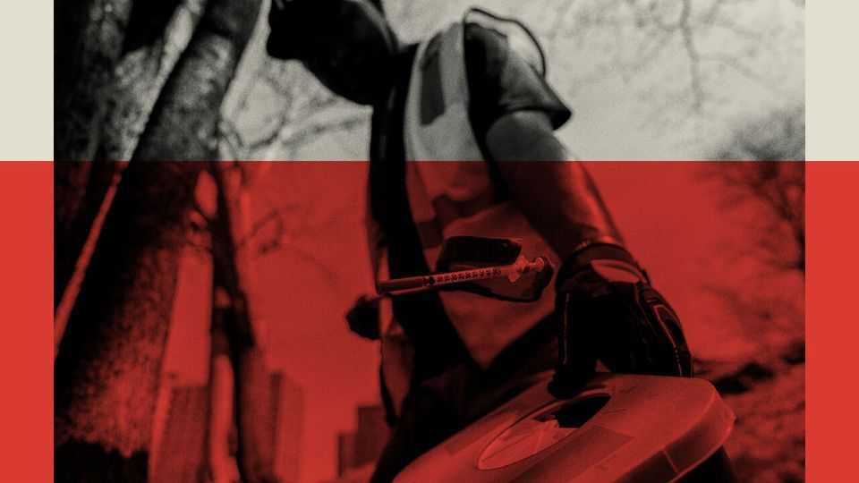

United States | Harm’s way
Democratic mayors and the president are converging on drugs policy
Harm reduction has gone out of fashion, but will not disappear
September 25th 2025

FOR A HISTORY of recent drugs policy in America, look to a decommissioned church in Philadelphia. Still home to a forlorn-looking organ, it is now Prevention Point, a non-profit trying to help addicts. Since 1991 the group has provided clean needles to intravenous drug users, reckoning an addiction is less dangerous than HIV. It moved into the old church a decade ago, as fentanyl began to arrive in Philadelphia. There was “an explosion of people coming in” for syringes, says Silvana Mazzella, who runs the organisation. Yet Prevention Point is now handing out fewer needles. City government used to provide $900,000 for clean needles, but Cherelle Parker, the mayor, has pledged to “fight tooth and nail to make sure that not one city dollar” is spent on the programme.

It is not just Philadelphia. Across America, drug policy is shifting as a backlash takes hold against “harm reduction’, an approach grounded in the idea that some people will always use drugs and that public policy should focus on minimising the damage, whether by stopping disease transmission or limiting overdoses. Much of the pushback has come from local communities, where residents angry about disorder and open drug use have rebelled against incumbent politicians.

In recent years, as the opioid epidemic raged and overdose deaths and addiction affected more communities, more areas have embraced harm reduction. The term refers less to a discrete list of policies than an operating philosophy. Much of the theory of harm reduction came out of the horrors of the AIDS epidemic. Today some interventions, like Naloxone, a life-saving drug that can reverse an overdose, are uncontroversial. Others, such as drug testing or distributing clean needles, have always attracted some opposition. Perhaps the pinnacle of harm reduction came in New York City in 2021, when two safe-consumption sites opened, allowing people to take drugs while supervised, in case they overdosed. “Honestly, I didn’t like it at first,” says Bill de Blasio, who was then-mayor of New York. But having looked at centres in Europe and Canada, he realised “we could end up saving a bunch of lives”.

Some elements of harm reduction are more supported by research than others. “We do know certainly some things do work,” says John Kelly, who studies addiction at Harvard Medical School. He points to Naloxone and clean needles, as well as clinical trials for medications that reduce cravings for opioids. Other policies, he says, “need more evaluation”. Advocates for harm reduction argue that clean-needle sites give users a point of contact to eventually find treatment for addiction. Yet how effective programmes are at getting people into drug treatment varies by their individual design, says Anees Bahji, who studies addiction at the University of Calgary. He warns that “The urgency of the crisis has blinded us to the fact that some of the evidence for some of these interventions has been really, really low.”

San Francisco has emerged as a locus of backlash. When fentanyl hit the west coast and then covid-19 shut down the rhythms of everyday life, certain parts of downtown turned into an unsanctioned—but tolerated—drug market. City-funded groups distributed drug paraphernalia, such as foil and

pipes for smoking fentanyl, so people would not have to share. San Francisco’s liberal approach to drugs “evolved into this safe-drug-use thing”, argues Steve Adami, who runs the local homelessness and recovery programmes for the Salvation Army, a religious charity.

Residents voted out politicians they held responsible for a deteriorating quality of life. Their replacements have decided to change tack. “I believe in the power of harm reduction,” Daniel Lurie, the city’s new mayor, told The Economist earlier this year. But, he added, “if you continue to just hand out [smoking supplies] with no consistent process to get people into treatment or get them help, then you’re just enabling people”. Mr Lurie and his allies in city hall are making recovery, rather than just safe drug use, the city’s goal. City-funded groups can still distribute smoking supplies, but they cannot do so in public and they have to try to nudge people into treatment. The Salvation Army is opening the first city-funded sober shelter for people recovering from drug addiction. It is not meant to replace other shelters, which emphasise harm reduction rather than recovery, but to be another option.

The president’s stance is not so different from that of these Democratic mayors. In July he issued an executive order on “Ending crime and disorder on America’s streets” that aims to stop federal funding for “so-called ‘harm reduction’ or ‘safe consumption’ efforts that only facilitate illegal drug use”. Given that safe-consumption sites do not receive federal funding, the executive order was evidence more of the politicisation of the term “harm reduction” than a specific policy agenda.

The priority of the administration’s drug policy is in fact to reduce overdoses by increasing “the availability of drug-test strips and Naloxone.” Safe- consumption sites are a useful bogeyman because few people want one in their neighbourhood. But they are nearly nonexistent: just three such sites are currently approved. Sam Rivera, who heads the two in New York, agrees with critics who do not want public drug use or paraphernalia in playgrounds, but says “the difference is we bring [users] inside to love on them and work with them.” The Justice Department could challenge that love: federal law bans running a site for the purpose of using illegal substances. In 2019 the first Trump administration sued to stop a safe-

injection site opening in Philadelphia. Still, Mr Rivera hopes to negotiate with the White House.

Some people worry about what will happen if harm reduction is completely repudiated. Mr Kelly warns that if funding is lost for Naloxone, clean needles and addiction treatment, “you’ll get a lot more death certificates. That’s for sure.” Others take a more qualified view. Daniel Ciccarone of the University of California, San Francisco, worries that passing out fewer smoking supplies could push people to inject fentanyl instead, which is more dangerous. But he reckons there is a need for greater understanding between harm reductionists and neighbourhoods where residents feel their quality of life has been sacrificed to serve an ideology.

Happily, overdose deaths are declining, albeit from a high base. But coming cuts to Medicaid, the public health-insurance programme for the poor, risk gutting drug-treatment programmes. The One Big Beautiful Bill attempted to shield addiction treatment. But nearly half of adults under 64 who are addicted to opioids rely on Medicaid for their health coverage. ■

Stay on top of American politics with The US in brief, our daily newsletter with fast analysis of the most important political news, and Checks and Balance, a weekly note from our Lexington columnist that examines the state of American democracy and the issues that matter to voters.

This article was downloaded by zlibrary from https://www.economist.com//united-states/2025/09/25/democratic-mayors-and-the- president-are-converging-on-drugs-policy