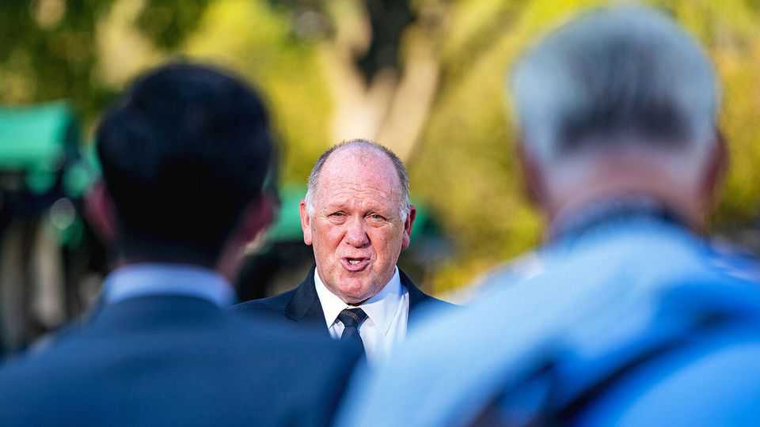

United States | Tom Homan
The president’s border czar was caught in a sting operation
Then the administration waived it away
September 25th 2025

IT READS LIKE something out of a detective novel. Picture it: a sleuth gets suspicious of a former beat cop. He reckons the old police officer is taking bribes on a promise to influence the government, since one of his buddies was about to get elected to a top office. The detective goes undercover as a local businessman. His disguise? A trench coat, fedora and a well-placed wire. He offers the cop $50,000—stuffed into a fast-food bag—to help steer public funds his way. The cop goes for it. Gotcha! Except this is not a Raymond Chandler story. These are the real details of an investigation into whether Tom Homan (pictured), Donald Trump’s border czar, accepted cash from FBI agents posing as executives, to secure future

government contracts. The only thing missing were the trenches and fedoras (as far as we know). Reports from MSNBC and the New York Times suggest that the FBI and the US attorney’s office in west Texas were tipped off to Mr Homan’s alleged influence-peddling at the end of the Biden administration. After Mr Trump took office, the case was closed. Mr Homan says he did nothing illegal. Karoline Leavitt, the White House press secretary, denies he took any cash. Democrats on the House and Senate judiciary committees see the chance of a scalp. They have asked the Department of Justice (DoJ) to share any recordings of the meetings.

Like his father and grandfather, Mr Homan was indeed a cop before he joined the Border Patrol in the 1980s. He worked in immigration enforcement under Democratic and Republican presidents, and, in Mr Trump’s first term, was promoted to acting director of Immigration and Customs Enforcement, the agency that carries out deportations. He retired before Joe Biden was elected, and started a consulting firm. This is where things get messy. During the presidential campaign last year, Mr Homan insisted there were no conflicts of interest between his business—which he promised to wind up—and his work for the once and future president. DoJ officials apparently did not agree—they thought they had a case against him for conspiracy to commit bribery.

The end of the investigation is more evidence that post-Watergate controls on graft are fading away. Over the past two decades, argues Jacob Eisler of Florida State University’s law school, the Supreme Court has limited the scope of anti-corruption law. Some lobbying looks more and more like bribery. The president is firing inspectors-general responsible for government oversight and gutting the DoJ’s Public Integrity Section, which investigates corrupt politicians and election crimes. In the noir novella that is the second Trump administration, Mr Homan’s sting is but one short chapter.■

Stay on top of American politics with The US in brief, our daily newsletter with fast analysis of the most important political news, and Checks and Balance, a weekly note from our Lexington columnist that examines the state of American democracy and the issues that matter to voters.

This article was downloaded by zlibrary from https://www.economist.com//united-states/2025/09/25/the-presidents-border-czar-was- caught-in-a-sting-operation