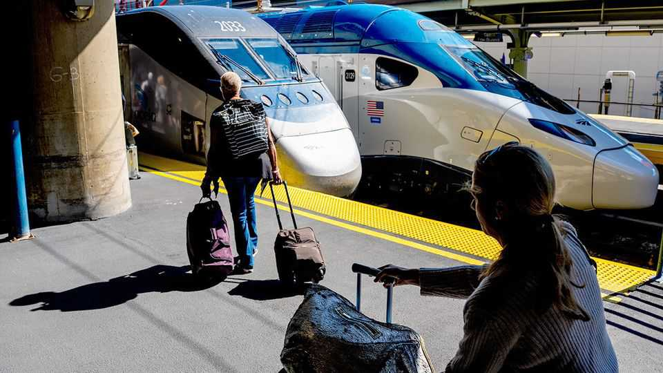

United States | Right on track
Rail travel is booming in America
More trains mean more riders
September 25th 2025

GOVERNMENT AGENCIES are rarely known for the quality of their TikTok output. Most avoid the network entirely, preferring X, Elon Musk’s social-media site. An exception is Amtrak, America’s national railway firm. Its posts can get hundreds of thousands of views. One popular recent video featured an employee pulling plastic covers off seats in a new train carriage, to the sound of Beethoven’s “Ode to Joy”. The train is the “next-gen” Acela, launched on August 28th, which travels between Boston and Washington, DC. The choice of music—the “anthem of Europe”—hints at Amtrak’s message: America too now has some European-style trains. The launch of the new Acela rolling stock, despite being several years late, comes at a particularly hopeful moment for Amtrak. In the nine months to

July, 28.6m people took a train ride, a 6% increase on the same period last year. That puts the firm comfortably on track this financial year to record the most journeys in its 54-year history. Its fare revenue grew by 11% in the year to June. Amtrak is also not the only company providing inter-city passenger rail services in America. In Florida Brightline, a private firm which runs trains between Miami and Orlando, increased its passenger numbers by 11% over the past year, to 1.8m rides. Trains are back in fashion. Can it last?

There are several reasons why Americans may be returning to the rails, says Roger Harris, Amtrak’s president. There is, he says, “a greater interest in passenger rail, especially in the younger generation”. Hence the TikToks. But he also cites growing congestion on the roads, more painful airport experiences and population growth in city centres near stations. Amtrak itself has made improvements too. More trains are running, particularly on routes that sell out often, such as from New York to Washington. The firm is also doing more with what it has. It has embraced clever pricing, with discounts used to sell seats on emptier trains, while passengers on the busiest services are squeezed for more.

By international standards, the boom is still fairly piddling. Avanti West Coast, one of several inter-city train-operating companies in Britain, carries roughly 33m people each year. But it is not nothing. The Northeast Corridor (NEC), where the Acelas run, is the only part of the network fully owned by Amtrak, and unlike trains elsewhere in America, does mostly resemble service in Europe or Asia. It carries 43% of Amtrak’s passengers, runs frequently and is by far the most comfortable way to get between city centres. One government rail expert jokes that if future historians had nothing but Amtrak data to understand America, they would assume everyone lived in or around New York City.

Can the boom continue? There is good reason to think it will. The infrastructure law signed by Joe Biden in 2021 has flooded the system with money. Since 2019 Amtrak’s capital spending has risen more than three- fold, to $4.5bn. Construction recently started on a new tunnel in Baltimore, to replace a 150-year-old one where trains now have to slow down to 30mph. Service is also expanding outside of the NEC. Two new routes have been initiated over the past two years, between Chicago and Minneapolis,

and between New Orleans and Mobile, Alabama. Both have sold far more tickets than expected. New diesel-electric hybrid trains for non-NEC routes are also being purchased.

Yet there are limits too. The new Acela train in theory can run at 160mph, using tilting technology to go around curves without slowing. But for now, the trains neither tilt nor go any faster, though they can carry 25% more passengers. What is needed is a track overhaul. The new Baltimore tunnel will help. But another tunnel, under the Hudson river in New York, will remain a much bigger bottleneck for years, says Yonah Freemark, of the Urban Institute, a think-tank. Amtrak’s record of finishing investment projects on time and on budget is patchy. As for Brightline, which unlike Amtrak is actually building entirely new tracks, including a line from Los Angeles to Las Vegas, financing remains tricky. In July the firm rolled over its considerable debt at an interest rate of 15%.

For Amtrak, one worry is that the share of trains running late has increased this year. “We don’t want to miss that opportunity,” says Mr Harris. “We’ve got this first chance to impress people on a large scale.” For now, though, more Americans are learning again the joy of getting somewhere without fighting their way through airports, or sitting in traffic on crowded freeways. ■

Stay on top of American politics with The US in brief, our daily newsletter with fast analysis of the most important political news, and Checks and Balance, a weekly note from our Lexington columnist that examines the state of American democracy and the issues that matter to voters.

This article was downloaded by zlibrary from https://www.economist.com//united-states/2025/09/21/rail-travel-is-booming-in- america