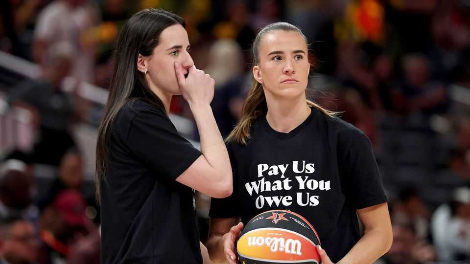
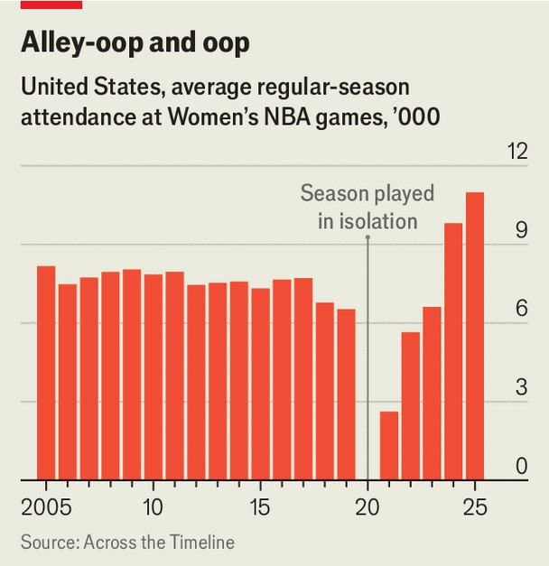

United States | Slam dunk
Women’s pro-ballers want more cash
The popularity of the WNBA is soaring
September 25th 2025

At the Barclays Centre in Brooklyn, New York, a spectacle is starting. Fans in seafoam green, inspired by the Statue of Liberty, stream to their seats armed with chicken tenders and beer. A glamorous elephant shimmies around the court to Mary J. Blige, an R&B musician, in a crown and generous layers of mascara. It’s the last regular-season home game for the New York Liberty, the city’s Women’s National Basketball Association (wnba) team, and seats are sold out. “The atmosphere is unbelievable,” says Ana Bermúdez, a lawyer who has been a fan since the league’s launch in 1997. Women’s basketball is thriving. Attendance this year has climbed to a record level, and is up 50% from ten years ago (see chart). It is part of a boom in

women’s sports in general. But with success comes tension. In particular, female athletes would like a bigger share of the pot. Their collective- bargaining contract expires on October 31st. A fight seems inevitable.

Female ballers have a case. Revenues in the male nba league are vastly higher. But the disparity in wages is higher still. WNBA players earn around $120,000 a year on average. In the NBA the figure is $10m. In the WNBA, unlike the NBA, pay rises are not linked to revenue growth, so higher ticket sales are not now filtering down to female players. The women deserve “a meaningful share of the business they are driving”, says Terri Carmichael Jackson, who leads the players’ union.

The NBA, the majority-owner of the women’s league, claims that it still loses it money (as a private entity, it doesn’t publish its accounts). But that stance is getting harder to maintain. Last year the WNBA unveiled a media deal that could boost revenue to $500m next year. David Berri, an economist at Southern Utah University, thinks it could easily generate more. Five new teams will be added by 2030, collectively paying “expansion fees” of nearly $1bn to the league. And take the New York Liberty: in 2019 it was sold for about $15m. This year, an equity sale valued it at $450m. To net their share of that growth, the women may embrace a different sport’s move: a strike. ■

Stay on top of American politics with The US in brief, our daily newsletter with fast analysis of the most important political news, and Checks and Balance, a weekly note from our Lexington columnist that examines the state of American democracy and the issues that matter to voters.

This article was downloaded by zlibrary from https://www.economist.com//united-states/2025/09/25/womens-pro-ballers-want-more- cash