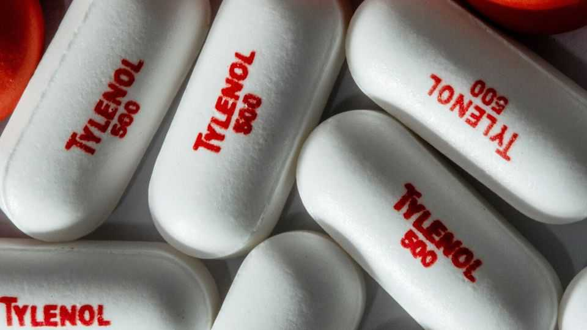

United States | Doctor-in-chief
The president is wrong on Tylenol
Scientists studying any link between the painkiller and autism have reached no firm conclusions
September 25th 2025

“DON’T TAKE Tylenol,” ordered Donald Trump at a press conference on September 22nd. His administration had just highlighted a link between the use of a common pain-relieving drug Tylenol (acetaminophen)—also known as paracetamol—and autism and ADHD. Mr Trump is certain that the drug is dangerous for children and has few real benefits. On both counts he is wrong. Scientists have examined the link between acetaminophen and autism for years but reached no firm conclusions. It is common for scientists to find correlations between medical conditions and external factors such as diet and drugs. It is also common for studies to point in different directions.

For example, one large-scale study of almost 200,000 children published in 2024 and funded by America’s National Institutes for Health (NIH) found no link at all between autism and acetaminophen use in pregnancy. Others have. The Food and Drug Administration (FDA) points to two large-scale cohort studies that did find an association: the Nurses’ Health Study II and the Boston Birth Cohort. The latter study looked at fetal exposure to acetaminophen and found that the risks of autism and ADHD increased according to the exposure to this medicine—a finding that could suggest a causal link.

Finding a mechanism would bolster the theory. Acetaminophen is known to cross the placental barrier, and some scientists have speculated that it may affect the hormone system, create stress in cells or influence brain-signalling chemicals. More research will be needed and on September 22nd the NIH also announced $50m to fund autism research more broadly.

Although the FDA is planning to change the labelling of acetaminophen to reflect this association, the agency was also clear that no causal relationship has yet been established. It may be, for example, that women who need pain relief during pregnancy are at higher risk of having a child develop autism for entirely different reasons.

The FDA’s health advice to doctors is also more nuanced and only suggests that doctors minimise the drug’s use during pregnancy. If women fail to treat a high fever during pregnancy this can pose a risk to the child. As the FDA notes, acetaminophen is the only over-the-counter drug approved for use to treat fevers during pregnancy. The idea that women should give up pain relief during pregnancy may not go down well. Mr Trump said they should simply “tough it out”. Public-health officials would no doubt have hoped for a little more nuance in his communications—particularly as infections associated with fevers are also a known risk for autism.

In a highly unusual move, the FDA also announced that it would allow a generic medicine called leucovorin to treat cerebral folate deficiency (CFD), a neurological condition marked by low transport of the vitamin folate into the brain. A feature of CFD is that it involves developmental delays with autistic features–such as challenges with social communication, sensory processing and repetitive behaviours, seizures and co-ordination.

The re-labelling of a drug for a new indication such as this usually follows an application by a drug firm, followed by clinical trials aimed to determine that new use is safe and effective. However, the FDA has decided only on the basis of a literature analysis, published case reports and data on mechanisms of action that leucovorin can be marketed to treat CFD. And the administration now suggests the drug can be requested by the parents of autistic children.

Leucovorin is a molecule similar to the vitamin folic acid. An approval for CFD means a doctor would need to prescribe leucovorin “off label” (ie, for reasons beyond their approved use) in autism. The science to support this is minimal, but positive. One study followed 80 autistic children and found an improvement in symptoms after the use of leucovorin in a blinded, randomised trial. The side-effects are believed to be small.

The presidential intervention shed more heat than light on the state of autism research, and no light at all on the nuanced set of genetic and environmental factors that researchers have found to be at play in this condition. The press conference also featured a rambling and incoherent tirade from Mr Trump about giving childhood vaccines separately. Despite the nature of the president’s comments, many parents of autistic children may be grateful for the focus on the health condition. ■

Stay on top of American politics with The US in brief, our daily newsletter with fast analysis of the most important political news, and Checks and Balance, a weekly note from our Lexington columnist that examines the state of American democracy and the issues that matter to voters.

This article was downloaded by zlibrary from https://www.economist.com//united-states/2025/09/23/the-president-is-wrong-on- tylenol