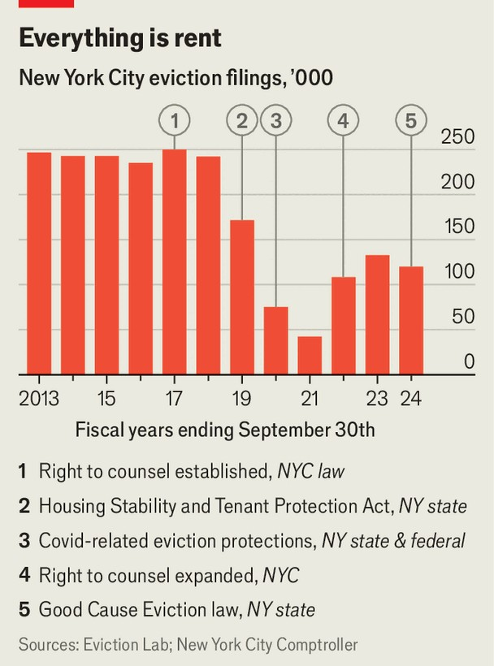

United States | Stay in place
It is getting much harder to get evicted in New York City
Tenants win. Potential tenants lose
September 25th 2025

There are few things that unite all New Yorkers, but one is an obsession with talking about the housing market. And so it is no surprise that it is dominating the city’s mayoral election on November 5th. The Democratic candidate (and frontrunner) Zohran Mamdani has made a slogan out of his a promise to “freeze the rent” on the 50% of flats that are rent-stabilised. The trailing candidates have scraped together their own housing plans. Yet for all the noise, one thing has been missed: New York City’s rental sector has already changed rather dramatically. Last year the city had the lowest apartment vacancy rate in almost 60 years. And yet at the same time, landlords filed almost 50% fewer eviction cases

than in 2016. Completed evictions are down by a quarter. New rights and procedures introduced over the past decade have transformed the legal landscape for tenants.

A decade ago, one in ten New York City renters faced eviction proceedings every year. Evictions are costly, financially and in human and social terms. After being evicted, renters tend to see their incomes fall, they are more likely to become homeless and they visit hospital emergency rooms more often. For children, being evicted has roughly the same impact on high- school graduation rates as being in juvenile incarceration. For landlords, evictions can cost the equivalent of two to three months of rent, not including the vacancy rent gap while new tenants are found.

The first big change came in 2017, when the city introduced a right for poor tenants to legal representation. This was followed by a new tenants’ rights law passed by the state government in 2019. The effects of both seem to have been dramatic (see chart).

Before the representation law came in, just one in 100 tenants had counsel, compared to 95% of landlords. On paper, tenants in New York benefit from powerful legal protections, but in practice, without lawyers, these are hard to enforce. Since the change, landlords do seem to have stopped filing as many

legally weak eviction cases. That is despite limited funding. Munonyedi Clifford of New York’s Legal Aid Society says she has been hiring “like gangbusters” but it is not enough.

Ms Clifford also says that the 2019 law passed by the state “really changed the landscape”. Landlords agree. The law “systematically changed the economics of housing”, says Kenny Burgos of the New York Apartment Association, which represents property owners. More change came last year: the state limited rent increases further and now requires some landlords to renew most leases automatically.

The trouble with all this is that there is inevitably a trade-off. Existing tenants are certainly better off. But newcomers and movers find it harder and more expensive to find a place to live, as landlords become more cautious. Nicole Upano of the National Apartment Association, a landlord trade association, says many are already introducing stricter screening to exclude risky tenants. In Washington, DC, pandemic-era rules made evictions harder and slower. Unpaid rent rose from $11m in 2020 to $100m in 2025. Affordable housing disappeared from the market, as landlords became more conservative. The city is now rolling back many of the changes. ■

Stay on top of American politics with The US in brief, our daily newsletter with fast analysis of the most important political news, and Checks and Balance, a weekly note from our Lexington columnist that examines the state of American democracy and the issues that matter to voters.

This article was downloaded by zlibrary from https://www.economist.com//united-states/2025/09/25/it-is-getting-much-harder-to- get-evicted-in-new-york-city