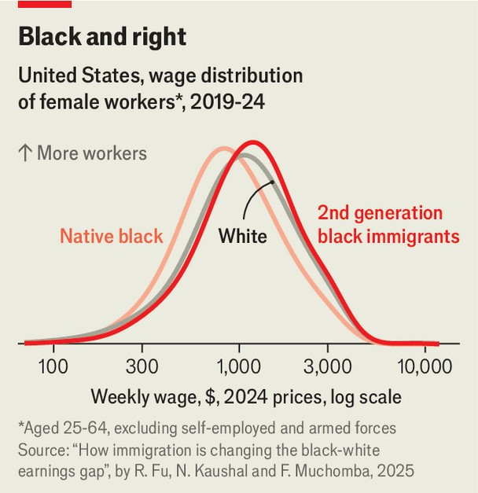

United States | Kofi’s heirs
Immigrants are narrowing the black-white wage gap in America
Their success is changing what it means to be African-American
September 25th 2025

A BLACK STUDENT was visiting the Jim Crow South when he entered a barbershop. The white barber looked at him and reportedly told him, “I do not cut nigger hair.” The student responded, “I am not a nigger, I am an African.” He proceeded to sit down and get his hair cut. The student was Kofi Annan, an ambitious young man from Ghana who would later become the secretary-general of the UN. When he arrived in America, African immigration was a statistical blip. In 1960 less than 1% of America’s immigrants came from the continent. By 2020 that figure had jumped to 11%. Over the past 30 years four times more Africans—around

2m—have arrived in the United States than did in continental North America during the Atlantic slave trade.

Today more than a quarter of the black workforce was born abroad or have parents who were. That is reshaping what it means to be black in America. Africans are among the fastest-growing groups: they now make up almost half of all black immigrants. But the number of Caribbeans and people from Latin America is also growing. These newcomers arrive without the inherited baggage of America’s racial oppression (though many, of course, descend from people enslaved elsewhere). Just as Annan was at the height of Jim Crow, they are often perceived—and treated—differently.

New research by Rong Fu, Neeraj Kaushal and Felix Muchomba, of Waseda University in Japan, Columbia University and Rutgers University respectively, finds that the wave of black migration is narrowing the black- white earnings gap, which has not changed for decades. Black migrants tend to be better educated than both natives and other immigrants. They also tend to settle in richer, whiter neighbourhoods, with good schools.

To test how much housing choices matter, the researchers looked at how black immigrants would do if they lived in the same places as black natives. The earnings gap, they found, would widen by up to 9%.

The success of black immigrants and their families seems likely to grow. Immigrants’ sons earn more than those of American-born blacks, albeit still less than whites. Their daughters make more than white women on average (see chart). “Black Africans are going to be the next model minority,” says Ms Kaushal.

At Africon, a diaspora conference that began in Atlanta on September 19th, hundreds of African immigrants attended sessions on building wealth through boutique hotels and Airbnbs, education at historically black colleges, learning how to use artificial intelligence in business and navigating corporate America. There were speakers from Meta, Reddit, Etsy, Google and Microsoft. A slender Nigerian-British man in a powder-pink suit offered an “exclusive” opportunity to invest in his (he claims) lucrative property company.

This ambition can bring tension, too. Over a bowl of gingery fried plantains, Yvonne McCowin, Ghana’s honorary consul in Georgia, explains that Africans often feel that black Americans do not work hard to seize the opportunities in front of them. Many immigrants have survived wars. When they encounter racism in America, they tend to brush it off. Olivia Mugenga, a Rwandan human-rights lawyer whose mother and grandparents were killed in the genocide against the Tutsis, says that makes black Americans “perceive the African as a house Negro”, a term popularised by Malcolm X, which refers to a black person who is willing to work within an oppressive system to get ahead. “I’m not a house Negro, I just don’t have time to debate with white people about whether I’m a human being,” she says.

Conservatives have long pointed to Caribbean and African immigrants as evidence that black people can lift themselves out of poverty in America, prejudice be damned. When asked how he dealt with racism, Colin Powell, whose parents immigrated from Jamaica, said simply, “I beat it.” Yet Camilla Moore, the head of the Georgia Black Republican Council, says that comparing Africans to black Americans is absurd. “We have nothing in common,” she says. “They are more like Chinese or German immigrants whose families have the resources to send them to Harvard.” She laughs at the idea of talking to a Nigerian about civil rights.

A man who runs a barbershop in a black neighbourhood in Atlanta says that in recent years more Africans have come in. What he notices most is not that the Africans and the black Americans don’t get along, but that they ask for different cuts. The American men want “curly afros, something a bit more stylish”. The Africans want a conservative look, “low and even, shaved closer to the scalp”. That, the barber reckons, reflects a broader attitude: “They just want to assimilate.” ■

Stay on top of American politics with The US in brief, our daily newsletter with fast analysis of the most important political news, and Checks and Balance, a weekly note from our Lexington columnist that examines the state of American democracy and the issues that matter to voters.

This article was downloaded by zlibrary from https://www.economist.com//united-states/2025/09/24/immigrants-are-narrowing-the- black-white-wage-gap-in-america