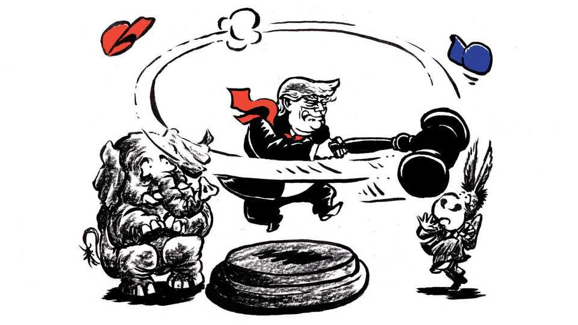

United States | Lexington
Donald Trump is raising the stakes for holding power
Winning is becoming about prosecution, not just public policy
September 25th 2025

It is news these days when Republicans dare to object that Donald Trump is making hypocrites of them, on deficits or trade or the boundaries of presidential power. But Ted Cruz, a conservative senator from Texas, set a particularly striking example of consistency recently on free speech. While other conservatives who once gloried in deriding leftist cancel culture were celebrating government pressure on a broadcast network to muzzle a late- night comedian, Jimmy Kimmel, Mr Cruz condemned it as “dangerous as hell”. He couched his defence of speech not in high principle but in instrumental terms: “It might feel good right now to threaten Jimmy Kimmel, yeah,” he said on September 19th on his podcast, “Verdict with Ted

Cruz”, “but when it is used to silence every conservative in America, we will regret it.”

That was clearly meant as a message to the Trump administration to mend its ways. But Republicans might reasonably draw a different conclusion from Mr Cruz’s warning, as they might from many actions Mr Trump is taking: that they need to do everything possible to prevent Democrats from regaining power, and turning this president’s methods against his party.

Mr Trump is using his office to punish adversaries in ways that are without precedent. The actions are often alarming in themselves, but what may eventually matter more is that together they are intensifying not just the perceived stakes of politics, which have been climbing for years among hyperpartisans, but the actual importance for officeholders of political authority. The way Mr Trump uses power, in other words, is raising the real stakes for holding on to power. No one can be certain where this will lead, but it is surely sharpening the incentives of American politics.

It has always been crushing to lose an election, but the worthies of a defeated administration could count on lucrative corporate jobs or respectable postings at think-tanks or universities while they awaited the turn of the political wheel. This arrangement was cosy and could be corrupting, as some officials looked ahead to passing through the “revolving door” to a lobbying job and then maybe back to power. But it was also stabilising. There was a good life to be had after government, along with the prospect of a return to public office, probably in a more senior role.

Now, when they lose power, officials have reason to fear criminal investigation. Bill Pulte, Mr Trump’s director of the Federal Housing Finance Agency, has been rummaging through mortgage records for mistakes by Trump adversaries that might amount to fraud, and he has referred three of them for prosecution. Meanwhile, journalists have found that four of Mr Trump’s cabinet secretaries may have committed similar errors, along with Mr Pulte’s father and stepmother. Any future Democratic president would come under tremendous pressure from the party’s activists to deliver payback, or more. On the right it is an article of faith that Democrats resorted to this kind of lawfare first, by prosecuting Mr Trump when he was out of office. That is all the more cause for Republicans in

office now to fear reprisals for Mr Trump’s zeal for prosecution and litigation.

The norms of American governance may yet prove resilient. Mr Trump, and even the loyalists surrounding him, are not following through on some of his extreme claims: more than two months have passed since he declared “irrefutable proof” of treason, a capital crime, by Barack Obama and other senior Democrats, and the president has fallen silent on the subject. Those law firms with the courage to stand up to Mr Trump’s efforts to cripple them for doing business with Democrats have been winning in the courts (victories that also preserve classic out-of-power jobs for former Democratic officeholders, even as business booms for lobbying firms connected to Mr Trump’s top aides). Mr Kimmel himself returned to the airwaves on September 23rd, still cracking wise at Mr Trump’s expense. And none of the three Democrats targeted by Mr Pulte has yet been brought up on charges.

Yet this administration is barely eight months old. Erik Siebert, a federal prosecutor in Virginia nominated by Mr Trump, resigned on September 19th after angering him by concluding there was not enough evidence to pursue a mortgage-fraud case against Letitia James, the New York attorney-general who successfully sued Mr Trump for fraud in his property business. Mr Siebert was also reportedly reluctant to prosecute James Comey, a former FBI director Mr Trump sees as an enemy. Via social media, Mr Trump ordered the attorney-general, Pam Bondi, to prosecute his foes. “We can’t delay any longer,” he wrote to “Pam”. “JUSTICE MUST BE SERVED, NOW!!!” Within days, prosecutors were preparing to seek an indictment against Mr Comey, the Washington Post reported.

This is the context for Mr Trump’s bid to alter the electoral terrain before the midterm elections. He wants to defy history, which suggests the Democrats will win control of the House, by trying to impose new restrictions on voting and pressing Republican state governments to redraw electoral boundaries to favour Republican candidates. Mr Trump’s rewards for allies and punishment of foes may also account for the stunning gap in fundraising: after the first six months of this year, the political action committee associated with the president, MAGA Inc, had $196m in cash on hand; the Democrats’ main presidential PAC, Future Forward, had all of $2,826.08. Even those advantages are not enough. Mr Trump has ordered an

investigation into ActBlue, a fundraising platform for Democrats, and since the assassination of Charlie Kirk his aides have spoken of a broader offensive against nonprofits that support the left. A dangerous cycle is gathering momentum: the more Republicans treat their political opponents as criminals, the more reason they will have to fear them. ■

Subscribers to The Economist can sign up to our Opinion newsletter, which brings together the best of our leaders, columns, guest essays and reader correspondence.

This article was downloaded by zlibrary from https://www.economist.com//united-states/2025/09/25/donald-trump-is-raising-the- stakes-for-holding-power

The Americas

Argentina’s finances just got even more surreal Is Colombia at the “gates of hell”?