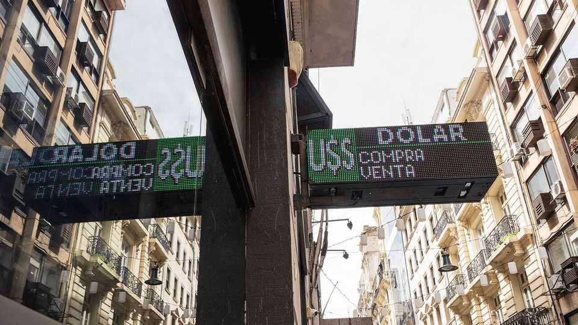
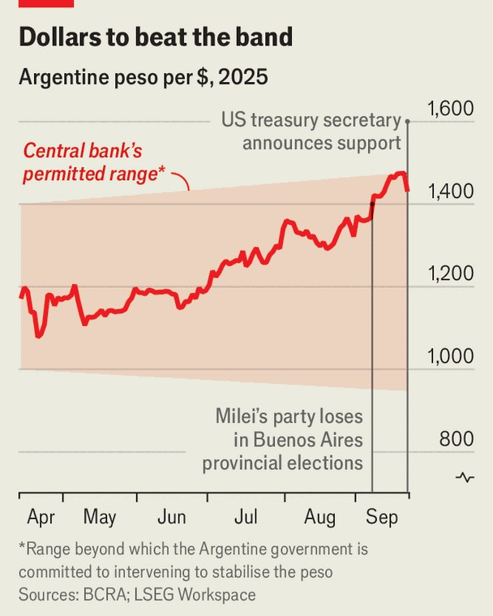

The Americas | Propping up the peso
Argentina’s finances just got even more surreal
Scott Bessent says Uncle Sam is underwriting Mr Milei’s laboratory
September 25th 2025

On September 22nd, 15 minutes before Argentina’s foreign-exchange markets opened, America’s government made an intervention. “Argentina is a systemically important US ally,” Scott Bessent, America’s treasury secretary, wrote on X, a social network. He added that the United States would “do what is needed” and that “all options for stabilisation are on the table.” The next day President Donald Trump met Javier Milei, Argentina’s libertarian president, and declared that he was doing a “fantastic job”. Early on September 24th, Mr Bessent announced that negotiations were under way for a $20bn swap line with the Argentine central bank, and that the US Treasury “stands ready to purchase Argentina’s USD bonds and will do so as conditions warrant”.

It is highly unusual for the United States to back another country’s currency and bonds like this, especially when rating agencies classify those bonds as “junk”. Doubly so in that the backing is prompted not by a global or regional crisis, but rather by the wobbling political fortunes of Mr Milei, a close ally of Mr Trump’s.

Mr Milei has been pushed off-balance by the gyrations of the Argentine peso, which has recently come under such intense pressure that it threatened to derail his libertarian economic project, and thereby his presidency. The trouble started on September 7th when, with his sister embroiled in a corruption scandal, Mr Milei badly lost a legislative election in the province of Buenos Aires. He then suffered a series of stinging defeats in congress. Markets panicked, worried that this signalled the end of popular support for his reforms, and the potential return of spendthrift Peronists. A sharp peso sell-off began, while investors ditched Argentine bonds.

Since April, when the IMF launched its 23rd programme in Argentina, the peso has been floating within a widening band, the limits of which the Argentine government has vowed to defend. By mid-September the peso’s official rate was testing the upper limit of that band, even briefly piercing it on September 17th to reach 1,475 to the dollar. Over the following two days the Argentine central bank spent some $1bn of its scarce foreign-currency reserves to defend the currency.

The bank does not have sufficient foreign reserves to keep up that level of spending for long. Drafting in the dollar-bazooka of the US Treasury is intended to show that Argentina has the firepower to defend the band’s upper limit and thus stabilise the peso. That the US Treasury is willing to buy dollar-denominated Argentine debt could also make it easier for Argentina to repay its creditors, and perhaps even allow it to borrow from commercial lenders to do so.

Markets reacted to the announcements with relief and elation. (A big temporary tax break for agricultural exporters which should bring more dollars into the country had already improved the mood.) The price of Argentine bonds, which had been in freefall, surged back on the news of American support. The peso has strengthened by about 9% since Mr Bessent’s initial comments. Local Argentine stocks soared.

The American support is extraordinary, but it does not guarantee lasting calm. Difficult moments loom. Many consider the peso overvalued. Capital Economics, a consultancy in London, reckons the gap to be 30%. That means the pressure on the currency will probably return.

That could happen soon. Argentines vote in midterm elections on October 26th. Many suspect that the government will have to change its exchange-

rate scheme shortly after, probably to let the peso float more freely. As a result, the week before the midterms is likely to be rocky, as markets anticipate the change. If the government’s polling is weak, American support for the peso may well be tested.

Though American dollars help with the peso, Mr Milei’s political prospects are far from assured. His opponents smell blood. Congress has already succeeded in overturning his veto on one spending bill, and is in the process of overturning three more. That is a serious problem for the president, as market confidence in him rests on fiscal rectitude. His ability to control congress, where he has few allies, has been predicated on his personal popularity. Mr Trump’s support has not changed the fact that Mr Milei’s ability to govern is now in question.

A poor showing in the midterms is just the most immediate concern. Markets also worry that he will lose a re-election bid in 2027. One looming spectre is Axel Kicillof, the governor of Buenos Aires province, who emerged strengthened from the recent provincial elections and has presidential aspirations. His economic views are unorthodox, his record alarming.

Mr Milei’s problems are technical, as well as political. His reform programme has long relied heavily on a strong peso to contain inflation. His government’s interventions to prop up the currency, even after committing to a limited float, have worried both voters and investors. Voters dislike the economic damage that has been the inevitable side-effect of intervention. Many find that their wages buy less now than in early 2023. Investors are calmed for now, but as long as a strong peso remains the linchpin of Mr Milei’s inflation-fighting policy, the prospect that he will fail to accumulate enough foreign reserves, or even begin burning them again to prop up the currency, remains.

It is not clear whether the Americans plan to help Mr Milei defend the peso after the midterms, or would then like to see it float freely. Speaking on Fox News, a television channel, Mr Bessent said that American help was a “bridge to the election”. He has not said whether he too thinks the peso is overvalued. Mr Milei’s government has long argued that its fiscally conservative management and tight monetary policy naturally make for a

stronger peso. They have instead often blamed the peso’s woes on speculators and political operatives, language which Mr Bessent echoed. If that is the Americans’ bet, it is a risky one.

There is no happy outcome for Mr Bessent and investors if Mr Milei fails to win the support of Argentine voters. The national electorate likes Mr Milei better than do the voters in the Peronist heartland of Buenos Aires who kicked off this crisis. He has so few seats in congress that any gain would be significant. American backing may boost his flagging polling.

Argentine history is a graveyard of economic reforms. Attempts at fiscal propriety often go fine initially, then unravel. If the midterms go badly, and markets conclude that Mr Milei has lost all control of congress and that his re-election in 2027 is a long shot, Mr Trump’s dollars will not stop Argentina from going broke again. ■

Sign up to El Boletín, our subscriber-only newsletter on Latin America, to understand the forces shaping a fascinating and complex region.

This article was downloaded by zlibrary from https://www.economist.com//the-americas/2025/09/22/argentinas-finances-just-got- even-more-surreal