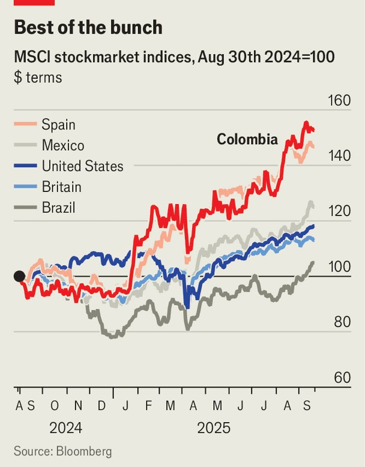

The Americas | Colombian politics
Is Colombia at the “gates of hell”?
Opposing candidates in next year’s presidential election hold wildly divergent views of their country
September 25th 2025

Colombia is “at the gates of hell”, says Vicky Dávila, a right-wing candidate in next year’s presidential election. She says it will decide whether the country “burns” or “turns back”. Others feel differently. “The last six months have been fabulous for the Colombian economy,” says Gustavo Bolívar, a left-wing candidate and ally of President Gustavo Petro. He says tourism and the stockmarket are booming, unemployment is at record lows and inflation is well down since Mr Petro’s election. Polarisation is a global phenomenon, but Colombia’s right- and left-wing politicians seem to live in parallel dimensions. In reality Colombia’s economy is in decent shape, but storing up trouble. Though Mr Petro assails

its independent institutions, Colombia is not becoming Venezuela or Cuba. But the degradation of security is alarming; in early June Miguel Uribe, a presidential candidate, was shot and killed. On September 15th Donald Trump declared that Colombia had “failed demonstrably” to meet its counter-narcotics obligations—a declaration which would have ended much American assistance had the Trump administration not simultaneously issued a waiver, making it more symbolic than practical. Colombia is still far less bloody than in the terrible 1990s, but it is not hard to imagine it slipping back in that direction.

The economy was sluggish for two years after Mr Petro took office in 2022. This year it is set to grow by 2.4%, unspectacular but better than much of South America. In July the unemployment rate was 8.8%, the lowest for that month for almost a quarter-century. The stockmarket is the fourth-best- performing in the world over the past year, surging by 54% in local-currency terms. Inflation has fallen by half since Mr Petro took office. Tourism is booming. Some 7m people visited Colombia in 2024, up by 2m in two years.

Still, Mr Petro cannot claim much credit. He boasts about lowering inflation, but his bullying of the central bank has made that work harder. And there are caveats. Some 60% of workers in Colombia toil in the informal economy, where they get fewer benefits, do not pay taxes and are less productive.

Investment is low, which raises questions about the sustainability of the growth, which is mostly consumption-led. The government’s ban on new oil and gas exploration is putting off foreign investors.

Areas on which Mr Petro has focused have seen the least progress. The number of people living in the government’s definition of poverty (on less than $3.90 a day) has declined. But the number living in extreme poverty (on less than $1.90 per day) has barely budged. Inequality has fallen only slowly; Colombia remains one of the world’s most unequal countries.

Part of Mr Petro’s effort to fight it was a sharp rise in the minimum wage. But even before that it was worth over 90% of the median wage, by far the highest ratio in the OECD, a club of mostly rich countries. By making it expensive to hire formally, Mr Petro incentivised more informality. Early indications suggest that he got it.

Some reform efforts have even busted up services which had been working fine, like the health-care system. Since Mr Petro increased the state’s role, maternity wards and emergency rooms have been closing, or refusing new admissions.

The darkest cloud over the economy is high government spending. The fiscal deficit will hit some 7% of GDP this year, pushing public debt to a record high, above 60%. In June the government suspended a legal limit on state spending and borrowing for three years. Legislation allows this only in extraordinary circumstances, which the government’s own fiscal watchdog says do not currently exist.

A fiscal mess thus awaits the next president. Mr Bolívar and Iván Cepeda, another left-wing presidential candidate, say cuts can be found, but simultaneously vow to protect social programmes. Even a right-wing winner may have to raise taxes; a wise one might try to make taxes more progressive and cast the net wider.

The right is closer to the mark on security. The assassination of Uribe was an echo of Colombia’s bloody past. Politicians are on edge. Interviewing them often means entering a world of bodyguards, police and bulletproof vehicles. The assassination came amid a wider flurry of deadly violence including a

truck-bomb in Cali, a major city, and the downing of a police helicopter. Together these killed 20 people and injured more than 70. Since June scores of soldiers have been kidnapped by locals, seemingly at the behest of drug gangs, then released days later.

This has highlighted the failure of Mr Petro’s signature security policy, Paz Total, an attempt to negotiate with all the country’s armed groups at the same time. Despite vestigial Marxist names, these groups are drug- traffickers, not freedom fighters. Early ceasefires collapsed and no lasting deals are in sight, in part because the army has not applied enough pressure. “If you are not strong enough, don’t negotiate,” says Sergio Fajardo, a centrist presidential candidate. While pretending to be serious about peace, the groups used ceasefires to take territory, re-arm and recruit.

Armed groups in Colombia now boast perhaps 22,000 members, up by 45% since Mr Petro took office. The number of people displaced by violence is up by 230,000, according to the UN. At least one armed group is present in more than half of Colombia’s municipalities, according to Pares, a think- tank in Bogotá, the capital. Mr Petro’s peace talks are not the only problem. The groups were already expanding steadily under his predecessor, Iván Duque. Cultivation of coca, from which the gangs make cocaine, is at record highs.

Extortion rose by 50% between 2021 and 2024, and kidnapping by 75%. Attacks on the armed forces so far this year have already outstripped the total for any full year in at least a decade. The homicide rate is flat, but at around 25 per 100,000 people it is higher than every other South American democracy except Ecuador. “It is nothing to be proud of,” says Mr Cepeda, though he points out that it is relatively low by Colombia’s own standards. In the early 1990s, as Pablo Escobar, a drug lord, terrorised the country, the homicide rate hit 86 per 100,000. In the early 2000s it was running at over 70 because of violent rebel groups.

Deteriorating security is an obvious problem; the degradation of institutions is overlooked. Few are spared Mr Petro’s bombast. He claims there is an “institutional blockade” against him and the will of the people, and talks of calling a constituent assembly to rewrite the constitution.

His chaotic governing style undermines the civil service. Between frustrated resignations and endless shake-ups, ministers do not last long. Mr Petro appoints a new one every 20 days on average. Constant change leaves bureaucrats demoralised and lacking direction. Damage to the central bank is more direct. He rails against its interest-rate decisions, says it seeks to slow economic growth “for purely political reasons” and suggests it is trying to “defund the Colombian government”.

The legislature is a target, too. When the senate blocked Mr Petro’s employment-rights bill, he threatened to bypass it by calling a referendum of questionable legality. Cowed, the senate then passed it. Congress’s approval is required as a first step to calling a constituent assembly, but Mr Petro and his justice minister suggest they can somehow bypass this and convene one simply by popular demand.

There are regular clashes, too, with the justice system. Mr Petro often claims to have been a victim of a “soft coup” when the courts do not rule in his favour. In February 2024, after clashing with the supreme court over the selection of a new attorney-general, he called protesters onto the streets. They surrounded the court, trapping the judges for hours, until Mr Petro eventually ordered their removal. His government denies instigating the siege.

Colombia’s institutions can probably withstand this. The constitution limits Mr Petro to a single term, and most of the left-wing candidates seem less volatile. For a clear sign about the state of Colombia, then, consider its people’s revealed preferences. In the past three years about one million seem to have left the country permanently, double the number in the three years before covid-19. Colombia is not at hell’s door. But its next president will have much to do to make it a better place. ■

Sign up to El Boletín, our subscriber-only newsletter on Latin America, to understand the forces shaping a fascinating and complex region.

This article was downloaded by zlibrary from [https://www.economist.com//the-americas/2025/09/21/is-colombia-at-the-gates-of-hell](https://www.economist.com//the-americas/2025/09/21/is-colombia-at-the-gates-of-hell)

Asia

Would you shelter under Pakistan’s nuclear umbrella? Indian cities have a devilish animal problem The world’s most persecuted people Asian countries are nabbing a lot more foreign students