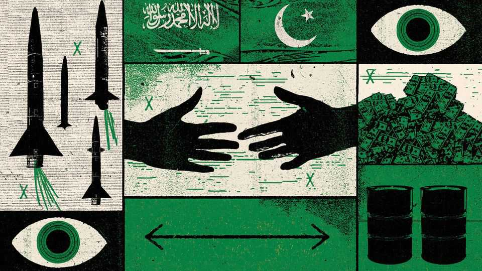

Asia | Rent-a-bomb
Would you shelter under Pakistan’s nuclear umbrella?
Saudi Arabia rolls the dice
September 25th 2025

FOR YEARS Pakistan and Saudi Arabia were bound by an unspoken bargain. Saudi Arabia had lots of cash but little muscle. Pakistan was cash- poor but arms-rich. The kingdom poured money into Pakistan’s coffers; Pakistan reciprocated with protection in the form of troops, training and weaponry. On September 17th the two Islamic countries took those arrangements a step further by signing a bold new pact. “Any aggression against either country”, they declared, “shall be considered an aggression against both.” In practice, that could mean Pakistan using its arsenal of approximately 170 nuclear warheads to deter attacks on Saudi Arabia. “Pakistan’s nuclear

capability…was established long ago when we conducted tests,” said Khawaja Mohammad Asif, Pakistan’s defence minister, on September 18th. “What we have, and the capabilities we possess, will be made available… according to this agreement.” Mr Asif later backtracked, suggesting that nuclear weapons were “not on the radar” of the pact. But Saudi officials have made clear that they see this as a nuclear umbrella. “This is a comprehensive defensive agreement”, one official told Reuters, “that encompasses all military means.” If so, it would be the first time that a nuclear-armed state outside the five powers that are recognised by the Nuclear Non-Proliferation Treaty (NPT) has extended its deterrence to another country.

The deal builds on decades of co-operation. In the 1960s Pakistani troops were deployed to Saudi Arabia’s border with Yemen during unrest in the country. Around 2,000 troops are thought to remain in Saudi Arabia today. In 1998, when India tested nuclear weapons, the Saudis offered Pakistan more than 50,000 barrels per day of free oil to help it match those tests while weathering the impact of sanctions. A year later Prince Sultan bin Abdulaziz, then Saudi Arabia’s defence minister, visited the sites where Pakistan enriched uranium and assembled its missiles.

In his history of the Pakistani bomb, “Eating Grass” (published in 2012), Feroz Hassan Khan, a former Pakistani nuclear official, acknowledged that the Saudis had provided “generous financial support” but denied that there had been any “nuclear-related co-operation” or any talk of extending Pakistani deterrence over Saudi Arabia. But many Western intelligence officials have long suspected otherwise. The kingdom “already paid for the bomb”, claimed Amos Yadlin in 2013, shortly after retiring as head of Israeli military intelligence. If Iran got nuclear weapons, he predicted, “they [Saudi Arabia] will go to Pakistan and bring what they need to bring.”

Saudi and Pakistani officials say that the latest deal has been in the works for more than a year. But it is likely to have been accelerated by recent events. On September 9th Israel conducted air strikes against a meeting of Hamas leaders in Doha, Qatar’s capital. That came mere months after Iran fired missiles at an American air base in Doha in response to America’s strikes on Iranian nuclear sites. For Saudi Arabia, which like other Gulf countries is unnerved at the frequency with which missiles are flying around, the pact

might be a way to raise the cost of any attack on the kingdom. The deal “could affect the strategic calculus of Iran”, wrote Jamal al-Harbi, an official at the Saudi embassy in Islamabad—and, he added euphemistically, “other regional players” (presumably referring to Israel).

For Pakistan, the deal could bring much-needed cash, in the form of Saudi aid to the government just months after it had to resort to an IMF bail-out. On September 21st the country’s central bank cut its growth forecast for the next fiscal year, in part because of unprecedented flooding across the country that displaced 2.5m people and wiped out food harvests. The deal also comes four months after a brief India-Pakistan military conflict. In that skirmish, India successfully attacked Pakistan-based militant groups and, later, several Pakistani air bases and military sites. But Pakistan shot down several Indian jets, allowing it to claim a victory of sorts. In a future conflict, Saudi Arabia would have little to offer Pakistan by way of arms. But it could send cash and help raise support for Pakistan in the Middle East.

The deal is also a diplomatic bellwether. In recent years, several Gulf Arab countries have tilted closer to India. Narendra Modi, its prime minister, has visited Saudi Arabia three times, most recently in April. The kingdom’s sovereign-wealth fund has pledged to invest $100bn in India. “What Pakistan has achieved in terms of its engagement…with the Saudis is to signal that they [the Pakistanis] are not isolated, that they have strong support systems within the region and globally,” notes Talmiz Ahmad, a former Indian ambassador in Riyadh. On September 19th India’s foreign ministry gently reminded Saudi Arabia to keep in mind “mutual interests and sensitivities”. But Indian diplomats will be dismayed by Mr al-Harbi’s public warning that the pact “may heighten India’s caution in dealing with Pakistan”.

The alliance is likely to have been spearheaded by Asim Munir, Pakistan’s chief of army staff, who was elevated to the rank of field marshal after the clashes with India. Though Pakistan has an elected government, its armed forces call the shots on most important issues. The field marshal is the most powerful Pakistani leader since Pervez Musharraf, the military dictator who ruled the country from 1999 to 2007. In June he was feted by Donald Trump at the White House. That came as America’s relationship with India was fraying over American tariffs and—to Pakistan’s great glee—Mr Trump’s

near-weekly public claims that he had coerced India into ending the fighting in May.

Part of Field Marshal Munir’s pitch to Mr Trump has been that Pakistan could be a stronger player in the Middle East, potentially supporting American efforts in the region. Throughout the 1980s and 1990s Pakistan’s nuclear-weapons programme—developed outside the NPT, which Pakistan refused to sign—was a source of tension between America and Pakistan. In the 2000s America grew alarmed at the prospect that A.Q. Khan, a leading Pakistani nuclear scientist who briefed Prince Sultan on that 1999 trip, might sell weapons technology to hostile states or jihadist groups. It would be ironic if Pakistan could now use its bomb as an instrument to shore up its diplomatic position. “It’s premature to say anything,” said Ishaq Dar, Pakistan’s foreign minister, “but some other countries want to enter into an agreement of this nature.”  ■

This article was downloaded by zlibrary from https://www.economist.com//asia/2025/09/22/would-you-shelter-under-pakistans- nuclear-umbrella