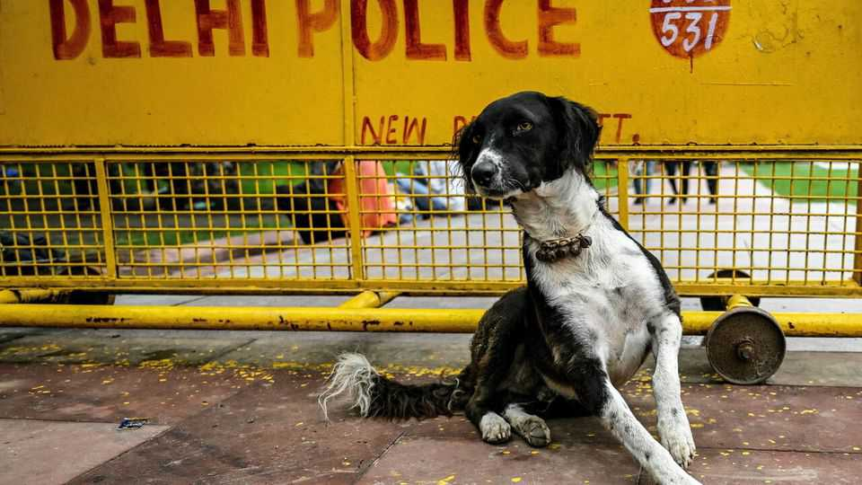

Asia | Herd on the street
Indian cities have a devilish animal problem
Not everyone wants it fixed
September 25th 2025

BERLIN HAS trouble with wild boars. Parts of Buenos Aires are overrun by capybaras. In Cambridge, Massachusetts, wild turkeys are a menace. Many cities have problems with animals. But few have it as bad as India’s urban centres, which are home to street dogs, feral cats, stray cows, various monkeys, an encyclopedia of snakes and even the occasional leopard. As India’s cities expand, so conflict between humans and beasts is growing. Delhi’s 1m street dogs are the latest animals to make headlines. Last year people there reported 25,210 dog bites. The number is rising: this January alone, there were more than 100 bites a day. That may be an underestimate. The same government source put the number of rabies deaths nationally last

year at 54, whereas the UN reckons it is somewhere between 18,000-20,000 annually (about a third of the global total). Many of the victims are children.

Yet across India many other animals also present hazards. Cows trample property, obstruct traffic and cause road accidents. Monkeys steal food (sometimes phones) and occasionally attack humans. Snakes usually mind their own business, but can lash out if threatened: India has the highest rate of snakebite deaths in the world. It is not just humans who suffer. Mumbai’s leopards sometimes attack its street dogs; snakes are crushed by cars; birds get stuck in overhead cables.

Why do so many animals call urban India their home? One reason is that cities have been expanding rapidly into habitats that used to be theirs alone. Consider Bangalore. In 2008 only about 50% of land within its city limits was classed as “built-up”; today roads or buildings cover around 88% of it. That has been catastrophic for some creatures. But others have found ways to adapt. The People for Animals Wildlife Hospital in Bangalore used to get reports of snakes only on the outskirts of the city, says Colonel Dr Navaz Shariff, its chief veterinarian. “Now we get reports of hatchlings everywhere.”

Poor administration of cities has allowed wildlife to thrive. Abandoned cars, rubble from construction sites and assorted other debris offer many creatures convenient shelter. Leaky pipes and rain-filled potholes serve them with water. Household refuse—which even in posh neighbourhoods can go uncollected—provides food. It should be no surprise that municipal governments which struggle to pick up the rubbish also flounder when it comes to meeting the requirements of animal-control laws, such as to neuter stray dogs.

But India’s animal problems also have social and political roots. Strict animal-protection laws prevent members of the public from driving out or killing feral canines, even when they are aggressive. Other animals are also well-protected, and not just by the law. “Every creature has got some place in Indian tradition and culture,” says Kishor Rithe of the Bombay Natural History Society, a conservation group. Monkeys are seen to represent the Hindu monkey-god, Hanuman. Snakes are worshipped on Naag Panchami, a religious festival. The cow is revered as a “mother”.

In recent weeks official impotence and public resistance have combined to hobble several big animal-control plans. In August protests erupted in Mumbai when officials tried to shut down pigeon-feeding stations on public- health grounds (pigeons can spread lung disease, among other risks). Members of the Jain religion, which advocates non-violence towards all living things, refused to abide by the rules. One pacifist monk even threatened to take up arms against the decision. Jains are a small minority, but well represented among India’s social and economic elite. And politicians avoid offending religious sentiments, because that is a sure way to lose votes.

Last month India’s Supreme Court, alarmed by reports of canines savaging children, gave authorities in Delhi eight weeks to put the city’s stray dogs into shelters. Animal-lovers erupted in outrage. The court modified its order a few days later; it decided the captured dogs could in fact be released once vaccinated and neutered. But there is little reason to think that Delhi authorities have the means to comply with either of these plans. Or that they will be able to enforce a ban on feeding strays, which the court also put in place.

What are the solutions? Better funding for municipal authorities, more systematic programmes for controlling breeding, and, most important, routine waste disposal would all help make cities less hospitable to animals. But even the best policies will founder unless ordinary Indians also start to think differently. Citizens, says Mr Rithe, need to understand that India’s animal problems must “be managed scientifically, and not sentimentally”. ■

Stay on top of our India coverage by signing up to Essential India, our free weekly newsletter.

This article was downloaded by zlibrary from https://www.economist.com//asia/2025/09/25/indian-cities-have-a-devilish-animal- problem