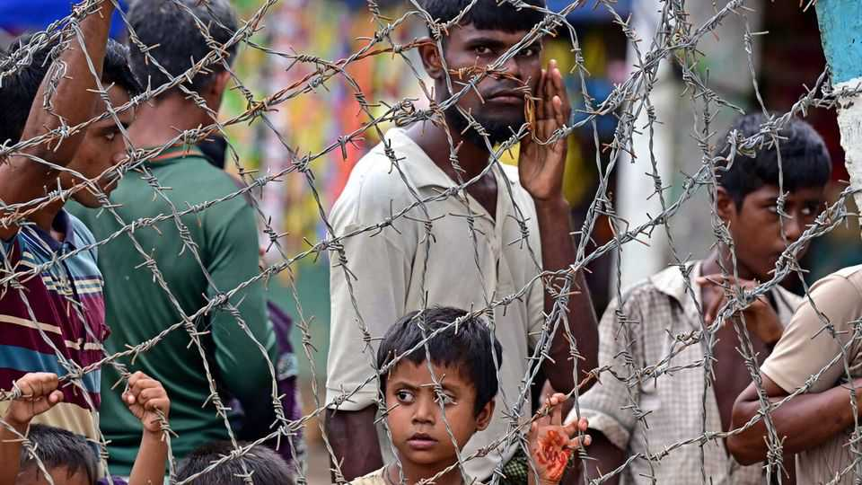
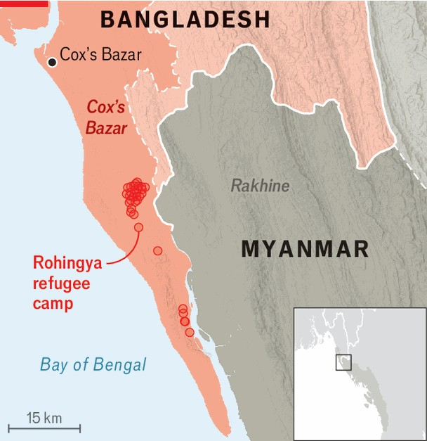

Asia | Time to act
The world’s most persecuted people
Dumb ideas are worsening the Rohingyas’ dire plight
September 25th 2025

“NO FOOD, NO health, no education, no jobs. Just insecurity and uncertainty.” That is how Jamilda Khatun describes conditions near Cox’s Bazar in Bangladesh, where refugee camps house more than 1m people. Her family of eight has lived there since 2017. They came as part of an exodus from Rakhine state in neighbouring Myanmar, sparked when Myanmar’s army launched attacks on the Rohingyas, a much persecuted Muslim minority (see map). Life for Rohingyas in Bangladesh—and for those who remain in Rakhine— has long been very grim. Yet lately a rash of awful setbacks has brought matters to a head. In New York on September 30th the UN General Assembly will hold a “high-level” conference on the Rohingyas—the first

such meeting on their plight. But without swift action a worsening crisis could affect the entire region.

The most immediate problem is cuts in funding for the camps in Cox’s Bazar. America, long the biggest provider of cash, has slashed aid to them in the course of dismantling its development agency, USAID. Last year it gave around $300m; the figure for 2025 will probably be much lower. But the UN says that supporting the Rohingyas will cost around $934m this year, and that so far only about one-third of that total has been raised.

The effects of the shortfall are growing more apparent on the ground. Already some 40% of children in the camps in Bangladesh are malnourished; some 25% of women are suffering from anaemia. Yet health clinics, like schools, are shutting down. The UN’s World Food Programme, the sole source of food assistance, says cooking fuel will run out by next month. It warns that rations will be exhausted by the end of the year.

While money dries up, the number of Rohingyas seeking refuge in Cox’s Bazar is rising. Since the start of 2024 more than 150,000 additional people have left Myanmar for the camps’ rickety, bamboo huts—the biggest such influx for years.

Many have been forced from their homes in Rakhine during fighting between Myanmar’s junta and the Arakan Army (AA), one of several ethnic militias that are battling the Myanmar government in an endless civil war. But the AA—which represents Rakhine’s Buddhist majority and now controls most of the state—is also accused of launching attacks on the Rohingyas themselves, including a massacre that killed hundreds in a village last year. The UN says the group has committed “numerous abuses and violations”. (The AA denies that it has it in for the Rohingyas, saying it targets only armed militants.)

Bangladesh, the refugees’ reluctant host, is losing the will to help. Its own politics were thoroughly scrambled by a revolution last year. Its politicians are jostling for influence ahead of a fresh election that its caretaker government says will be held in 2026. These politicians are promising voters that they will find ways to pack the Rohingyas back to Myanmar, even as refugees continue to flow in.

Some in Bangladesh reckon they can hasten the Rohingyas’ return by egging on armed Rohingya groups that operate from the refugee camps. These militias have long been accused of running organised crime in Cox’s Bazar, such as kidnapping and extortion. But lately they have been launching raids back across the border into Myanmar, in order to attack the Arakan Army. The squalor in the camps is making it easier for these groups to find recruits. A spokesperson for one of them, the Arakan Rohingya Salvation Army, says people are joining because they “are left with no choice but to take responsibility for the Rohingyas’ destiny”.

Yet more violence is hardly a solution. Battles between armed Rohingyas and the Arakan Army will probably make conditions in Rakhine even more miserable and force greater numbers to flee to Bangladesh, according to Thomas Kean of the Brussels-based International Crisis Group.

The deteriorating situation could cause waves across the region. Perilous efforts to escape from Cox’s Bazar are becoming more appealing. In May more than 400 people died after a boat carrying refugees capsized in the Bay of Bengal. But no country looks keen to take in Rohingyas. In January the Trump administration quashed one legitimate route by shutting down a refugee programme that had allowed 16,000 Rohingyas to be resettled in

America since 2022. In May the UN said it had received “credible” reports that an Indian naval vessel deporting Rohingyas from Delhi had dumped the refugees into waters near one of Myanmar’s 800-or-so islands and made them swim to the shore.

What might be done? The priority is to keep humanitarian aid flowing to Cox’s Bazar. At a minimum that means more food, water and medical care. Ideally it would also mean better housing. Bangladesh currently bans the construction of structures that might be deemed permanent; it also forbids Rohingyas from working. It should be more lenient, on both counts.

Reining in the camps’ armed groups would make it easier for capable Rohingya politicians to emerge. Governments could also pressure the Arakan Army, now the de facto government in Rakhine, to improve things there. China, which has investments in the state and close ties to the AA, could play a big role in this, should it wish to. Yet there is a baleful risk that this forgotten crisis continues to be widely ignored. ■

This article was downloaded by zlibrary from [https://www.economist.com//asia/2025/09/25/the-worlds-most-persecuted-people](https://www.economist.com//asia/2025/09/25/the-worlds-most-persecuted-people)