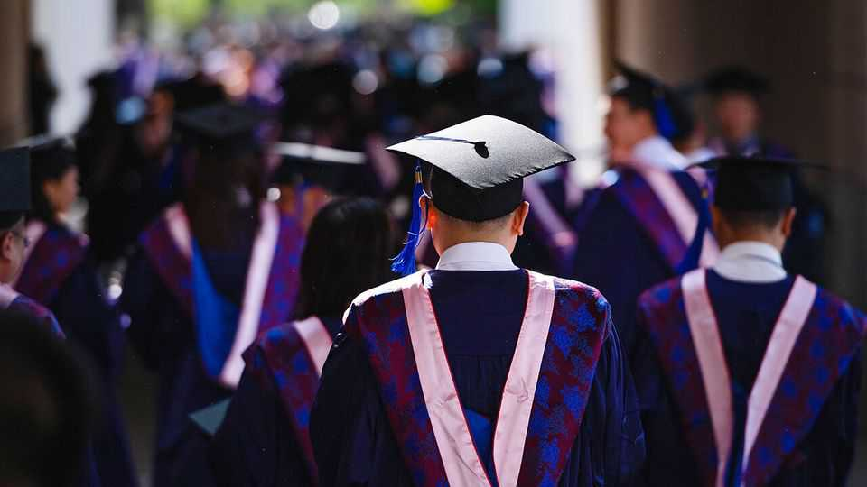

Asia | Higher Education
Asian countries are nabbing a lot more foreign students
Degrees from East Asia are cheap, and growing more prestigious
September 25th 2025

FROM THE age of 13, Yang wanted to study in America. Visiting Boston, she envied students she saw lying on the grass reading; that was “how studying overseas should be”. After graduating from Cornell University in 2022, she chose to do a PhD. But by then “international relations had got more intense” and America had tightened its visa rules. So she went to Singapore, where she doesn’t “need to constantly worry about paperwork”. She likes being closer to her family in Hubei, a province in central China. For years ambitious Asian students have made a beeline for universities in the “big four” Anglophone countries: America, Australia, Britain and Canada. These places have benefited handsomely: they have netted lots of

young talent, not to mention mountains of cash. Yet lately those traditional destinations have been losing a little of their shine. They take in around 35% of the world’s international students, down from roughly 40% in 2020, by one estimate. Asian students who fancy foreign study are now growing more inclined to travel somewhere in their own backyard.

Tighter immigration rules in the big four countries are one reason Asian students are staying local. Another is that Asian universities are growing more prestigious; those in East Asia, in particular, have for some years been leaping up international league tables, says Simon Marginson of Oxford University. Lower costs are a third big draw. A consultant who helps Indian students study abroad says this is why he is getting more inquiries about Japan, Taiwan and South Korea, when it used to be “all about the big four”.

The pandemic sped this process up. Many Asian students and their parents decided it would be better if they stayed closer to home, and that habit has stuck. Some see the West as increasingly dangerous and unpredictable. Between 2016 and 2022 the number of Asians studying abroad in East Asia increased about 40% according to the British Council, which surveyed seven popular destinations.

Receiving countries spy a big opportunity. In 2023 Japan, South Korea and Taiwan set new targets for attracting foreign students. Japan hosted 337,000 last year, up 21% from 2023. More than 90% came from Asia. It wants 400,000 by 2033. Taiwan aims to more than double arrivals to 320,000 by 2030. All three countries are offering more English-language courses. They are also offering more generous scholarships and making it easier for students to work after graduating. Hong Kong is another hotspot: this month authorities there said they would allow 50% of undergraduates in public universities to come from outside the territory, up from 40% in 2024 and only 20% before that.

Low birth rates make these places especially enthusiastic. International students can help solve labour shortages, says Hiroshi Ota of Hitotsubashi University in Japan. He says some Japanese universities may need to close without more students from abroad. Soft power is another prize. Taiwan is targeting students from South-East and South Asia through its “New Southbound Policy”, which aims to build stronger ties with its neighbours.

Challenges remain. In places such as Hong Kong, Singapore and Malaysia (where the number of Chinese students has surged since 2019) there is only so much room for growth. Language barriers limit the appeal of China, South Korea and Japan, particularly for students who aspire to snap up local jobs after their studies. Public worries about immigration are rising: members of Sanseito, a far-right party in Japan, have decried growing student arrivals from China. Some 115,000 came in 2023, up from under 100,000 in 2019.

Chinese students are the most numerous foreigners in many Asian universities. The window to profit from them may be closing; their flow could drop sharply as China’s youth population dips. Yet demand for foreign degrees among Indians will probably grow. Quacquarelli Symonds, a research firm, thinks the number of international students around the world will rise from around 7m today to 8.5m by 2030. That is a lot more talent to grab. ■

This article was downloaded by zlibrary from https://www.economist.com//asia/2025/09/25/asian-countries-are-nabbing-a-lot-more- foreign-students

China

Why Xi Jinping now accepts Kim Jong Un at the grown-ups’ table China is turning up its nose at American soyabeans All eyes on the NBA as its players return to China A restaurant scandal sticks in China’s throat