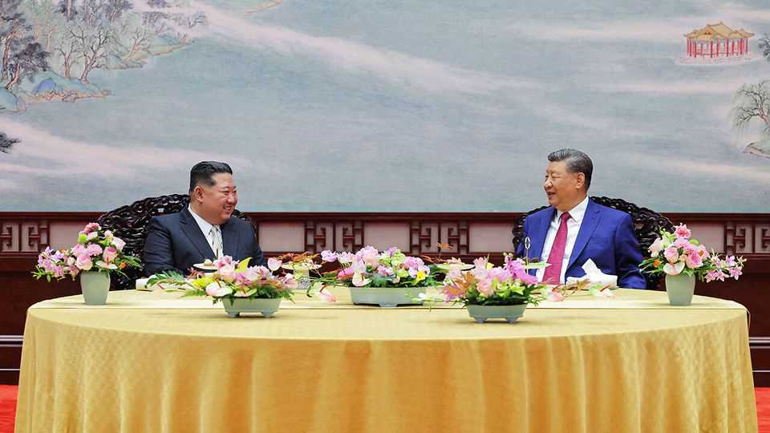

China | Toxic neighbours
Why Xi Jinping now accepts Kim Jong Un at the grown-ups’ table
China is grudgingly mending ties with North Korea
September 25th 2025

THERE IS AN unusual buzz of activity in Tumen, a small Chinese city on the border with North Korea. When The Economist visited in recent days, builders and cranes could be seen working on customs and immigration centres at the end of a new cross-border bridge. Elsewhere on the frontier, similar endeavours began in the months before Kim Jong Un, North Korea’s leader, attended a military parade in Beijing in early September. And work has continued apace in the weeks since, as China prepares to revive cross- border trade, despite UN sanctions to curb North Korea’s nuclear-weapons programme.

These and other signals suggest that China and North Korea are feeling more friendly after a fractious decade in which Xi Jinping, the Chinese leader, tightened enforcement of those sanctions under American pressure. China treated Mr Kim with unprecedented respect at the parade, allowing him and Vladimir Putin, Russia’s leader, to flank Mr Xi. To much of the world, that suggested that the three are closing ranks in an anti-Western alliance.

Yet Mr Xi’s re-engagement with North Korea also reflects his discomfort at the new power dynamics within the trio. The Kremlin was North Korea’s main sponsor throughout the cold war. Then, for most of the time since the Soviet Union’s collapse, China took on that role. It remains North Korea’s biggest economic partner, accounting for more than 90% of its global trade and vast quantities of its oil (although much of North Korea’s trade with China and Russia is unreported).

In the past two years, however, Mr Kim and Mr Putin have drawn closer. North Korea has sent troops and weapons to help Russian forces in Ukraine and Russia has provided fuel, food and military technology in return. Last year the two countries signed a mutual-defence treaty. Mr Putin also appears to have provided North Korea with military assistance that China will not supply, including anti-aircraft missiles and drone technology. He is reported to have signed an agreement to deliver Russian fighter jets.

That is all troubling for Mr Xi, even if China’s relations with Russia have also strengthened as a result of the war in Ukraine. China shares Russia’s concerns that a collapse of the North Korean regime could lead to a unified, democratic, pro-Western Korea. That development could bring American troops (of which there are 28,500 in the South) to China’s eastern land borders. At the same time, Chinese leaders have sought to avert North Korean military aggression against the South, which is one of China’s biggest trade partners and foreign investors.

China also still hopes to prevent North Korea from acquiring a fully functional nuclear arsenal, fearing that it could prompt Japan and South Korea (both American allies) to do the same. Russia seems less interested in curbing North Korea’s military ambitions, conventional or nuclear. Some officials even suspect that Russia may have helped North Korea to achieve recent advances in its atomic-weapons programme.

To discourage Mr Kim from swinging further towards Russia, Mr Xi now seems to be relaxing some of the trade curbs with North Korea that he imposed during President Donald Trump’s first term. Reported bilateral commerce plunged by roughly half to $2.4bn in 2018 after China began to enforce new UN sanctions. It then dropped further during the covid-19 pandemic. But in the first eight months of 2025 it has bounced back to pre- pandemic levels, increasing by 28% year-on-year to $1.6bn.

There have been signs, too, of North Korean workers returning to Chinese factories and of North Korea ramping up coal exports to China—despite UN sanctions targeting both activities. South-east of Tumen, satellite images show that China is building a giant new customs facility near the point where the Chinese, Russian and North Korean borders meet. Further south, work has resumed at China’s end of another new cross-border bridge.

Mr Xi has also started publicly to play down his concerns about North Korea’s nuclear ambitions. China’s official readout of his recent meeting with Mr Kim did not mention Chinese support for “denuclearisation” of the Korean peninsula, despite including such wording in statements on previous meetings, in 2018 and 2019. North Korea did not object to the wording back then, but denounced it as “a grave political provocation” when it appeared in a joint declaration at a summit between China, Japan and South Korea in May last year.

China still advocates a Korean peninsula free of nuclear weapons, according to Chinese experts. But given the strengthening ties between Messrs Putin and Kim, progress is unlikely without a resolution of the conflict in Ukraine, argues a recent paper by experts from two Chinese universities and a think- tank linked to China’s state-security ministry. China, they contend, should focus instead on preventing a military clash between North and South Korea, and on exploiting tensions between America and its Asian allies.

China‘s other concern is that Mr Trump might resume efforts to negotiate a deal with Mr Kim. Mr Trump met him three times in his first term and has publicly suggested a fourth meeting. Mr Kim said on September 21st that he was open to that, if America dropped denuclearisation demands. The chances of him giving up his nukes are even slimmer than before. Progress in its nuclear programme aside, North Korea fears relinquishing weapons

that it believes can guarantee its regime’s survival. Even so, if the war in Ukraine ends any time soon, China fears being isolated as Russia and North Korea re-engage with America. On September 23rd Ukraine’s president, Volodymyr Zelensky, told the UN Security Council that China could force Russia to end the conflict if it wanted. (China counters that it is impartial on the war.)

Ultimately China’s efforts to build economic leverage with North Korea may not pay off. It struggled to influence North Korea even when it had more sway. Mr Kim well understands that China would never let his country collapse. Chinese leaders have tried in vain to encourage market-opening reforms, hoping that regional integration would reduce military tensions. And on the occasions when China applied more direct pressure, North Korea usually shrugged it off. In 2009 a Chinese deputy foreign minister likened North Korea to a “spoiled child” after it fired a rocket over Japan. A few weeks later, China publicly condemned a North Korean nuclear test.

It is not even clear that North Korea will reciprocate China’s efforts to expand connections across the border. In contrast to its effusive rhetoric towards Russia, North Korea sounded lukewarm in its statements on Mr Kim’s recent meeting with Mr Xi. China may have to offer benefits not just on trade “but on a larger political scale, because that’s what Russia is doing”, says Jenny Town of the Stimson Centre, an American think-tank. She suggests that Mr Kim may seek formal involvement in multilateral groupings involving China, such as the BRICS.

That might explain the lack of activity opposite Tumen when The Economist visited. The Chinese authorities suggest that the new facilities around the bridge will be finished by next year. At North Korea’s end, however, there were no signs of construction. Meanwhile, about 80 miles away, work has been under way since May at both ends of the first road bridge between Russia and North Korea. ■

Subscribers can sign up to Drum Tower, our new weekly newsletter, to understand what the world makes of China—and what China makes of the world.

This article was downloaded by zlibrary from https://www.economist.com//china/2025/09/25/why-xi-jinping-now-accepts-kim-jong-un- at-the-grown-ups-table