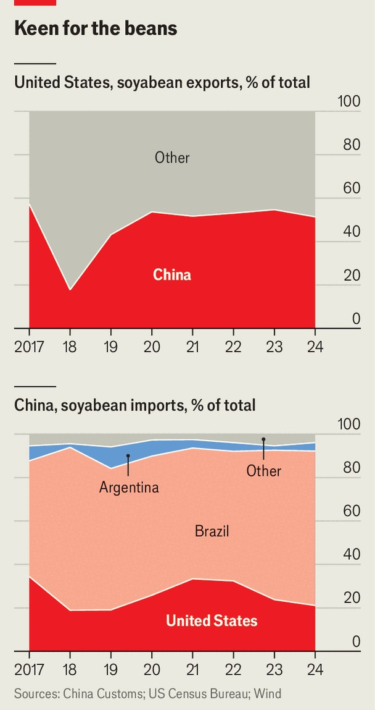

China | Agricultural trade
China is turning up its nose at American soyabeans
Midwestern farmers want their $12bn market back
September 25th 2025

IN THE CORN belt of midwestern America, the soyabean harvest is under way. By this point last year China had ordered close to 40% of America’s overseas sales. This year, however, China has not booked a single shipment. It is the first time that such a late stage in the season has been reached without any recorded Chinese orders, according to official online records that date back to 1998. China has squeezed American agriculture in this way before (see charts). In response to a tariff war waged by President Donald Trump during his first term, China imposed tariffs on American farm products of up to 25%. It suffered little, finding other sellers instead. Mr Trump eventually agreed to a

deal that involved China pledging to buy more American goods, including farm produce, but it fell short on its promises amid the covid-19 pandemic and continuing geopolitical tensions.

The latest drop in demand still represents a huge shift for American farmers. In 2024 they sold $12.6bn-worth of soyabeans to China, most of which were used to boost protein in animal feed. That was eight times the value of American sales to China of beef and beef products, the next-biggest category of China-bound agricultural exports. It was also more than the total value of aeroplanes and aircraft parts sold by America to China that year ($11.6bn, according to America’s Census Bureau).

The main reason for the collapse in demand is tariffs. Earlier this year, tit- for-tat blows initiated by Mr Trump left Chinese levies on American soyabeans at over 20%. That makes them much more expensive than imports from Argentina and Brazil, China’s other main suppliers, which are subject to tariffs of just 3%. Argentina also temporarily suspended grain- export taxes in recent days to make its soyabeans all the more enticing. China has ordered shiploads of the stuff.

China’s usual practice would be to meet its needs earlier in the year with supplies from South America, before turning to the United States in the

autumn. This year, however, Chinese buyers have stockpiled cheaper soyabeans from South America instead. That means that farmers in the United States now face painful losses of between $100 and $150 per acre, reckons Josh Gackle, chairman of the American Soyabean Association.

Trade is sure to dominate upcoming encounters between Mr Trump and his Chinese counterpart, Xi Jinping, in November and possibly early next year. China will negotiate hard. And when it comes to soyabeans, it knows that the corn-belt farmers are an important set of Republican-leaning voters. But even if a deal is reached in the short term, Mr Xi is determined to reduce China’s reliance on imports of soyabeans; last year the country brought in 105m tonnes of them. It is all part of his push for “food security”—a goal that he sees as critical to the country’s broader interests.

Even if the summitry helps to restore the flow of American soyabeans to China, Mr Trump’s farmers will need to think about diversifying. Many will grow more maize instead. True, China will probably turn back to American soyabean farmers later this year, once South American supplies are exhausted. But Brazil keeps breaking records for its soyabean production and China has invested heavily in ports and other infrastructure in the country. China is also trying to sate the taste of its middle class for meat by finding ways of making animal feed using home-grown ingredients and by reducing the share of soyabean meal within it.

Dan Basse of AgResource, a research firm in Chicago, says China will continue to see America as a back-up, should crops fail in South America. And the vast areas of land required to grow soyabeans mean that China will still need to ship in enormous quantities of them from abroad. “But ultimately,” Mr Basse says, “China is going to be a smaller importer of US soyabeans for years to come.” ■

Subscribers can sign up to Drum Tower, our new weekly newsletter, to understand what the world makes of China—and what China makes of the world.

This article was downloaded by zlibrary from https://www.economist.com//china/2025/09/25/china-is-turning-up-its-nose-at- american-soyabeans