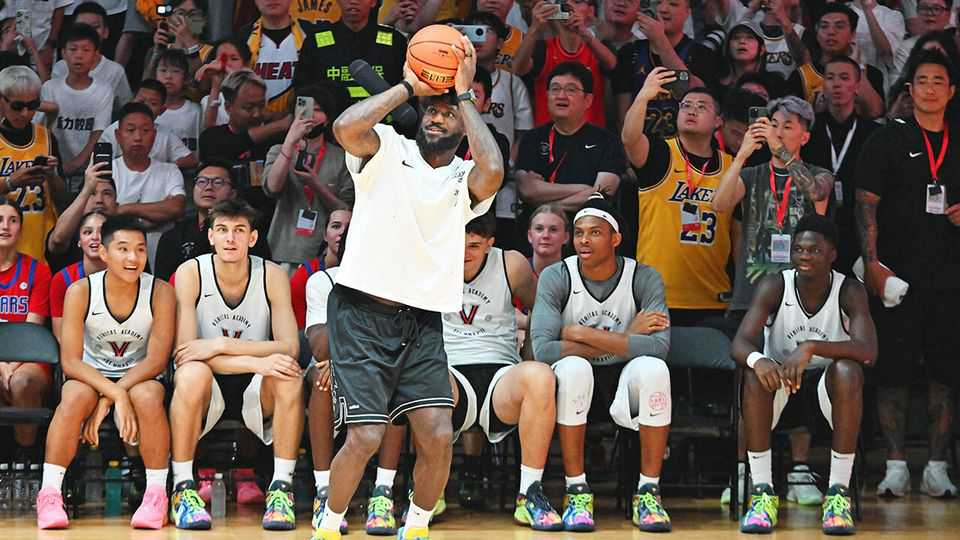

China | America’s globetrotting basketballers
All eyes on the NBA as its players return to China
Next month its teams will play in front of Chinese fans for the first time in six years
September 25th 2025

HOOPS AND hoopla return to China on October 10th and 12th: the Brooklyn Nets and Phoenix Suns will play pre-season games in Macau, a specially administered Chinese territory. The matches will be the first in China involving teams from America’s National Basketball Association (NBA) since the league was, in effect, banished six years ago. The excitement, and the stakes, could hardly be higher for those involved. LeBron James (pictured), an American sporting superstar, is treading carefully. This month the People’s Daily published an article seemingly written by him—to the surprise of many back in America. His team later clarified that it was actually a compilation of various remarks he made during a recent visit to China.

The episode was a reminder of how the tense state of play between America and China challenges the NBA. The fact that Mr James was on such a tour at all, promoting the NBA’s return, suggests that relations have recovered from their low in 2019. Back then Daryl Morey, who managed the Houston Rockets at the time, infuriated China’s leaders by voicing support for Hong Kong’s pro-democracy protests on social media.

The backlash was swift and costly. Chinese state broadcasters stopped showing NBA games and sponsors pulled funding. The NBA said losses amounted to hundreds of millions of dollars. It has taken years—and kowtowing by the NBA—to patch up relations. Some warming happened in 2022 when games were broadcast again on China’s state-run TV. The upcoming matches in Macau are another milestone: they are considered a prelude to games on the mainland.

For the NBA to keep growing, it needs China, the world’s biggest source of basketball fans. Estimates suggest that around a third of the population, or 450m people, follow the game, more than the entire population of America. Much of that is thanks to the NBA itself. State media began broadcasting its games in the 1980s. The growth in the game’s popularity since has been stunning. In a survey conducted in 2023, around half of all Chinese internet users and 90% of Chinese basketball fans said they watched the NBA.

Sportswear giants, such as Nike and Adidas, have long used their stable of NBA stars to market their wares in China. Chinese firms are getting involved, too. In 2023 Anta, based in the eastern city of Jinjiang, signed Kyrie Irving, one of the league’s best players, to be the face of its basketball line. Other NBA stars have followed suit, propelling Anta’s rise. It is now the third-biggest sportswear firm in the world in terms of sales and closing in on the top two, Nike and Adidas.

The NBA could reach even greater heights in China if the country produces another global star. The exploits of Yao Ming, a 2.29-metre-tall centre who played for the Houston Rockets in the 2000s, drove huge interest in the sport back home. Since then, Chinese players—and the national team—have struggled to make a big impact. One Chinese youngster is attracting new attention: Yang Hansen. Since the NBA’s Portland Trail Blazers drafted him

this year, the team’s merchandise sales have risen to more than ten times those in the same period last year.

The hope is that Mr Yang marks the beginning of more such moves from China to the NBA. So far, the traffic has largely been the other way. China’s rebound on the NBA sends a message to businesses in America and elsewhere. They are all welcome in China—as long as they play by its rules.■

Subscribers can sign up to Drum Tower, our new weekly newsletter, to understand what the world makes of China—and what China makes of the world.

This article was downloaded by zlibrary from https://www.economist.com//china/2025/09/25/all-eyes-on-the-nba-as-its-players- return-to-china