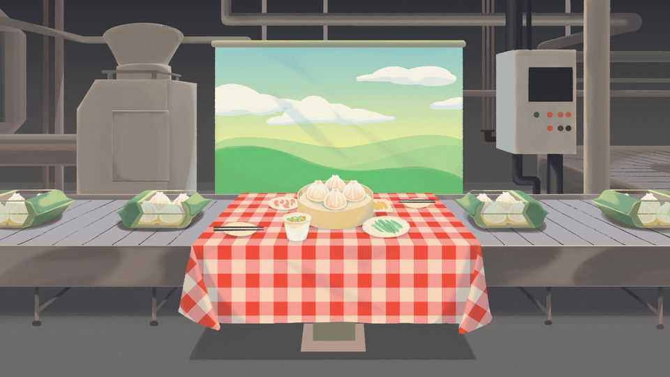

China | Chaguan
A restaurant scandal sticks in China’s throat
It’s hard for city diners to find the good life at a good price
September 25th 2025

FEW SCANDALS in China provoke as much outrage as those relating to food. This is perhaps only natural in a country that takes immense and justified pride in its wondrous culinary heritage. Concerns about public safety, corporate responsibility and regulatory capacity all distil into one essential question: can the food on your table be trusted? A furore that has gripped China in recent days poses the question in a different way. It revolves not around safety, but rather around food quality and the very definition of cooking. Anger has erupted at a popular fast- casual restaurant chain, Xibei, which bills its north-western-style food as fresh and family-friendly. Think of it, roughly, as a big upgrade on America’s Olive Garden chain (with extra-scrumptious roast lamb). Xibei

was revealed to be serving dishes made with frozen ingredients, often whipped up in advance in central kitchens. The controversy stings because it touches on deeper anxieties—about authenticity in China’s hyper-urban landscape and the emergence of new class divisions.

It all began innocuously enough, with an acerbic comment from a dissatisfied customer, the kind seen on social media anywhere in the world. “Almost all pre-made dishes, and still so expensive. Really disgusting,” fumed Luo Yonghao, an entrepreneur-cum-influencer. Mr Luo has 1.4m followers on Weibo, so his message was bound to attract eyeballs. But Xibei made it even worse. Along with threatening to sue Mr Luo for defamation, Jia Guolong, Xibei’s spirited owner, opened its kitchens for curious customers to see for themselves. And see they did: frozen broccoli with a shelf life of two years; expensive soups that consisted of tossing bouillon into boiling water; and chefs with minimal training. For middle-class families who viewed Xibei as an affordable indulgence—pricier than their daily choices but perfect for weekends or children’s birthdays—it felt like a betrayal.

Much of the anger has focused on Xibei’s hypocrisy. With nearly 400 outlets and more than 6bn yuan ($840m) in annual revenue, it trades on a metropolitan craving for field-fresh nourishment. Its restaurants have wooden interiors and tables covered in red-and-white gingham cloths. Screens play videos of chefs kneading dough or lovingly selecting fish for the wok. Windows open onto the kitchens where staff in crisp white uniforms labour over dishes—or, as it turns out, put the pre-made parts together.

At an outlet in Beijing a few days after the controversy began, just a few tables had customers—far fewer than normal. Some were gastronomic rubberneckers. “I wanted to see for myself,” said Mr Shang, a young man in a fashionable black T-shirt. Others were peeved, but not enough to boycott it. “Pre-made dishes are obviously convenient, but they should indicate that they are made this way,” said Mr Yue, a silver-haired customer.

The humbling of Xibei will certainly not spell the end of the pre-made trend. China’s vastly expanded middle class demands the good life at good prices. Frozen food from central kitchens solves multiple problems: the results are

tasty, relatively inexpensive and utterly consistent. How else to satisfy customers in a country that has gone from majority rural just 15 years ago to nearly 70% urban today? It all exposes an inescapable tension. The Chinese culinary dream was captured in “A Bite of China”, the most-watched television documentary of the past decade, which featured exquisite ingredients and heavenly cooking, often in idyllic rural settings. The closest many urbanites can actually come to such fare lies down the glossy corridor of a shopping mall and within a chain like Xibei.

The shift towards pre-made food stems not just from urbanisation but also the evolution of the labour market. Traditionally, being a chef has meant long hours, few holidays, low pay and a hot, smoky kitchen. Few embrace such gruelling work. Centralising cooking thus makes sense, but it also takes romance away from the food. The growth of pre-made food has been, and will remain, tremendous. Industry analysts estimate that it generated revenue of 400bn yuan in 2022 and will exceed 1trn yuan next year. Vast improvements in China’s cold chain, from storage to distribution, have also helped to bring the experience of Xibei, and restaurants like it, into cities in the hinterland that were once underserved. The government, appreciating the importance of prepared food, drafted its first standards last year. But these were oddly structured: they defined pre-made food as reheatable pre- packaged dishes, so long as they do not include preservatives or come from central kitchens. (Perversely, restaurants using central kitchens and preservatives can thus claim not to be serving pre-made food, as officially defined.)

The endpoint may be a two-tiered Chinese restaurant scene, says Xiang Dongliang, a cultural commentator. Most of the market will consist of chains like Xibei—clean, reliable reheaters of decent and sometimes delicious food. Then there will be an upper tier of restaurants cooking truly fresh food. Chefs at these will be stars, commanding high salaries and experimenting with new takes on old favourites. “It will be a polarised situation,” he says.

At its best, pre-made food should be seen as a great leveller. Take “Buddha jumps over the wall”, a complex Fujianese seafood stew. It used to require ordering a day ahead at posh restaurants. Now it is available everywhere, any time. A foodie like Mr Xiang rates the pre-made version highly: not as refined as the fresh original, but close enough. To have raised the art of pre-

made cooking to such a standard is a true accomplishment. But for those who love their food—and that is most in China—how galling it is to know that the best you can regularly afford comes from a vacuum-packed bag, cut open and cast into a bowl.■

Subscribers to The Economist can sign up to our Opinion newsletter, which brings together the best of our leaders, columns, guest essays and reader correspondence.

This article was downloaded by zlibrary from https://www.economist.com//china/2025/09/22/a-restaurant-scandal-sticks-in-chinas- throat

Middle East & Africa

Could Tony Blair run Gaza? It will take more than speeches to change Israel’s policy toward the Palestinians Syria’s new leader makes a star turn in New York Measuring mortality is getting even harder in Africa Burkina Faso’s strongman has gone viral