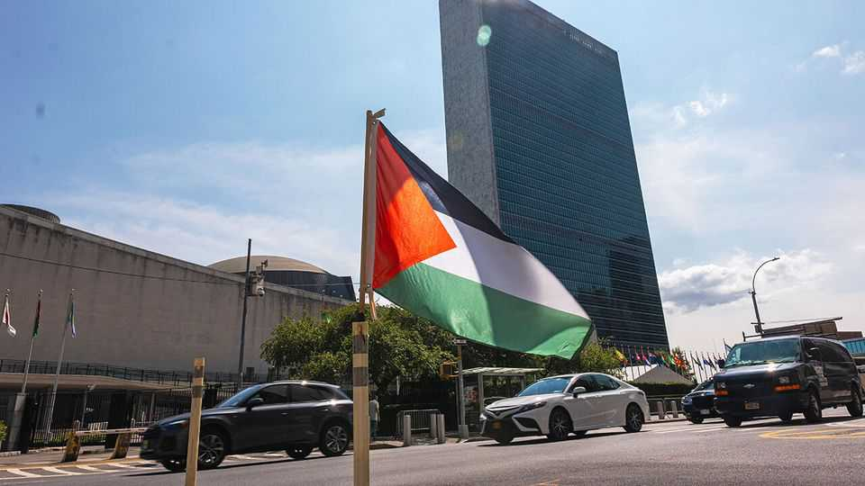

Middle East & Africa | Twaddle at Turtle Bay
It will take more than speeches to change Israel’s policy toward the Palestinians
European and Arab leaders say peace is urgent, but act as if it is not
September 25th 2025

EHUD BARAK, a former prime minister, famously warned in 2011 that Israel could face a “diplomatic tsunami” within six months if peace talks with the Palestinians remained moribund. The deadline came and went, and Binyamin Netanyahu, the longer-serving prime minister, grew fond of mocking Mr Barak’s prophecy: “What tsunami, what isolation,” he said in 2017. “What nonsense!” Yet 174 months after Mr Barak’s warning, Mr Netanyahu sounds like his rival. In a speech on September 15th he acknowledged that Israel was indeed becoming isolated. The solution was to become “super-Sparta”, he argued, and “adapt to an economy with autarkic characteristics”.

A week later world leaders gathered at the UN where France and Saudi Arabia led a summit to push for a Palestinian state. “The time has come for peace, because in an instant it may be beyond our grasp,” said Emmanuel Macron, the French president. “We can no longer wait.” To that end ten Western countries, including Britain and France, announced in September their recognition of Palestine’s statehood.

There is a curious thing about this tsunami, though: everyone is still trying to hold it back. In July the entire Arab League condemned the October 7th massacre and called on Hamas, the Palestinian militant group that perpetrated it, to disarm. Even countries that do not recognise Israel agreed to denounce its foe. Egypt, Jordan and Gulf states want to play a role in post-war Gaza. They have spent two years discussing plans, most recently at a meeting with Donald Trump on September 23rd.

Ahmed al-Sharaa, the Syrian president, told audiences in New York this month that he was willing to sign a security pact with Israel. It is not implausible to think Lebanon will do the same. Elsewhere, the United Arab Emirates (UAE) has maintained ties with Israel despite the Gaza war; Saudi Arabia is still willing to negotiate its own normalisation deal (albeit with more conditions than it once had).

Put this all together, and Israel has a chance at peace with all its neighbours; closer ties with Arab states further afield; and regional help to uproot Hamas from Gaza. A decade ago this might have tantalised Israeli strategists. Today Mr Netanyahu’s government treats it with disdain.

Not for the first time, global diplomacy is out of step with what Israelis or Palestinians want. Israel was founded in 1948 after the UN voted to divide Palestine into two states, one for Jews, the other for Arabs. The latter rejected the scheme and went to war. The 1990s brought the Madrid peace conference, the Oslo accords and a host of other diplomatic efforts, none of which overcame rejectionists on both sides.

The dilemma this time is twofold. First is political will. A Pew survey earlier this year found that just 21% of Israelis think their country can coexist peacefully with a Palestinian state. Almost two-thirds of Palestinians tell pollsters that a two-state solution is no longer feasible. Mr Macron may

think a peace deal is urgent, but a majority of Israelis and Palestinians think it is either unfeasible or undesirable.

Second is motivation: neither side, but particularly Israelis, believes the world is serious about pushing for a settlement. In private, Arab leaders argue that Israel faces a decision: embrace a plan for regional peace and integration, or isolate itself by charging ahead with war and annexation.

Yet in public they have not made this binary clear to Israelis, which allows Mr Netanyahu’s government to insist it is a false one. Muhammad bin Salman, the Saudi crown prince, did not even address the summit in New York. That fell to Faisal bin Farhan, the foreign minister, who gave the sort of threadbare speech countless Arab diplomats have given before.

The same goes for Europe. Most EU members now recognise Palestine; unless their declarations are paired with tangible actions, though, it will be easy for Israelis to dismiss them as mere symbolism. Many were horrified by Mr Netanyahu’s Sparta speech. But Europe and the Arab world will have to do more to convince them that it is becoming reality—and that a better alternative exists. ■

Sign up to the Middle East Dispatch, a weekly newsletter that keeps you in the loop on a fascinating, complex and consequential part of the world.

This article was downloaded by zlibrary from https://www.economist.com//middle-east-and-africa/2025/09/25/it-will-take-more- than-speeches-to-change-israels-policy-toward-the-palestinians