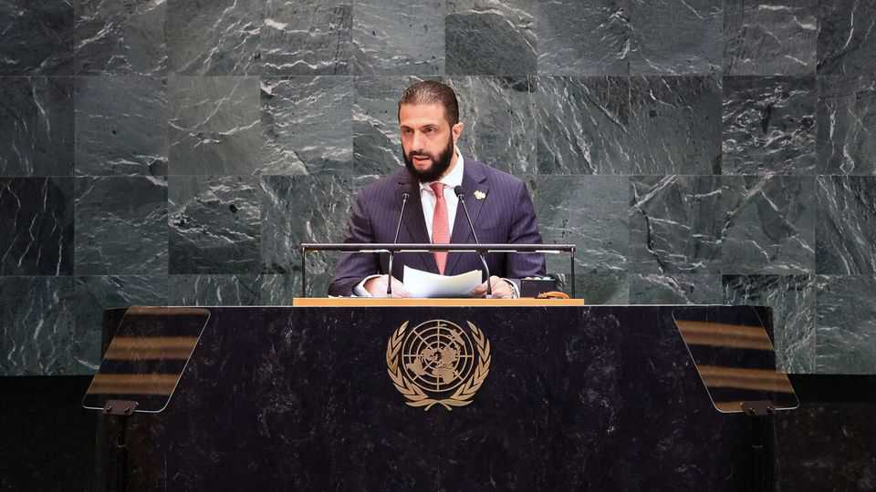

Middle East & Africa | Ahmed al-Sharaa woos the world
Syria’s new leader makes a star turn in New York
But his problems at home may undermine his relations with America
September 25th 2025

The slightly awkward handshake in Manhattan between Ahmed al-Sharaa (pictured), Syria’s al-Qaeda-operative-turned-statesman, and David Petraeus, one of America’s most famous generals, was the first in a string of moments that would have seemed unthinkable just a year ago. Nearly ten months after ousting Bashar al-Assad, Syria’s longtime dictator, on September 24th Mr Sharaa addressed the un General Assembly, the first Syrian leader to do so in almost 60 years. The man who once waged jihad against American forces in Iraq was now the hottest ticket in New York. The trip marked the peak of Mr Sharaa’s campaign to win over America. At first glance, it seems to be working. Tom Barrack, America’s ambassador to Turkey and Donald Trump’s envoy to Syria, ushered Mr Sharaa and his

foreign minister, Asaad al-Shaibani, along America’s corridors of power. There were photos with senators. But Mr Sharaa’s growing problems at home may yet undermine his efforts to make his mark abroad.

The Syrian leader’s biggest concern is the sanctions that remain in place on his country. In May Mr Trump announced that he would lift a slew of American ones on Syria. Yet the most suffocating of them, the Caesar Act, is stuck in Congress and is now the subject of political horse-trading.

Those pushing for the repeal say they have as little as four weeks to attach it to the National Defence Authorisation Act. Hawkish Republicans, led by Lindsey Graham, are adding amendments that would place unrealistic demands on Syria before the sanctions can be lifted.

Mr Sharaa is keen to reassure his detractors. “Syria will not pose a threat to any country, including Israel,” he told a packed audience at a glitzy private members’ club in midtown Manhattan. The real risk, he said, comes from Israel’s provocations. After the event Mr Barrack suggested that the “de- escalation deal” whereby Israel would stop bombing Syrian targets in return for commitments from Syria which include not redeploying heavy weaponry in a buffer zone south of Damascus was nearing completion.

But even as Mr Sharaa was feted in New York, in Syria the atmosphere is becoming bleaker. His rule shows little sign of the “inclusiveness” he promised. The partial lifting of sanctions has not benefited most Syrians much. And businessmen and bankers in Damascus say they see the emergence of a cronyism reminiscent of Mr Assad’s rule. Mr Sharaa has appointed his three brothers and a brother-in-law to key positions. Foreign diplomats were shocked to find his foreign minister had moved into the Tishreen Palace, a former residence of Mr Assad. “How do they think this looks?” said a European ambassador. Traders whisper about being forced into partnerships with people in Idlib, the province that Mr Sharaa and his rebels once ruled.

“Many are sceptical that they are building a state based on rule of law,” says Moutasim Syoufi, director of The Day After, a group in Damascus that promotes Syrian democracy. Elections for a People’s Assembly in the coming weeks are seen as a farce. Lists are being stacked with those publicly

loyal to Mr Sharaa. Long-standing opposition figures are being excluded. There will be no universal suffrage; electoral colleges selected by the government will choose candidates from pre-screened lists. Political parties are still banned.

At his midtown event, Mr Sharaa was keen to emphasise the importance of rebuilding institutions. But most decisions are taken by half a dozen of his closest allies, among them his brothers. Foreign investors say they have to chase his brother, Hazem, rather than the appropriate ministers. Those trying to work with the government say this structure is undermining efforts to rebuild institutions.

Most damaging has been his government’s failure to realise the extent to which sectarian violence has alienated minorities. “This government has become an existential threat in the eyes of many Druze,” says a Druze businessman who had been attempting to mediate. The violence in July in Suwayda, a province dominated by the Druze minority, also seems to have hardened the resolve of Kurdish forces in the north-east not to put down their weapons and join the new government.

The risk of more such violence poses the greatest risk to the flourishing new friendship with America. Mr Barrack is Mr Sharaa’s biggest champion in Washington, but even he admits that if another Suwayda occurs, where Mr Sharaa lost control of his security forces, the love-in could fizzle. Another such episode would probably mean that sanctions would remain. Those lobbying for him will find it much harder if he continues to make mistakes at home.

Some in Damascus worry that Mr Sharaa will take the wrong message from his trip to America. While General Petraeus may have declared himself a fan of his, “what he really needs is some tough love,” says a leading foreign official working on Syria. As Geir Pedersen, the UN’s outgoing envoy to Syria, said this week, Mr Sharaa’s legitimacy at home will not come from a podium in New York. ■

Sign up to the Middle East Dispatch, a weekly newsletter that keeps you in the loop on a fascinating, complex and consequential part of the world.

This article was downloaded by zlibrary from https://www.economist.com//middle-east-and-africa/2025/09/24/syrias-new-leader- makes-a-star-turn-in-new-york