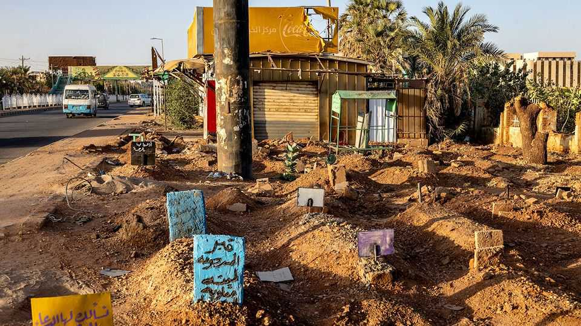

Middle East & Africa | Africa’s missing war dead
Measuring mortality is getting even harder in Africa
One estimate puts deaths in the war in Tigray at 5,325; another at 600,000
September 25th 2025

As a number, 150,000 is usefully round. In May 2024 Tom Perriello, then America’s special envoy to Sudan, told Congress that anywhere between 15,000 and 150,000 people might have died in the 13 months of the country’s civil war. The higher number stuck, though it was just a guess. It was a necessary one. Until then, the most common death toll cited by the media and the un was 20,000, based on fatality figures compiled by the Armed Conflict Location and Event Data project (acled), an America- registered monitor that tracks reports of political violence. But acled counts fatalities only when it has specific data for them, such as media reports. Adding those up can give only a lower range in a conflict, and often a poor

one. According to a study in 2024 by researchers at the London School of Hygiene and Tropical Medicine (lshtm), more people were killed by bombs and bullets just in the capital, Khartoum, over the same period. Such relatively low estimates may help explain why Sudan’s conflict is ignored by so many. And yet accurately tallying deaths in conflicts across Africa is getting harder.

Take Ethiopia’s war in Tigray, fought between 2020 and 2022. According to acled at least 5,325 people died in the region as a result of direct combat or violence targeting civilians. Yet the most commonly cited death toll for the conflict is 600,000, based on a claim made by Olusegun Obasanjo, then the African Union’s envoy to the Horn of Africa. This was probably based on an estimate of civilian deaths made by a team at the University of Ghent in Belgium. A more recent study carried out by lshtm researchers put the number killed, including by war-induced hunger and disease, at closer to 102,000. (These tallies all exclude fatalities outside Tigray.)

Such wide discrepancies are common. Two decades ago Leslie Roberts of Columbia University helped conduct a pioneering mortality survey that uncovered millions of previously unrecognised deaths during the second Congo war, from 1998 to 2003. In 2023 he and colleagues published the results of a similar study in the insurgency-racked Central African Republic (car). It found that 5.6% of the car’s people had died in 2022 alone, up to four times the un’s mortality guess.

Several factors explain why counting the dead is hard in African conflicts. Straightforward body counts, such as those produced by acled, rely primarily on media reports of violent deaths. Access to reliable telecoms can determine whether an incident gets into the news, notes Jake Shapiro of Princeton University. Ethiopia’s government switched off the internet in Tigray for months to prevent word of wartime casualties getting out. In South Sudan about 85% of the population is offline because telecoms are ropey. That probably explains why in 2024 acled rated Kenya “more dangerous” than both South Sudan and the car.

Estimates that include deaths caused indirectly—by the collapse of medical care, sanitation and food supplies—often give a fuller picture of a conflict’s severity. But they require baseline population data that are often absent in

Africa. Neither Ethiopia nor Nigeria—Africa’s most populous countries— has carried out a national census in nearly 20 years. Congo’s last one was in 1984. So researchers may rely on un surveys, which can be fragmentary or out of date. The un’s mortality estimates for the car were based on data collected only from areas controlled by the government.

Measuring “excess deaths”—the number of deaths beyond those expected in any normal year—in a war zone requires reliable records. But Africa has the most incomplete death registers of any continent, according to a study by Ariel Karlinsky of the Hebrew University of Jerusalem. Maysoon Dahab and colleagues at lshtm had to limit their recent mortality survey in Sudan to Khartoum, in part because registers elsewhere in the country were too patchy. A similar study she helped run in Gaza last year was easier because the relevant pre-war systems were much better.

Numbers matter. The news that 2.5m could have died in Congo in the early 2000s helped spur a big increase in Western aid. Yet Michael Spagat of Royal Holloway University of London fears the continent is now on the cusp of a new “data dark age”. Civil wars are lasting longer. Weary donors are less keen to fund mortality surveys; recent aid cuts could jeopardise them entirely. America’s Demographic and Health Surveys, which produced nationally representative household surveys across Africa, were ended this year.

Compounding the problem, notes Mr Roberts, is that governments in Africa are becoming more hostile to independent body counts. Some outsiders no longer want to do them. Médecins Sans Frontières (msf), a medical charity, did not publish its mortality survey in Tigray for fear that Ethiopia’s government would retaliate by restricting access to the region. msf’s decision probably saved lives—but no one will ever know how many. ■

Sign up to the Analysing Africa, a weekly newsletter that keeps you in the loop about the world’s youngest—and least understood—continent.

This article was downloaded by zlibrary from https://www.economist.com//middle-east-and-africa/2025/09/25/measuring-mortality- is-getting-even-harder-in-africa