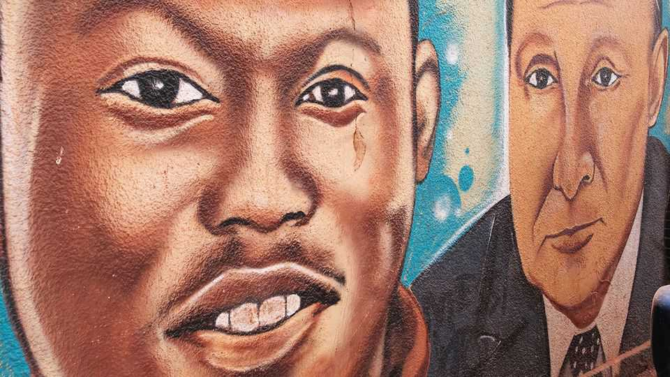

Middle East & Africa | Cyber-nationalism in the Sahel
Burkina Faso’s strongman has gone viral
He may have had a little help from his Russian friends
September 25th 2025

His American accent is generic, his facial features a touch blurry. But the words have a ring of truth to them. “Africa must unite,” says the ai- generated likeness of Ibrahim Traoré, Burkina Faso’s 37-year-old president. And then, after a pause: “Vladimir Putin: I am grateful and thankful for all the support you have given me.” The Burkinabé strongman, who took power in a coup in 2022, is an online sensation. On social media, especially TikTok, a mix of authentic and deepfake video clips portray Mr Traoré as a pan-Africanist revolutionary standing up to the West. Many are shared by anonymous accounts with names such as “REAL IBRAHIM TRAORÉ”, and can attract millions of views and shares. At home Mr Traoré is struggling to quell a jihadist

insurgency, but abroad he is a “symbol of anti-neocolonialism”, says Will Brown of the European Council on Foreign Relations, a think-tank.

Many suspect that Russia, a close ally, has boosted Mr Traoré’s promotion online. Several of the most popular accounts exhibit telltale signs of “inauthentic behaviour”, such as co-ordinated activity and the promotion of exclusively ai-generated content, according to analysis shared with The Economist by bloom Social Analytics, a business-intelligence firm. This suggests they may be troll farms, a model for spreading disinformation pioneered in Africa by Russia’s Wagner Group, a mercenary outfit. “It is safe to assume that these accounts are either directly piloted by the Kremlin or they are controlled by local influencers who are paid—most of the time through an intermediary—by the Kremlin,” says Berke Alikasifoglu of bloom.

It would be a mistake to dismiss the campaign as merely an online phenomenon. Mr Traoré’s criticisms of the West—particularly of France, Burkina Faso’s former coloniser—resonate widely in Africa. The president’s face can be seen on T-shirts and flags across neighbouring countries such as Ghana. “I am 100%” behind him, says David Zamana, a Ghanaian journalist. General disillusion with democracy combined with rising support for military rule can be seen across the continent, according to Afrobarometer, a pollster.

Nor are Africans simply pawns of Russian manipulation. In neighbouring Mali, which has been under military rule since 2021, opposition to the West had been driven by local digital influencers known as “vidéomans” well before Wagner’s arrival there. The vidéomans still dominate Malian media. “Everybody listens to them,” says Fatouma Harber, a Malian blogger. Many have ties, allegedly including financial ones, to the government. But sometimes they simply share the authorities’ views.

Still, Russia is no doubt fanning the flames. Wagner alone once had a budget of $35,000 per month to spend on social-media influencers, according to a recent study. The Africa Initiative, a Kremlin-linked media outlet staffed by ex-Wagner operatives, now has offices in Mali and Burkina Faso. Because they often earn little from their regular work, “there’s a massive profit incentive for local journalists and influencers” to air the Kremlin’s

narratives, notes Mr Brown. Mr Traoré—and his many ai avatars—can probably expect to play well online for some time yet. ■

Sign up to the Analysing Africa, a weekly newsletter that keeps you in the loop about the world’s youngest—and least understood—continent.

This article was downloaded by zlibrary from https://www.economist.com//middle-east-and-africa/2025/09/25/burkina-fasos- strongman-has-gone-viral

Europe

Ukraine faces deepening military, political and economic problems What happens when Ukraine stops fighting? Why France is thinking of targeting the super-rich Can’t anyone get Germany’s trains to run on time? Europe wants to turn frozen Russian assets into Ukrainian firepower