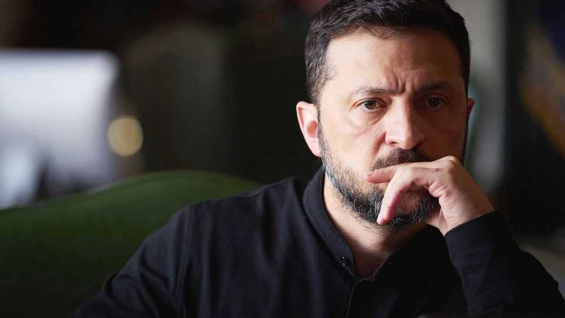
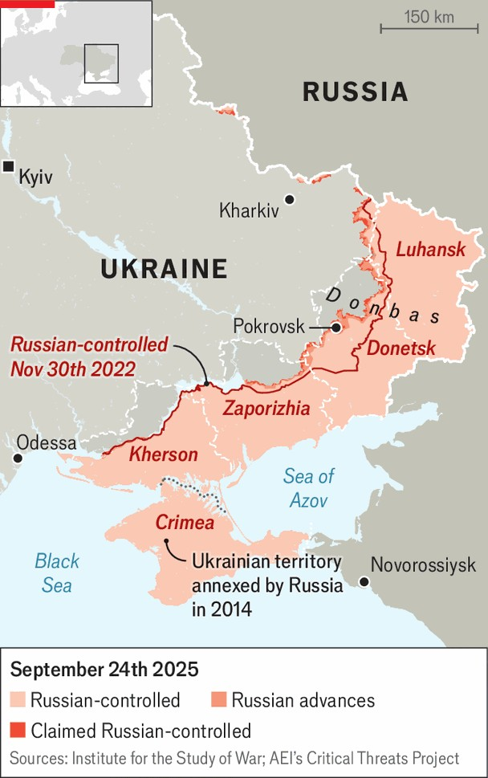
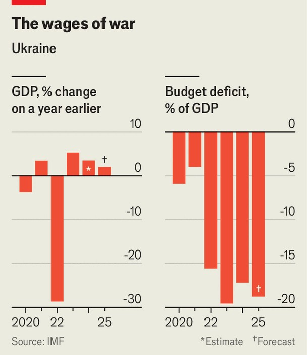

Europe | Turning hollow
Ukraine faces deepening military, political and economic problems
A report card on Ukraine 2.0
September 25th 2025

TWO YEARS ago this newspaper outlined a vision of a “Ukraine 2.0”, led by reformers in government and citizens outside. We acknowledged that it had little hope of recovering its lost territory, at least as long as Vladimir Putin remained in the Kremlin. But if Ukraine could emerge secure, democratic and prosperous even within a shrunken frontier, that would be a form of victory. Today, the country is struggling on all of those three counts. Ukraine is clearly surviving, but it is gradually being hollowed out and losing room for manoeuvre. “We can fight for years, losing positions slowly,” says one senior official. “But the question is why?”

Take the situation on the ground first. Compared with what might have happened, it remains impressive. Three and a half years in, Russia has failed militarily, even if Ukraine is bleeding, too. Mr Putin has not even managed to overrun Kharkiv, just 35km from the border, let alone Kyiv. The flow of goods through Ukraine’s deep-sea ports surpasses pre-war volumes. Russia’s warships have taken refuge in distant Novorossiysk, shut out of the Black Sea by Ukraine’s naval drones.

The front lines have not shifted significantly since November 2022. Fighting continues for the small city of Pokrovsk (pre-war population: 60,000) in the Donbas, for instance, well over a year after it began. At least a million Russian troops have died or been wounded. Ukrainian innovation has meanwhile turned the front lines into a jungle of drones; any movement in a 40km “grey zone” is a gamble with death. Ukraine can maintain this kind of defence for a long time.

Ukraine stands because its people insisted on it. Much of the country’s security backbone grew independently of a weak state, and often despite it. Parallel networks of society, business and soldiers patched gaps left by a defence ministry that insiders call “the chaos ministry”. World-leading drone companies began in spare rooms and garages. “When the bureaucracy stalls, small structures create what the country needs,” says an intelligence officer.

The problem, however, is that Russia often copies and then mass-produces Ukraine’s innovations quicker than Ukraine can. Conscription meanwhile is getting harder, and more violent. The infantry is critically understaffed. Early in the war, Ukrainians paid bribes to get to the front lines and fight. “Now they just run,” says “Fantomas”, a former conscription officer. “The system broke down last year.”

It is hard to see a route to Ukrainian victory without a much wider, but politically very difficult, level of conscription. Recruits would need to be dragged from civilian industries. Politicians’ sons, now often protected, would have to join up. A Trump-imposed compromise may be the best Ukraine can hope for. The senior official insists the outlines of a deal are already clear, but most in the armed forces are pessimistic, readying for the long fight to continue. Serhiy Kyslitsya, Ukraine’s deputy foreign minister and a senior negotiator, does not expect a diplomatic breakthrough: “If I said Russia is selling bullshit, that would be unfair to fertiliser. They are selling air.”

If Ukraine is running out of men, it is, secondly, also running short on democratic legitimacy. “Trust has broken down between government and society,” says the senior official. Discontent came to a head in July, when the government clumsily tried to rein in two independent anti-corruption agencies because their investigations were getting too close to the top. Concern from foreign allies and popular opposition forced the government to back down.

The protests near the presidential compound, the first anti-Zelensky demonstrations in the country since the start of the war, were a turning- point. “There will forever be a before and after,” says another top official. “It exposed crisis in government, panic in the face of protest.” It was a moment when the people checked an abuse of power. Their handwritten placards not only gave the protests a name—the “cardboard revolution”—but accused those in the offices above of sins beyond the immediate scandal. “You aren’t a tsar,” read one. “If you stole less, I’d bury my friends less,” said another.

Elected in 2019 in a landslide and with full control of parliament, Mr Zelensky wields more formal power than any presidential predecessor. War, and his brave decision to remain in Kyiv and inspire the nation to fight,

allowed him to centralise further. But his rise as a cult hero in the West has encouraged a worrying degree of hubris. “Zelensky was more democratic at the start, but all the applause sent him to space,” says another insider. “He began to believe in destiny.” Decisions now flow through a shrinking circle of confidants. Most prominent among them is Andriy Yermak, his chief of staff, a bruiser whose power does not seem warranted by his experience or his mandate as an unelected official. One former minister describes Mr Zelensky and his aide as “alter egos”, in effect running a joint presidency.

Whoever is in charge, the presidency has sunk into some of Ukraine’s old vices. It has threatened opposition media and their advertisers; unleashed lawfare against political opponents, including Petro Poroshenko, a former president; and overseen shakedowns by the domestic-security service. Allegations of ties to Russia are a common tool of extortion. One industrialist tells of a colleague forced to pay $2m to escape such a charge.

Many hoped that the July protests, and the presidential U-turn they forced, might check the overreach. Developments since then suggest otherwise. On September 6th news broke of a scarcely believable Ukrainian operation: the snatching of Fedor Khristenko, a disgraced ex-MP charged with treason, from hiding in the UAE. The interest in him was apparently less about alleged crimes than compelling him to testify against an anti-corruption detective probing the president’s inner circle. The season of scandal is far from over.

Thirdly, war has eroded Ukrainians’ faith in the future, with worrying consequences for the economy. In one primary school in Kyiv’s central Pechersk district, first-year numbers have fallen by two-thirds. The UN estimates that more than 5m people have fled from Ukraine. Most will not return, predicts Ella Libanova, a sociologist. Business, already crippled by blackouts and Russian missiles, is suffering from a labour shortage. Many men are fighting or hiding from conscription. Many mothers are staying at home, ready to shield children from the next explosion.

In such trying conditions, growth of 2-2.4% this year counts as success. Growth next year should be similar, ceasefire or not. Oleksii Sobolev, Ukraine’s economy minister, notes that a third of the growth comes from defence and tech firms.

EU membership remains elusive, but is still the Holy Grail: a prospect that can induce citizens to accept painful reforms. “Many still [naively] believe they can be a Texas of the EU,” says Taras Kachka, Ukraine’s new deputy prime minister for European integration. Progress so far has been patchy. Political obstacles—including Hungary’s pro-Moscow leader, Viktor Orban, and the interests of Polish farmers—stand in Ukraine’s path. But Mr Kachka is trying to jump-start the process with a plan to enact the necessary regulatory changes by 2030. “We have four years and cannot miss a single day.”

There are more pressing concerns. Russia’s invasion has blown a hole in Ukraine’s fiscal position. The country now survives on foreign life-support, with all the distortions that brings. Tax and domestic borrowing are only enough to cover core military spending, about two-thirds of the budget. Even the rosiest forecasts leave a $45bn shortfall next year. Western pledges currently fill at most $27.4bn of that. “We have got to a situation where there

is no money,” despairs an official. “And Europe alone doesn’t have the money needed to bring us back to life.”

Both of the two roads that are now open to Ukraine—uneasy truce or prolonged warfare—are grim. “If the war ends we at least have a chance to crawl out,” says another insider. But peace would bring problems of its own: rebuilding a wrecked economy; looking after traumatised returning soldiers; resentment; and paying for a new army with less foreign support. Sustaining the war effort is certainly possible, but it will further hollow out the country. If the war drags on, making elections difficult, Mr Zelensky will have to find something other than his role as Ukraine’s chief warrior to renew his legitimacy.

Clearly, elections should take place as soon as security allows. The government appears to be readying for a vote next year, should peace talks succeed—and if its ratings remain high enough. Internal polling seen by The Economist suggests Mr Zelensky could win re-election were he to stand. As of today, he would lead his nearest likely rival, his sacked commander-in- chief Valery Zaluzhny, in a first round, though he might then lose in the second. Many Ukrainians are unconvinced by either likely candidate.

Any report card on Ukraine should clearly not exclude hope. Since our assessment two years ago civil society and the private sector have evolved, and now spur on many aspects of the country. The progress of Ukrainian business; the economic and digital-transformation ministries; the army and the defence industries are all impressive. But essential parts of the central government are regressing. Though he saved Ukraine through his own personal bravery, Mr Zelensky now seems to be running out of road. It is far from clear that he knows how to find a new path. ■

To stay on top of the biggest European stories, sign up to Café Europa, our weekly subscriber-only newsletter.

This article was downloaded by zlibrary from https://www.economist.com//europe/2025/09/23/ukraine-faces-deepening-military- political-and-economic-problems