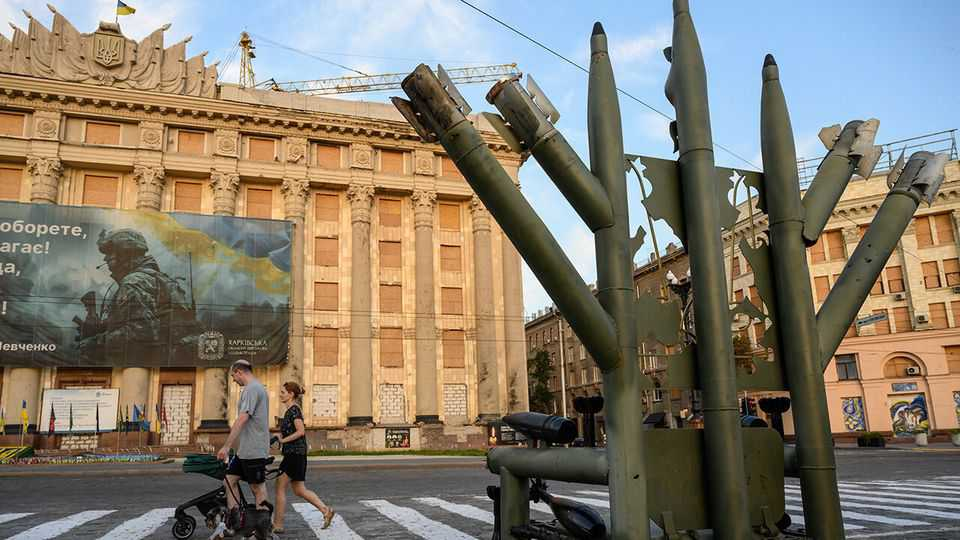

Europe | After the war
What happens when Ukraine stops fighting?
Rival forces will battle it out
September 25th 2025

“We are exceptionally close to the end,” Keith Kellogg, America’s special envoy to Ukraine, said at a recent conference in Kyiv. As Russia battles to complete its conquest of Ukraine’s south-eastern Donbas region, both countries are approaching the limits of what is achievable by military means. The mood in each country shows little enthusiasm for carrying on the fighting. Desertion rates are high in both. Some 58% of Russians would accept a ceasefire without preconditions, according to a poll by Russian Field, though Vladimir Putin may not pay much attention. A similar 59% of Ukrainians, says the Ukraine Rating Group, would accept a compromise on a de facto loss of territory, if that brought a ceasefire. Few believe there will be a formal peace; but many expect a pause that could last anything between six months and six years.

So the interesting question is, increasingly, not when will the fighting stop, but what happens next. The perception of success or failure depends less on territory, and more on the ability to prevent a further attack and on the stability of internal politics in Ukraine. “What is important is not just where the [ceasefire] line is, but what is behind that line and what is in people’s heads,” says Valery Zaluzhny, the former commander of Ukraine’s armed forces and now its ambassador in London.

From the time when Mr Putin first struck Ukraine in 2014, his goal was to stop a kindred Slavic nation breaking off and joining the West. For the West, drawing Ukraine into its fold was a test of its own superiority. As Henry Kissinger, a former American secretary of state, wrote a week after Russia’s annexation of Crimea, “Far too often the Ukrainian issue is posed as a showdown: whether Ukraine joins the East or the West.” The only way for Ukraine to survive and thrive, he argued, is to join neither, but serve as a bridge between the two; and he cited Finland, a prosperous and at that time still non-NATO country.

In February 2022, Mr Putin blew up that bridge, hoping to eliminate the option of Ukraine ever leaving the Russian sphere. In May 2023 Kissinger, who had strongly opposed inviting Ukraine to join NATO, told The Economist that having armed it to the teeth, the West now had no choice but to take Ukraine into the alliance—because leaving Ukraine as the best- armed country in Europe unanchored and unconstrained was dangerous.

The war, he predicted, would end in both sides being dissatisfied with the outcome. “So, for the safety of Europe, it is better to have Ukraine in NATO, where it cannot make national decisions on territorial claims.” He envisaged an enhanced, independent Ukraine, closely tied to Europe.

But two years on, the prospect of Ukraine being anchored in Western security and economic structures seems far less certain. Membership of NATO has been all but ruled out. President Donald Trump has offloaded the responsibility for Ukraine on to Europe. Niall Ferguson, a historian at the Hoover Institution, says that “people are still struggling to absorb it, but Trump has written the United States out of the script. It is Europe’s war.”

And although Europe’s economies are ten times the size of Russia’s, “you don’t win wars with GDP, you win it by turning GDP into [military] stuff, and we are only at the beginning of this process,” says Radek Sikorsky, the Polish foreign minister.

The chances of Ukraine joining the European Union any time soon are also looking more doubtful, as politics and public opinion in key member states turn from enthusiasm to fatigue. At the start of the war 75% of Poles supported Ukraine’s membership of NATO. Now 53% oppose it, while the share of supporters has fallen to 34%. The mood is also changing in Ukraine. Four years of war have given it more confidence and confirmed its identity, giving rise to the idea of Ukraine as a new middle power— Westward-leaning but non-aligned. The majority of Ukrainians (52%) would prefer the steady financing and arming of Ukrainian forces to the deployment of foreign troops on its territory (35%), according to the Ukraine Rating Group. “With alliances changing, we should not be anybody’s frontier, but look after our interests not as an anti-Russia project, but as project Ukraine,” says Yulia Mostovaya, the editor of ZN.ua, an online newspaper.

As Yaroslav Hrytsak, a Lviv-based historian, explains, Ukraine has long been a democracy more by default than by institutional design. Its liberties were grounded not in independent courts or in parliament, but in the pragmatism of power groups, the diversity of regions, the weakness of the central state, and perhaps above all the ability of its people to come together at moments of crisis. Ukraine’s muscular version of democracy has served it well during times of war but leaves it vulnerable in times of peace.

So there are plenty of risks. The country’s most effective units are semi- autonomous armies with their own financial, media and political resources and loyalties. In time of war these are aligned in fighting the enemy. But once the fighting stops, and in the absence of a well-functioning political process, they might revert to pursuing their own interests. The feeling of being let down by allies is already fuelling resentment towards the West. Disagreements over language and identity could fuel nationalism. Questions over the conduct of war, corruption and inequality could lead to score- settling. The hard work of real reform, Mr Hrytsak says, lies ahead. ■

To stay on top of the biggest European stories, sign up to Café Europa, our weekly subscriber-only newsletter.

This article was downloaded by zlibrary from https://www.economist.com//europe/2025/09/24/what-happens-when-ukraine-stops- fighting