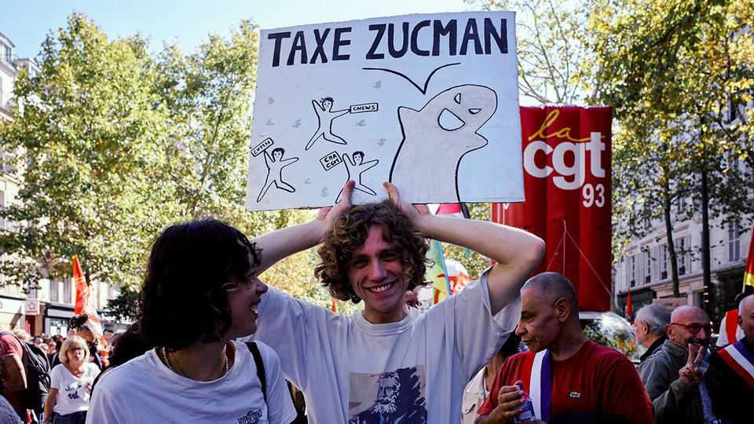
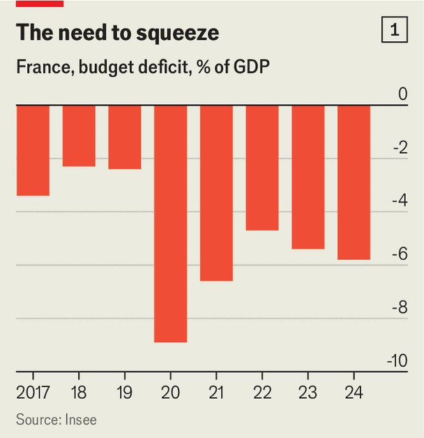
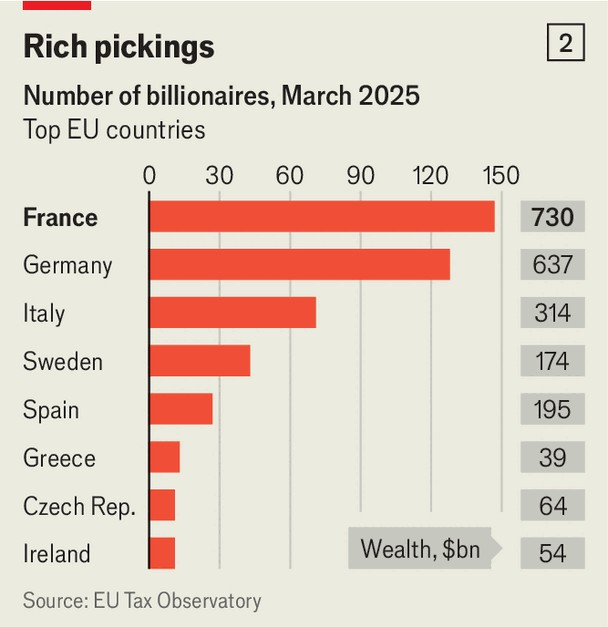

Europe | French public finances
Why France is thinking of targeting the super-rich
Handbags, champagne and a row over a possible new wealth tax
September 25th 2025

France may supply the world with luxury handbags and vintage champagne, but it seems to dislike those wealthy enough to splash out on such fripperies. As the country grapples with how to curb the budget deficit (see chart 1), the latest national psycho-drama concerns a proposed new tax on the ultra- riches. On September 21st even Bernard Arnault, the usually discreet head of LVMH, purveyor of luxury, and France’s richest man, joined in, arguing that the tax would “destroy” the economy. The row stems from a proposal by Gabriel Zucman, an economist, to tax wealth of over €100m ($117m) at 2% a year. This would touch the richest 1,800 households, a fraction of the 358,000 that paid the old wealth tax,

abolished by President Emmanuel Macron in 2018. Mr Zucman says the tax could raise €15bn-25bn a year.

The taxe Zucman has become a totem for the left, some of whose leaders want it introduced as a condition for backing a budget for 2026. This is currently under negotiation by the new prime minister, Sébastien Lecornu, who was appointed on September 9th after parliament brought down the previous minority government. Mr Lecornu has been holding talks with opposition parties in the hope of securing a non-aggression pact with the Socialists and others over the new budget.

The French tax and welfare system does a thorough job of correcting inequality. The overall tax take in France, at 46% of GDP, is the highest in the EU. Yet while the fortunes of the super-rich in France have soared, the top 0.01% of households, Mr Zucman calculates, pay a lower tax rate than everyone else due to tax-optimisation vehicles. The average effective tax rate in France, he estimates, is 50%. Billionaires, of which the country has the most in the EU (see chart 2), pay 27% of their income.

For the left, the real appeal of the taxe Zucman is symbolic. After Mr Macron got rid of the old wealth tax, to try to dispel the country’s image as a place that punishes wealth creation, he was dubbed the “président des riches”. No matter that, as Mr Arnault told the Senate in May, LVMH paid nearly €3bn of tax last year in France alone. A poll this month suggested that 86% approve of the taxe Zucman, including 96% of Socialist voters and 75% of those who back the hard-right National Rally.

The tax, however, has plenty of holes. One is its narrow base; nobody knows how a small number of families would behave if it were introduced. Other French economists estimate that, thanks to tax exile, optimisation and other factors, it would bring in only €5bn. Another is what would happen to startup founders. Arthur Mensch, the 33-year-old co-founder of Mistral, an AI firm now worth $14bn, went on television to try to explain why his wealth is virtual. Entrepreneurs, suggested Mr Zucman, could pay “in kind”, by handing shares to the state, or borrow to pay it. Mr Arnault called Mr Zucman “a far-left activist”.

Mr Lecornu is treading a perilous path. The left wants a measure big enough to claim victory over Mr Macron’s centrists. Yet the prime minister cannot afford to lose centre-right support. Someone who has seen Mr Macron recently says the president knows that the price of political stability is a

concession to the left. But the price of that concession may be the business- friendly image of France he has put so much effort into putting in place. ■

Subscribers to The Economist can sign up to our Opinion newsletter, which brings together the best of our leaders, columns, guest essays and reader correspondence.

This article was downloaded by zlibrary from https://www.economist.com//europe/2025/09/25/why-france-is-thinking-of-targeting- the-super-rich