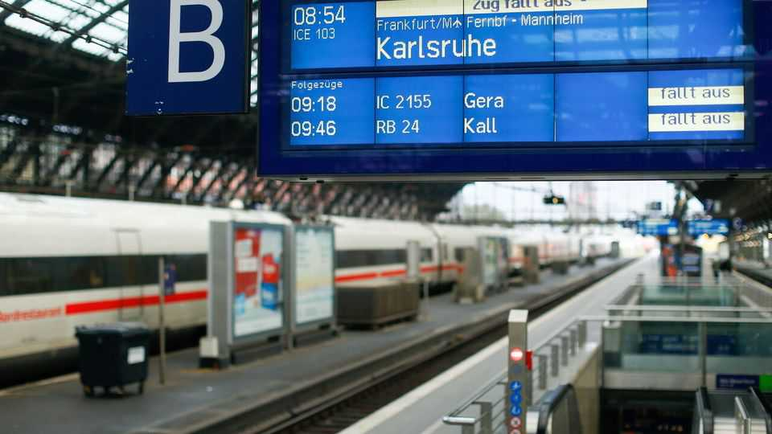

Europe | Weeping and railing
Can’t anyone get Germany’s trains to run on time?
The latest attempt to fix the pitiful performance of Deutsche Bahn
September 25th 2025

DEUTSCHE BAHN has only four enemies, runs the gag: spring, summer, autumn and winter. German trains did once run on time. But these days moaning about the risible performance of the state-owned rail giant is a national sport. Last year barely 60% of long-distance trains arrived on time, leaving Germany near the bottom of the European pack. Visitors expecting fabled German efficiency are often shocked. The national auditors have said Deutsche Bahn is in a “deepening, permanent crisis”. For the growing ranks of Germans who grumble that nothing works any more, trains may be the biggest complaint of all.

That message has been heard. Unveiling a new strategy for Deutsche Bahn on September 21st, Patrick Schnieder, the transport minister, said it was “extremely dangerous” that many Germans regard the railways as a form of state failure. He downgraded the previous “unattainable” punctuality targets to a promise that 70% of trains will run on time by 2030, promised facelifts for stations and trains, pledged to unbundle Deutsche Bahn’s infrastructure arm, and appointed a new ceo. His choice, Evelyn Palla, is a company insider, most recently restoring its regional-train division to profitability. But she began her rail career in the much more successful Austrian system. Lukas Iffländer of Pro Bahn, a lobby group, says he has “huge confidence” in her.

But she will have her work cut out. Loss-making and burdened with debt, Deutsche Bahn is contending with years of underinvestment. Capacity has not kept pace with rising passenger numbers. Soaring Trassenpreise (a toll charged to all rail operators) have led to fears that loss-making long-distance services may be cut and fares increased. Under eu rules, Deutsche Bahn’s freight arm must somehow turn a profit next year. A planned refurbishment of 40 big rail routes over the next 12 years means performance may get worse before it gets better. Morale among the 211,000 workers in Germany is at rock-bottom.

Two things must be done quickly, says Christian Böttger, a transport expert at the Berlin University of Technology and Economics: cut back some services in big cities lacking rail capacity, and rein in the Trassenpreise. In the longer term he advises decentralising decision-making and ensuring long-term stability in budgeting, as in Austria, to enable managers to plan properly. Thanks to bottlenecks and labour shortages, he says, much of the money that has flowed into the railways in recent years has simply stoked inflation. With more to come via Germany’s new €500bn ($590bn) climate and infrastructure fund, Mr Schnieder and Ms Palla must be careful not to get off track. ■

To stay on top of the biggest European stories, sign up to Café Europa, our weekly subscriber-only newsletter.

This article was downloaded by zlibrary from https://www.economist.com//europe/2025/09/25/cant-anyone-get-germanys-trains-to- run-on-time