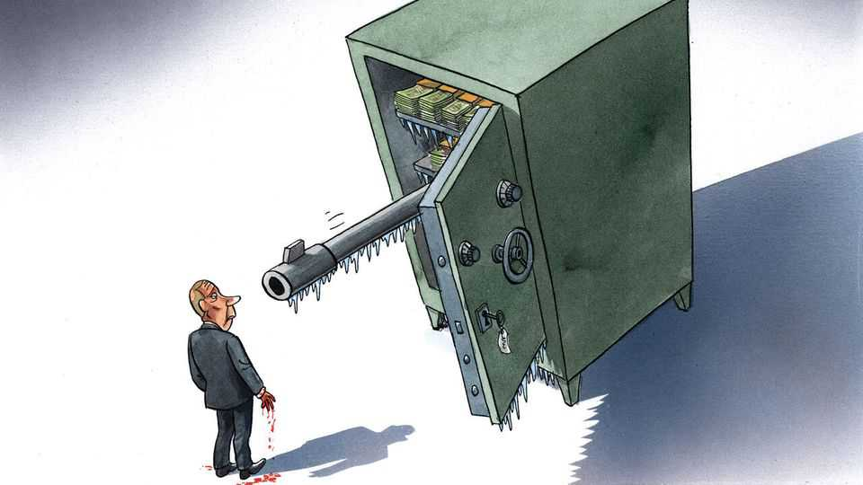

Europe | Charlemagne
Europe wants to turn frozen Russian assets into Ukrainian firepower
The €200bn question at the heart of Europe
September 25th 2025

In 1997 David Bowie once again startled the world with his creativity, this time in the unlikely realm of financial engineering. The rock icon convinced Wall Street types to fork out $55m, in exchange for which they would be entitled to all future royalties generated by his old albums. It is not just pop starmen needing to finance rock’n’roll lifestyles that might fancy turning tomorrow’s uncertain income into today’s ready cash. American states have similarly transformed the money they expected Big Tobacco firms would one day pay them in compensation for wrecking public health into upfront cash from investors. Now, in a twist even Bowie might find odd, another stream of future income is being touted as a candidate for such get-me-cash- now repackaging: putative Russian war reparations to Ukraine. Given that

the Kremlin will one day have to pay compensation to Ukraine for the damage it has caused there, the thinking goes, why not convert that money due tomorrow into a lump sum available today—then send it to Ukraine to help it fend off Russia?

How to make such a “reparation loan” work is currently being discussed in European Union circles. The creative fundraising ploy is in part a symptom of desperation. Ukraine needs close to $100bn a year in foreign assistance, fiscal and military, to stay solvent and go on fighting. The Trump administration is not keen to pitch in any longer. Europe is, but EU-level facilities are all but tapped out and many national governments are on the financial skids (dans la merde, in the original French). Thus all are willing to listen to financial whizzes who claim they have devised a way for Russia itself to bankroll its Ukrainian foe.

At the centre of the reparations loan scheme is a pot of sanctioned Russian money. Before the war, over $300bn of bonds and cash belonging to Russia sat in various bits of the global banking system’s pipes. Soon after Russia launched its full-scale invasion of Ukraine in 2022, most rich countries froze the assets as part of a package of sanctions. Plenty of hawkish types, notably in central Europe but also America, have long argued that the Russian money should simply be seized and handed over to Ukraine. Others, including France and Germany, fret that outright confiscation of assets belonging to a foreign government sets an awkward precedent. The European Central Bank (ECB) frets that snatching Russia’s bonds without compensation would hobble trust in the euro.

Despite these concerns, the frozen Russian loot has already partly been put to use to succour Ukraine. A loophole made it possible for European authorities to, in effect, expropriate the interest generated by the roughly €200bn ($235bn) in Russian cash held in Europe, without touching the cash itself. The seized interest alone amounts to around €7bn a year, which G7 countries have then repackaged, Bowie-like, into a roughly €45bn bond, the proceeds of which are flowing to Ukraine. That is no longer enough. A proposal last year by Hugo Dixon, a financial commentator, Daleep Singh, a Biden administration veteran, and Lee Buchheit, a lawyer, suggested a way to tap not just the interest from the Russian assets but the €200bn or so of principal too.

The gist of the scheme is that Ukraine would in effect be lent the €200bn in question, and only be made to repay the money if Russia in turn coughs up reparations, as Ukraine’s backers insist it must. The end result is a circular logic in which Russia ends up the loser, come what may. At the end of the war either the Kremlin compensates Ukraine and thus claws the €200bn kitty back into its own coffers—in effect paying at least €200bn in compensation to recover €200bn in frozen assets—or it declines to pay reparations and the €200bn remains frozen indefinitely. Meanwhile Ukraine has a large pot of money to keep itself in the war, without EU countries having to pony up cash.

Mr Dixon calls it “a down payment on the Kremlin’s obligation to pay war damages”. To some it still smacks of the kind of expropriation the ECB and others worry about, given that Russia would need to jump through hoops (by agreeing to pay reparations) to recoup its money. Though many insist Russia has an obligation to compensate Ukraine, that is a matter yet to be settled. Only the UN Security Council or the International Court of Justice can impose reparations, and Russia can block both. Ultimately, whether compensation to Ukraine is owed will be a matter for a peace deal, the contours of which are as unclear as ever. But the G7 has already made clear sanctions will only be lifted when Russian compensation to Ukraine is paid, thus endorsing the Russia-must-pay-first logic of Mr Dixon’s plan. The European Commission is working on a variant of the reparations loan idea, that would potentially entail Russia losing its money if it fails to compensate Ukraine, but in a way that still passes muster with the ECB. An outline is expected by the time EU leaders meet in October.

Beyond annoying Russia—Dmitry Medvedev, a former president, railed at the “Euro-degenerates” seeking to hold onto its cash—the reparations loan plan has the advantage of pleasing America. Donald Trump wants Europe to ramp up sanctions against Russia as a condition of America also doing more. A new EU sanctions package being worked on, the 19th since the war started, includes Europe weaning itself off what little energy it still imports from Russia (the only oil still flowing to EU countries goes to Hungary and Slovakia, two countries with MAGAish leaders whom Mr Trump might do well to sway directly). A dozen Chinese and three Indian entities are also included, signalling that Russia’s commercial allies will also be hit, an approach America is keen on. Punishing Russia financially

remains the right course of action. But using its frozen assets to both punish the Kremlin and help Ukraine at the same time, if it can be done legally, would be hunky dory. ■

Subscribers to The Economist can sign up to our Opinion newsletter, which brings together the best of our leaders, columns, guest essays and reader correspondence.

This article was downloaded by zlibrary from https://www.economist.com//europe/2025/09/24/europe-wants-to-turn-frozen-russian- assets-into-ukrainian-firepower

Britain

Why Labour’s growth mission remains grounded Why British bond yields are higher than elsewhere Should Britain deploy the navy to prevent small-boat crossings? Old routes to Britain’s sacred sites are getting more foot traffic The Orthodox Church is thriving in Britain, thanks to immigration Where should Britain hide its nuclear waste? Keir Starmer’s Kevin Keegan moment