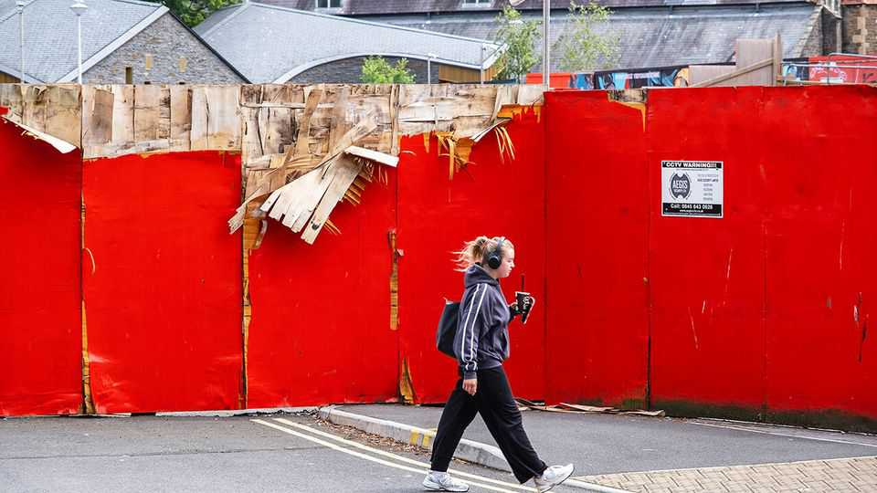

Britain | Britain’s economy
Why Labour’s growth mission remains grounded
Labour promised to get Britain building. So far it has failed
September 25th 2025

T HE LABOUR PARTY came to power promising to fix Britain’s economy. Boosting growth was the only way out of Britain’s fiscal bind and Labour would make this happen “very quickly”. “Everything hangs off that,” Sir Keir Starmer, Labour’s leader, had said. Fifteen months into office, such optimism has long since curdled. Sir Keir’s party is languishing in the polls. The prime minister’s own position is increasingly shaky. While his short tenure has been marked by a number of missteps, at the root of his troubles is failure in the matter which, as he himself flagged, is critical above all else: the growth mission has not taken off.

The economy picked up a bit in the first half of the year, having grown hardly at all in the previous six months. Yet Labour has now had time to lay out its plans, and the judgment from forecasters is that they do not amount to much. The IMF and the Bank of England expect Britain’s annual growth rate to remain around 1.5% over the next three years—that is, the same sluggish pace it has managed since 2008. The Office for Budget Responsibility, the fiscal watchdog, is set to downgrade its (slightly cheerier) forecast ahead of the budget in November, leaving the chancellor with an even bigger hole to fill with tax rises or spending cuts.

The task was always going to be harder than Sir Keir made out. Britain’s malaise, after all, goes deeper than Brexit and Liz Truss: productivity growth has been stagnant for almost two decades. The country’s economic problems, like a lack of productive cities beyond London, are entrenched; it faces global headwinds. For all that Sir Keir claimed his priorities were “growth, growth, growth, growth”, his plan for geeing it up was always a strikingly narrow one, focused on planning reform. His government has shown little interest in how, say, immigration, trade or tax policy might support (or detract from) it.

Still, if the government had to pick just one area, getting Britain building was probably the right one. Most British economists see the planning system as the biggest constraint on growth, according to a forthcoming survey by the Centre for British Progress, a think-tank. That makes it even more of a shame that a government with a whopping majority and a mandate to take on the blockers has fumbled it.

The number of housing starts in Britain increased by 17% in the first quarter of 2025. But that was mostly catch-up after fallow years; there is precious little sign of real expansion. Housebuilders remain downbeat, as shown by a 5% fall in the number of planning applications in the three months to June. Demand is weak, partly due to high interest rates.

Building has slowed in cities, where it is needed most. In London it has almost ground to a halt. In the second quarter of the year, two-thirds of London boroughs started no projects of 20 or more homes, according to Molior, a consultancy. “When Labour came in it was like morning had broken,” says one developer. “That mood has dissipated.”

The government’s target is to build 1.5m new homes in five years. In year one it managed 187,000; in year two it is on track for only slightly more. Housebuilding might pick up quickly after that, with interest rates expected to fall by nearly a percentage point by the end of 2026. But Ant Breach of the Centre for Cities, another think-tank, reckons ministers now realise that an incremental approach, which has left much of the existing planning system intact, is unlikely to yield the promised volumes. Steve Reed, who replaced Angela Rayner as housing secretary earlier this month, has called the lack of progress “unacceptable”.

Sir Keir also hoped that Britons would be cheered by an infrastructure revolution. The government has passed reforms to speed up approvals, and put more money into hospitals, roads and railways. But the Purchasing Managers’ Index, a leading indicator of construction activity, shows the sector as a whole is still contracting, notes Sanjay Raja of Deutsche Bank. That is because the “wall of money” Labour said would flow into Britain has not materialised. Business investment fell by 4% in the three months to June. International investors do not see the island of stability that Sir Keir envisaged.

The problem, says Rachel Wolf of Public First, a consultancy, is that the government has “no deep analysis of who their people are so they cannot identify any electoral pain they are willing to endure”. For all the fine words on growth, ministers weakened their flagship planning bill at the first sign of opposition. “They just wander in the wind, any opposing force is enough to push them back,” says Ms Wolf.

To see this in action, look at two projects supposed to prove the government’s mettle. In January, in a speech cobbled together to reassure bond markets, Rachel Reeves, the chancellor, said she would back a third runway at Heathrow and the Oxford-Cambridge Arc, a scheme to turn the university cities into “Europe’s Silicon Valley”. Neither is moving fast. Heathrow will spend four years getting approval. With luck, spades will hit the ground in 2030, and even that depends on an overhaul of regulation to allow the airport to pass some of the costs on to airlines.

Meanwhile the Arc is “lacking in direction and momentum”, says Andy Williams, a former AstraZeneca executive who chairs a board of local

business leaders. The region should attract the notice of global CEOs and compete for investment with Boston and the Bay Area, he adds. But the scheme, which involves improving housing and transport to create an economic cluster, has got bogged down in the debate about whether the North is missing out. The small team working on it lacks vision and clout. When business leaders proposed pitching the Arc at Davos and Saudi Arabia’s Future Investment Initiative, officials instead suggested a regional investment summit in Birmingham.

There are some signs that ministers now believe more radicalism is needed. On September 21st the government approved a second runway at Gatwick, a simpler upgrade that could be completed by 2029. Mr Reed is mooting another planning bill to shield big projects from judicial review. Ms Reeves will look again at automatically approving housing near railway stations—a good idea whose time is always about to arrive. Sir Keir will no doubt reiterate his mission. The question is what he is willing to do to make it happen. ■

For more expert analysis of the biggest stories in Britain, sign up to Blighty, our weekly subscriber-only newsletter.

This article was downloaded by zlibrary from https://www.economist.com//britain/2025/09/25/why-labours-growth-mission-remains- grounded