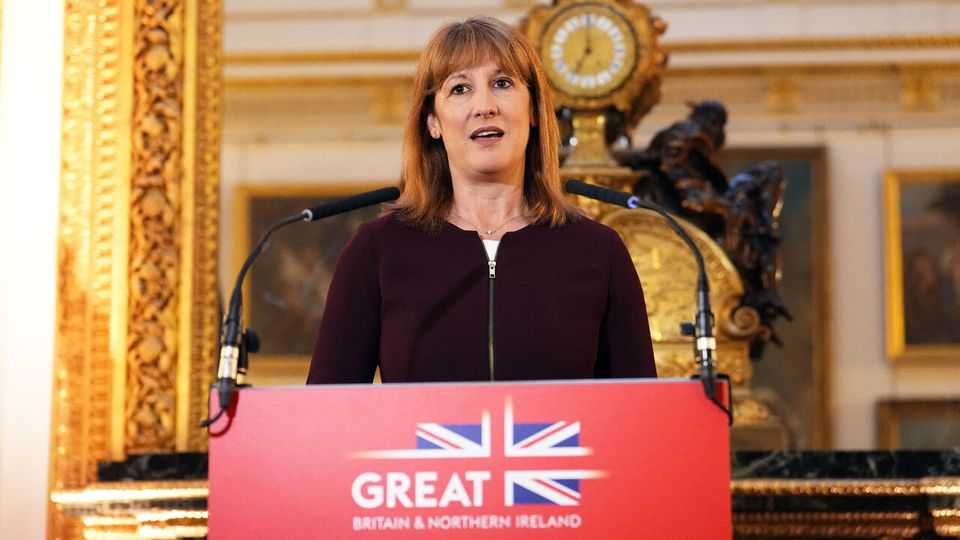
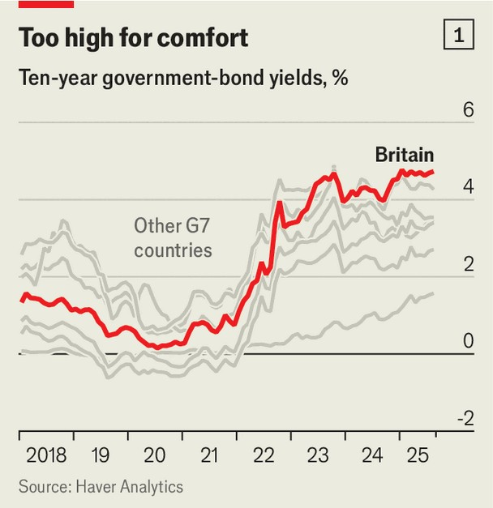
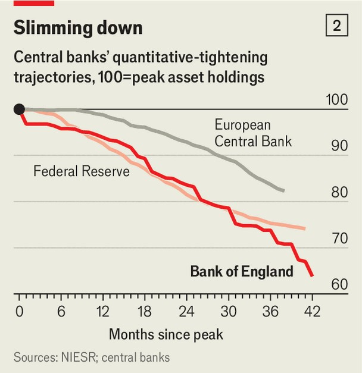

Britain | Vigilantes watching
Why British bond yields are higher than elsewhere
Labour shares only some of the blame. But it cannot ignore the consequences
September 25th 2025

Rachel Reeves could be forgiven for dreading Labour’s party conference in Liverpool, which kicks off on September 28th. MPs will lobby the chancellor for money in November’s budget. Sweaty-palmed lobbyists will ply her with cheap prosecco, pleading against tax rises. But the crowd that most scares Ms Reeves will not be physically present at all. Bond traders will monitor events from afar, ready to push yields ever higher at the mere hint of fiscal profligacy. Annual rates of return on ten-year British bonds (gilt yields) reached 4.8% recently, compared with 0.2% in 2020. Britain now has the highest yields across the G7 group of rich countries (see chart 1). Debt-interest payments

have more than doubled in the past five years. In 2025-26 the Treasury will spend £111bn ($150bn) on interest—more than the education budget.

The leader of the opposition, Kemi Badenoch, blames the chancellor for Britain’s high borrowing costs, calling it the “price of her economic mismanagement”. There is some truth in this. Ms Reeves has not convinced markets that her fiscal plans are credible, especially after backtracking on crucial welfare cuts this summer. But fiscal profligacy is only part of the story. It does not alone explain why long-term yields in Britain are higher than in countries with bigger budgetary messes, like America and France. Two other forces play a role.

The first is Britain’s persistent inflation. Consumer prices rose by 3.8% in the year to August, significantly more than the 2% inflation in the euro zone. To rein in these price pressures, the Bank of England (BoE) has held interest rates at 4%, double the level set by the European Central Bank (ECB). Shorter-term gilt yields closely shadow the BoE’s rate, which is why they remain stubbornly high.

Yet the greater concern is inflation’s impact on longer-dated yields. Britain’s dizzying recent price surge has shaken confidence that the BoE can stick to its 2% target in the decades ahead. A YouGov/Citi survey from August

found that Britons expect inflation to be 3.9% in five to ten years’ time. Higher long-term inflation expectations imply that interest rates will need to be higher in future as well as now, pushing up yields on long-term gilts.

The second force affecting yields is Britain’s vulnerability to global capital scarcity. Government borrowing has surged worldwide over the past year, including in previously abstemious countries like China and Germany. Meanwhile the AI boom has sucked up investment. This mix has fuelled global demand for capital, lifting real interest rates.

Britain in particular is awash with gilts needing buyers. Not only is the Treasury issuing increasing piles of debt, the BoE is busy selling off the gilts it bought between 2009 and 2021 to stimulate the economy. The BoE’s approach to these sales is unusually bold; whereas the Fed and the ECB are running down their stocks by not replacing bonds as they mature, the BoE is actively selling them off (see chart 2).

In the past domestic pension funds would have helped absorb this glut. However, these funds have shrunk their holdings in recent years as final- salary pension schemes wind down. This has left fickle overseas investors, who are much more sensitive to global market fluctuations, as the biggest owners of gilts. The Office for Budget Responsibility, Britain’s fiscal

watchdog, estimates that the decline in pension-fund ownership will eventually add about 0.8 percentage points to gilt yields, albeit over many decades. The Treasury has tried to offset this falling demand by issuing shorter-term debt, but this will only partially compensate for it.

While Ms Reeves has limited control over stubborn inflation or global capital scarcity, she does control the third lever: fiscal sustainability. Britain’s high yields are part of a wider trend of investors worrying that rich countries are taking on debts they cannot afford. Britain is by no means the biggest culprit here. America is running a budget deficit of 6.1% of GDP per year, with no credible plan for reducing it. France’s president, Emmanuel Macron, has lost four prime ministers in the past two years over his futile attempts to tackle France’s deficit of around 5.5%.

Ms Reeves has promised to reduce the deficit from 4.8% of GDP in the last fiscal year to 2.1% by 2029-30. Yet, despite a huge parliamentary majority, nobody believes she’ll succeed. Her plans rely on assumptions—ditched welfare cuts, low borrowing costs and optimistic productivity gains—that most consider unrealistic. Filling the gap requires far more than the £9.9bn which she has set aside in 2029-30. Capital Economics, a consultancy, estimates a shortfall as high as £28bn, which would mean higher taxes or spending cuts.

Although these sums are more manageable than they are in America and France, Britain would be more exposed if a global bond crisis did occur. France would be protected by the ECB, America by the dollar’s reserve- currency status. Britain would be alone. Traders know this. And seared in their memory is Liz Truss’s “mini budget” of 2022, which sent yields skyward in response to unfunded tax cuts. All of this has made the bond market hyper-alert to whether the chancellor’s sums add up.

A global bond crash is not inevitable; there is a world in which yields fall of their own accord, spurred by declining inflation. But too often the Labour government has prepared for the best scenario while neglecting more troubling ones. If Ms Reeves gets Britain’s finances back on track in November’s budget, it would help protect the country against a possible bond crisis. If she does not, it could become a lightning rod for the bond market’s discontent.■

For more expert analysis of the biggest stories in Britain, sign up to Blighty, our weekly subscriber-only newsletter.

This article was downloaded by zlibrary from https://www.economist.com//britain/2025/09/24/why-british-bond-yields-are-higher- than-elsewhere