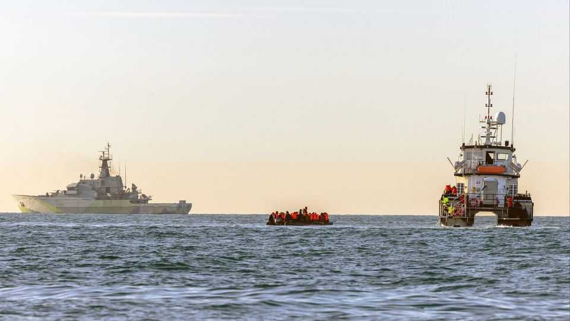
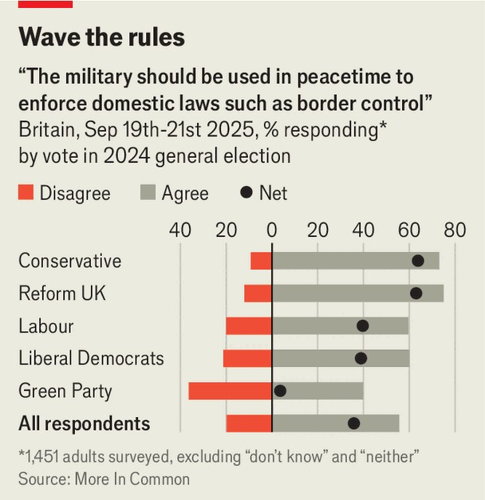

Britain | Rule, Britannia!
Should Britain deploy the navy to prevent small- boat crossings?
It would be politically popular, but previous efforts did not help
September 25th 2025

In a joint press conference on September 18th Donald Trump, America’s president, was asked what advice he had for Britain’s prime minister to “stop illegal migration” across the English Channel. Amid the rambling response one line jumped straight onto the front page of Britain’s tabloids: he could just “call out the military”. Sir Keir Starmer put on his best “keep calm and carry on” face and his government swiftly ruled out the idea. But how do Britons rate it? The Economist asked More In Common, a polling firm, to find out. More than half of respondents agreed that armed forces could be used for border patrol during peacetime (see chart) and that “deploying the navy in the English

Channel would significantly reduce small-boat crossings”. This idea was popular across much of the political spectrum.

In principle, Parliament could authorise the navy to support the UK Border Force’s five offshore cutters, but similar efforts have failed in the past. International law obliges vessels to rescue people in distress; they cannot just be turned back. In 2022 Operation Isotrope put the navy in command of border control; during that period small-boat migrants reached a 365-day record of 49,000.

Some 48% of Brits say immigration is their most important issue, a doubling since 2023. On September 19th another 13 dinghies arrived, with 1,072 migrants, bringing the 365-day total to nearly 45,000, a 50% rise on a year ago.■

For more expert analysis of the biggest stories in Britain, sign up to Blighty, our weekly subscriber-only newsletter.

This article was downloaded by zlibrary from https://www.economist.com//britain/2025/09/25/should-britain-deploy-the-navy-to- prevent-small-boat-crossings

