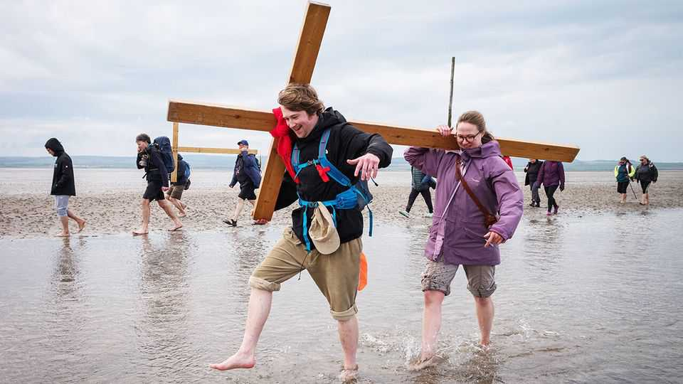
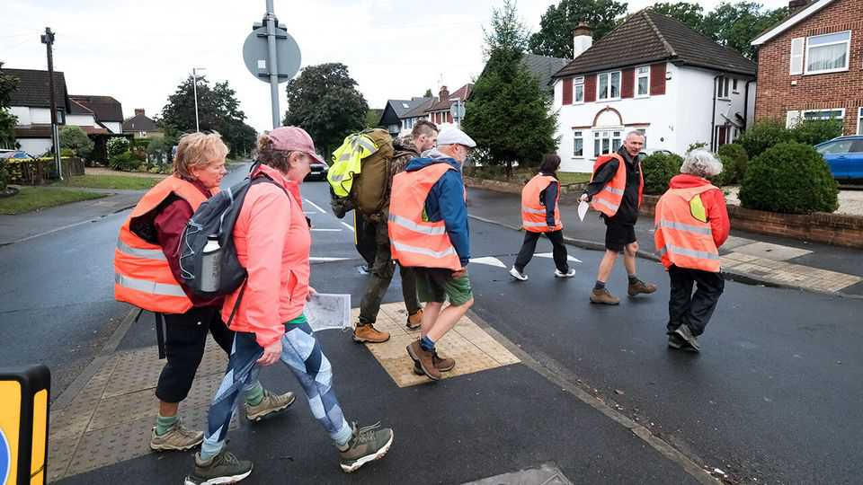
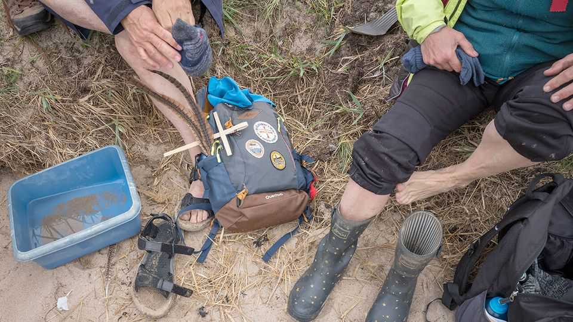

Britain | Canterbury trails
Old routes to Britain’s sacred sites are getting more foot traffic
The resurgence in British pilgrimages
September 25th 2025

The route of the Golden Valley Pilgrim Way sounds like something out of a medieval fairy tale. Beginning and ending at Hereford Cathedral, the path winds through the meadows and foothills of the Black Mountains before taking travellers past ruined castles, holy wells and sites from Arthurian legends. People can get their pilgrim passport stamped in village churches along the way, and those so inclined can stay in comfortable B&Bs and dine at gastropubs. For the first time since the Middle Ages, pilgrims can sleep overnight in the cathedral’s cloisters. In olden times Britain was known for its sacred routes. Canterbury Cathedral became a popular pilgrimage destination after Henry II prompted the murder

of Archbishop Thomas Becket, and miracles were reported at Becket’s tomb. The Shrine of Our Lady of Walsingham ranked among the medieval world’s four most-visited holy sites, alongside Rome, Jerusalem and Santiago de Compostela. The practice came to a sudden halt when Henry VIII outlawed pilgrimages in 1538 as part of his suppression of Catholicism. He preferred that his subjects stay put on farms.

Now the ancient tradition is enjoying a revival. In July Walsingham welcomed around 6,000 pilgrims for a single mass. Like the faithful centuries earlier, pilgrims left personal petitions in the Slipper Chapel before the statue of the Virgin Mary. Canterbury Cathedral is so keen on attracting pilgrims that it has hired a pilgrim officer to welcome them.

The British Pilgrimage Trust (BPT), a charity created in 2014 to promote pilgrimage routes, reports a striking rise in both web traffic and walkers along its 250 paths, the most popular of which is the daylong St Michael’s Way through Cornwall. A recent YouGov survey for the trust found that one in five British adults is considering making a pilgrimage, and that over 2m have already done so in Britain.

Guy Hayward, director of the BPT, stresses that what distinguishes a pilgrimage from a mere walking holiday is purpose. “Walking is for the body; pilgrimage is for the soul,” he says. But not all pilgrims set out for strictly religious reasons.

Over the past four years Torin Brown, the pilgrim officer at Canterbury Cathedral, has surveyed pilgrims on what drives them. While faith and a search for adventure rank high, most of the respondents cite spirituality as

their main motivation. “A thousand years ago pilgrims came to ask the saint for help,” he says. “Today many pilgrims do the same thing looking for a sense of meaning in life.” This mirrors broader trends. A YouGov poll published in 2022 found that while only 19% of Britons consider themselves religious, nearly 30% describe themselves as spiritual. Not all modern pilgrimage destinations are Christian. Newer routes take in ancient pagan sites, from the stone circle at Avebury to the Goddess Temple in Glastonbury.

Before Henry VIII, pilgrims arriving in Canterbury were guided through the cathedral under candlelight. Today, they can receive a blessing at the pilgrimage stone outside the cathedral and have their journey recorded for the pilgrim officer’s Instagram account. Mr Brown observes that it is usually after the blessing has been given that the tears start to flow. ■

For more expert analysis of the biggest stories in Britain, sign up to Blighty, our weekly subscriber-only newsletter.

This article was downloaded by zlibrary from https://www.economist.com//britain/2025/09/19/old-routes-to-britains-sacred-sites- are-getting-more-foot-traffic