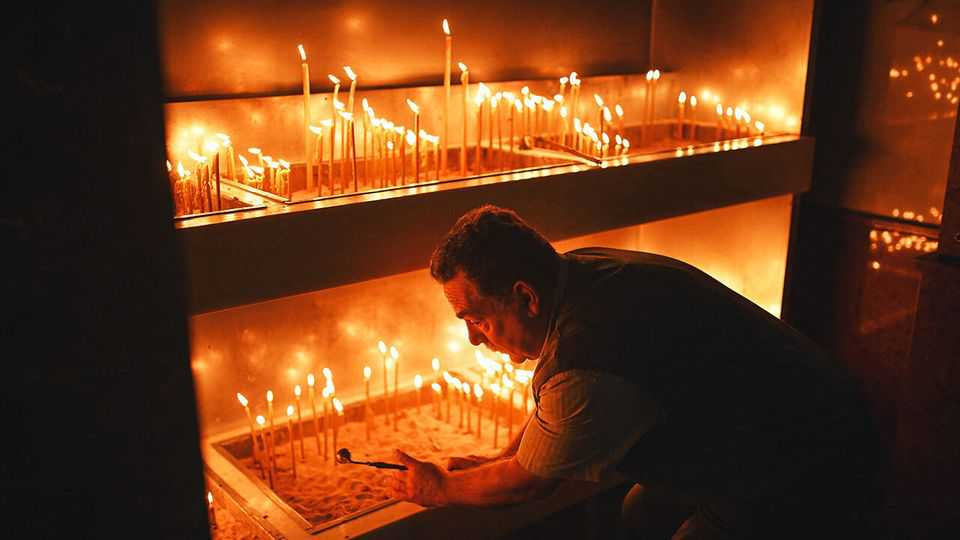

Britain | Light from the East
The Orthodox Church is thriving in Britain, thanks to immigration
Romanian arrivals have provided the latest boost
September 25th 2025

With its weathered brown bricks, cavernous neo-Gothic interior and rough urban surroundings, Saint Matthew’s is a typical Church of England building. Less typically, on September 14th it was bursting with 300 or so adults and almost as many children, women in dark floral costumes and toddlers with flashing trainers. Since a dwindling Anglican flock gave up the struggle, it has been leased to the Romanian Orthodox. “Wherever my compatriots go, they bring religion,” says their priest, Ioan Nazarcu. His community took over the church in Luton, north of London, in 2021, having outgrown smaller ex-Anglican premises.

According to Peter Brierley, a cruncher of religious data, the number of Eastern Orthodox Christians in Britain has risen by 5% over the past decade, to around 430,000. That contrasts, he says, with a 21% decline in adherence to other mainstream churches, including Anglicans, Catholics and Methodists, leaving them with a total of 2.7m. (The other notable patch of Christian expansion is the informal world of Pentecostalism, attracting many Africans and Brazilians.)

Long before the Romanians, newcomers from Cyprus and Russia boosted the number of Orthodox. Migration aside, Britain’s Orthodox clergy report a spike in inquiries from young people, especially men of socially conservative views. The (mainly Greek) Orthodox Archdiocese in London runs a Zoom course for potential converts that has already led to 200 baptisms; these were performed in April. More than 600 people have signed up for the latest course, which began this month.

In Luton the Orthodox add a new factor to a volatile religious scene. The Muslim population rose by nearly half between 2011 and 2021 while the share of self-declared Christians dwindled by 11%, to give respective totals of 33% and 38%. Since the emergence 20 years ago of both Islamist and white-nationalist extremism, local faiths have worked hard to maintain social peace. Father Ioan dutifully attends meetings of religious leaders.

In one way, his church stands out from the other migrant religions. It emphasises the sacred history of the new homeland—reviving the memory of Celtic hermits, Saxon abbesses and pious kings. Every June Father Ioan brings followers to an Anglican cathedral to venerate the earthly remains of Alban, a martyr of the Roman era. Similarly, on October 4th the Orthodox parishes of Shrewsbury and Chester will make their annual procession around a well in Wales sanctified by Saint Winifred, a chieftain’s daughter of the seventh century. This is an exuberant day-long excursion complete with rituals and chants, for the most part in English.

Among the Brits with a penchant for Orthodoxy and history is Charles III, who has made eight pilgrimages to a monastery in Greece. In 1998, when heir to the throne, he privately lauded Orthodoxy’s “timeless traditions” compared with the “loathsome political correctness” of other churches. But

now, as king and governor of the Church of England, the monarch knows he must express orthodox views, not Orthodox ones. ■

For more expert analysis of the biggest stories in Britain, sign up to Blighty, our weekly subscriber-only newsletter.

This article was downloaded by zlibrary from https://www.economist.com//britain/2025/09/22/the-orthodox-church-is-thriving-in- britain-thanks-to-immigration