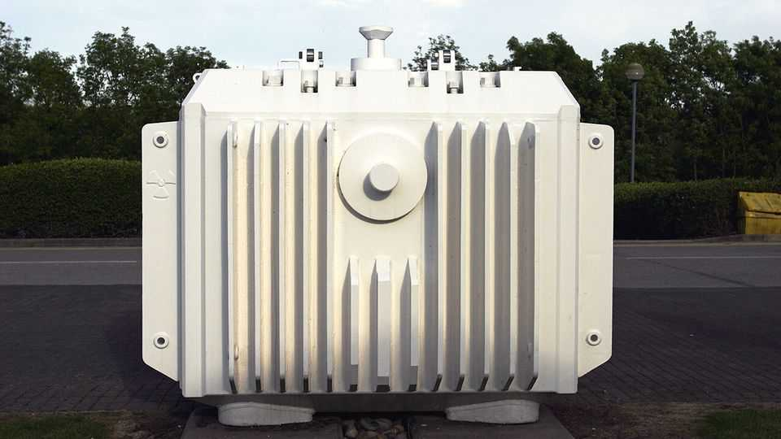

Britain | Nuclear-waste storage
Where should Britain hide its nuclear waste?
Cumbria is considering whether to host a radioactive tomb
September 25th 2025

Overlooking the tennis courts and terraced houses of Millom, a pair of iron velociraptor sculptures stalk a landscaped garden of slate, gorse and buttercups. This prehistoric idyll is a £295,600 ($403,300) gift from the nuclear industry. It is one among dozens of rewards—critics call them bribes —for the Cumbrian town’s participation in Britain’s latest attempt to build an underground forever home for its most radioactive nuclear waste. If that deal sounds unappealing, consider Millom’s misfortune. It is a forgotten mining town in a remote corner of West Cumbria, whose neglect is epitomised by its former Co-op. Since going bust in the late 1960s, the local supermarket has been a church, department store, nightclub and, as police

discovered three years ago, an Albanian cannabis farm. Now it has been derelict for so long that weeds grow through the rubble and plaster.

Britain is not alone in trying to find a place to bury its nuclear waste. Several other European countries are seeking a rural community willing to host what experts call a geological disposal facility (GDF), in essence a kilometre-deep mausoleum for hazardous material. But Britain, with its strict local planning regulations, is struggling. Even in parts of the country long associated with the nuclear industry, debate is under way about whether a tomb would be a boon.

Nuclear Waste Services (NWS), a government body, says that a GDF would be the safest place for Britain’s growing stockpile of spent fuel and other radioactive by-products. The community that hosts such a site will secure thousands of jobs and millions in investment, according to a government pamphlet. But opponents dread the years of site investigations and construction which they say will ruin the countryside and upend their lives. Despite public support for the GDF from Michael Shanks, the energy minister, there are sceptics in government, too. The Treasury has declared that lifetime costs of £20bn-53bn make a GDF unaffordable.

Britain accounts for less than 1% of the world’s 38m cubic metres of solid nuclear waste. But in reality its stockpile is among the highest in western Europe. Substantial caches of plutonium, uranium, spent fuel and irradiated land, all yet to be classified as waste, and a legacy of Britain’s early adoption of nuclear, mean its build-up is second only to that of France, the EU’s biggest nuclear-energy producer.

By the end of this century Britain will have almost enough to fill Wembley Stadium. Most of this waste has low levels of radioactivity and can be treated and stored in concrete vaults at a “near-surface” facility, such as the one by the village of Drigg in West Cumbria, whose fenced perimeter has a path for dog walkers. But a rowdy fraction is dangerously radioactive and will remain so for at least 100,000 years. For now the most hazardous waste is largely stored in ponds and containers at Sellafield, a decrepit facility in Cumbria, which is supposed to offer a temporary solution while Britain figures out its long-term plan. A recent cross-party report concluded that the site’s crumbling infrastructure poses an “intolerable risk” to safety.

The strongest case for building a GDF is both spatial and temporal: civilisations will rise and fall before long-lived waste will cease being harmful. What is needed is as much distance and as many barriers between the waste and humans as possible, in a place that will remain undisturbed for as long as possible. Sealed in an underground vault, nuclear waste is at least shielded from risks like climate change, natural disaster and terrorism. (More eccentric ideas, such as shooting it into space, have been discounted.) But Britain’s progress has been painfully slow. Finland has already built its GDF. Construction has begun in Sweden and France. Canadians have found a willing community for theirs.

For the past seven years NWS has been inviting places in England and Wales to host a GDF, in exchange for £1m a year held by NWS and disbursed by an independent committee. Few have applied. While there is some evidence of public attitudes to nuclear energy softening, most voters oppose sites near where they live. One council that applied U-turned after a month; another withdrew after it was taken over by Reform UK. That has left two councils in the running, both in Cumbria, a county with a uniquely tolerant view of the technology.

Even so, it is not all plain sailing. In Millom opponents of the GDF raise the usual concerns over tourism, ecology and house prices. They concede that Britain’s nuclear waste must find a home, but they would prefer a supervised surface site—in effect, another Sellafield—to a tomb. That might seem to guarantee more jobs for locals, but it would curb the amount of investment from which Millom could benefit. It would also dump higher costs onto future taxpayers, who have not benefited from the energy in the first place.

It will take more than a few baubles to persuade the town’s residents. Winning over the Treasury will be hard, too, given competing demands for investment. But Chris Davie, a former Sellafield worker making his way down the hill from the dinosaur garden, is enthusiastic (the prospect of funding for his golf club in nearby Silecroft may have helped). “It’s got to go somewhere,” he said, holding his nearly three-year-old daughter. “I’d rather it be done safely, instead of uncontrolled dumping in ponds and silos.”■

For more expert analysis of the biggest stories in Britain, sign up to Blighty, our weekly subscriber-only newsletter.

This article was downloaded by zlibrary from https://www.economist.com//britain/2025/09/25/where-should-britain-hide-its- nuclear-waste