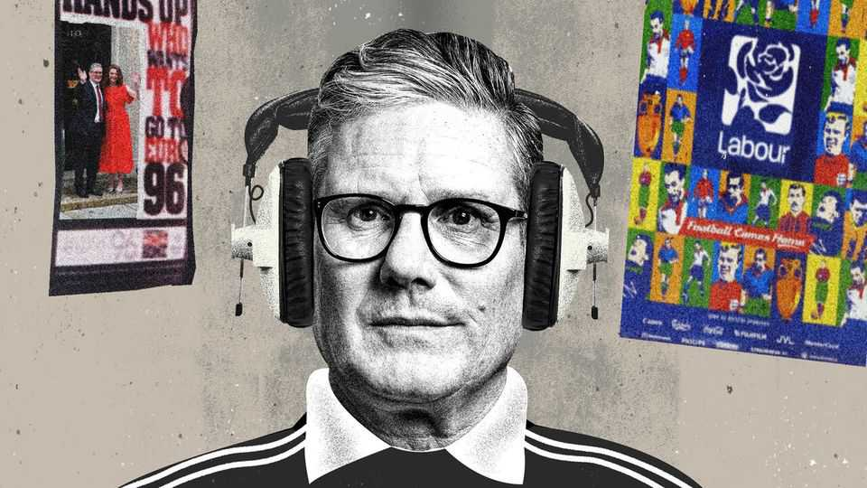

Britain | Bagehot
Keir Starmer’s Kevin Keegan moment
What if the prime minister just quits?
September 25th 2025

A slice of history happened 25 years ago in a toilet cubicle in Wembley Stadium on a wet October afternoon. England had lost 1-0 against Germany in the last-ever game at the soon-to-be demolished home of English football. The then England manager, Kevin Keegan, soaked and miserable, walked off the pitch and decided to resign. A boss from the Football Association dragged a dripping Mr Keegan into a toilet cubicle to persuade him to stay. “You can’t change my mind,” said Mr Keegan, standing nose to nose with his boss. “I’m out of here. I’m not up to it.” Kicking people out of jobs at the top of society is usually a bloody affair. Yet some people, such as Mr Keegan, go voluntarily. This fact is strangely overlooked in British politics, which has begun to focus on the future of Sir

Keir Starmer, the prime minister. Labour’s annual conference, which starts on September 28th, is to be a parade of potential replacements. Pretenders such as Andy Burnham, the mayor of Greater Manchester and an increasingly unashamed critic of Sir Keir, are already buttering up union bosses and humble members.

Politicos are now wrapped up in the who and how. Labour’s rule book demands a straight fight between Sir Keir and a challenger able to muster the support of 20% of MPs. In practice Britain’s constitution is more flexible than Labour’s hallowed pdfs. Sir Keir could be bullied out by senior members of his cabinet in a coup. But a third option, rarely discussed, exists: Sir Keir could do a Keegan. He could simply quit.

Consider Sir Keir’s situation using the prime minister’s favourite phrase: country first, party second. Labour is close to a historic low in its polling. Sir Keir is roughly as unpopular as Boris Johnson was after it emerged that Downing Street had played host to wine-soaked parties during lockdown. Sir Keir’s ratings are roughly where Rishi Sunak’s were when he led the Tories to their worst-ever election result. All leaders everywhere are unpopular, but Sir Keir is more unpopular than most.

Things are little better within the party. Who would talk Sir Keir out of the toilet cubicle? Sir Keir almost makes a virtue of how few friends he has in politics. By contrast, Mr Burnham’s push for leadership is marked with speculation about which Mancunian loyalist would lay down their political life (by resigning as an MP and thus triggering a by-election) and let Mr Burnham use their corpse as a ladder.

Labour is not a party in Sir Keir’s image. There are still Blairites and Brownites. There are some Corbynites. If you squint you can even see a few Milibandites. There are no Starmerites. Indeed, those who owe their role in Parliament to his historic victory in 2024 are remarkably ungrateful, often regarding their boss with contempt. Maybe they have little to be grateful for. Labour won by a mile, but largely by default. Sir Keir’s departure would have the air of an unloved manager’s leaving-do. A few speeches, some stale cake and an early exit.

Sir Keir’s unpopularity would matter less if the government was focused on worthy but unpopular works. Instead, Downing Street is simply dysfunctional. Such problems always start with the principal. Most of Sir Keir’s flaws were widely diagnosed well before he came to power. Sir Keir is slow. He plods through decisions, whether right or wrong. The prime minister has never claimed to be a man with political instincts. The main misjudgment from before he came to power was the idea that he would prove a competent bureaucrat. Instead he has whipped through senior staff, with the wrong people put in the wrong jobs so often that it is easy to wonder whether the core problem is one particular wrong person in one particular wrong job.

Might Sir Keir agree? Usually, those at the top of politics are immune to self-doubt. Sir Keir, by contrast, has wobbled before. In 2021 the Labour leader endured a humiliating defeat to Mr Johnson’s Conservative Party at a by-election in Hartlepool. While Mr Johnson posed in front of a giant blimp in his image at the town’s marina, 360km away in London Sir Keir pondered quitting. It took his aides to talk him into staying.

Compared with the psychopaths and egotists who usually rise to the top of politics, Sir Keir is relatively normal. It is this that makes him so strange. Chris Ward, a former aide to Sir Keir and now an mp, explained his boss’s purpose: “Keir regards his role solely as a means to an end of achieving change,” said Mr Ward in Tom Baldwin’s biography of the Labour leader. “If he becomes the obstacle to it, he’ll get out of the way.” Mr Keegan knew he was the obstacle in a toilet in Wembley; what does Sir Keir think today when he looks in the mirror in the loo?

Almost every other occupant of 10 Downing Street has dreamed of taking on the job ever since they learned of the address. Sir Keir, who is only three years from his state pension, took up politics in the way other middle-aged men take up gardening. Before entering Parliament in 2015, he had a successful career as a barrister. Circumstance dumped him at a preposterously high level. “I’m not fulfilling some lifelong dream here,” said Sir Keir to his biographer. “I could happily work in the bookshop or something.”

Perhaps Sir Keir’s blasé attitude to power was all an act. It would not be the first convenient untruth the prime minister told in pursuit of power. When the end nears, he may choose the path of his predecessors and barricade himself in Downing Street. At the moment, Labour is heading for a walloping in the next election. It is an aimless government, drifting from crisis to crisis, incapable of executing either tactics or strategy. Its problems start with the prime minister. If Sir Keir is the man he says he is, why wouldn’t he go? A Kevin Keegan moment should take nobody by surprise. ■

Subscribers to The Economist can sign up to our Opinion newsletter, which brings together the best of our leaders, columns, guest essays and reader correspondence.

This article was downloaded by zlibrary from [https://www.economist.com//britain/2025/09/24/keir-starmers-kevin-keegan-moment](https://www.economist.com//britain/2025/09/24/keir-starmers-kevin-keegan-moment)

International

Europe’s astonishing drop in illegal migration A made-in-China plan for world domination