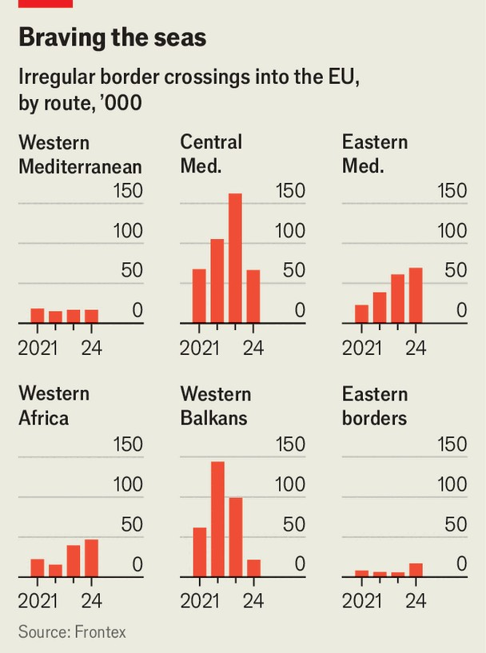

International | Irregular migration
Europe’s astonishing drop in illegal migration
Europe’s big, invisible wall is slowing boat crossings by migrants
September 25th 2025

“EUROPE IS IN serious trouble,” Donald Trump thundered on September 23rd in a speech at the UN. “Illegal aliens are pouring in.” Listen to other politicians, too, and it would seem that the flow of migrants illegally crossing Europe’s borders is an unstoppable tide. Yet the latest data show the opposite. In the first eight months of this year 112,000 people crossed illegally into Europe, down 21% from a year earlier. The drop is an even more impressive 52% from the comparable period in 2023, when 231,000 people landed on its shores or jumped its borders. Numbers are falling not because the underlying causes of migration have changed. Places like Afghanistan and Eritrea remain repressive. Others, such

as Sudan and the Sahel, are still wracked by civil wars or violent insurgencies. And there is still plenty of poverty in Bangladesh and Egypt, two of the most common nationalities of those crossing illegally into Europe, many of them in search of jobs.

Instead, it is because the bloc is experimenting with new ways of heading them off. The results will please many, but some of its methods are unsettling. The EU is showing that harsh policies far from its beaches are keeping migrants out.

In recent years most people crossing illegally into the EU have come by boat on three key routes (see chart and map). The first is known as the central Mediterranean route, which goes mainly from Tunisia and Libya in north Africa to Italy and Malta. Second is the eastern Mediterranean route, which runs mainly from Turkey to Cyprus and Greece by sea, but also includes those crossing by land into Greece and Bulgaria. Third is the western African route, in which boats enter the Atlantic from countries such as Mauritania and Morocco, heading for the Canary Islands, which are Spanish territory.

Europe’s migration crisis dates to the mid-2010s, when civil war in Syria and other conflicts caused the continent’s biggest flows of refugees since the

second world war. After more than a million people arrived in 2015, the EU put a long bet on deterrence. Its hope was that it would dissuade more from coming by making the crossing more difficult.

Until recently this seemed to have been a poor wager. After falling during the covid-19 pandemic, illegal migration into the EU increased sharply in each of the three years to 2023, when it reached 380,000. Yet this summer, when good weather would have normally led to a surge in boats crossing the Mediterranean, the bet seems to have paid off.

The EU’s strategy has in effect been to build a big, invisible wall far from its own borders where migrants can be intercepted and turned back well before they have a chance to set foot on European soil and lodge a claim for asylum. This has been done through a complex patchwork of agreements signed by the EU and separately by its member states with countries through which migrants try to pass. In exchange for cutting migration, transit countries get large sums of aid and investment. Egypt was promised €7.4bn ($8.1bn); Tunisia €1bn. In addition, the EU or its members train and fund their coastguards, border officials and police forces.

Although some were signed as early as 2015, between Turkey and the EU, and in 2017, between Italy and Libya, their effectiveness was limited because they blocked only some of the migratory routes. As the authorities clamped down on one path, another would open, displacing the problem rather than solving it.

As these deals have steadily expanded across north and west Africa, however, they have become increasingly successful by making it harder to skirt around blockages. In 2024, the year after the EU and Tunisia signed such a deal, crossings over the central Mediterranean route fell by 58%. Last year the bloc struck an agreement with Mauritania, cutting flows on the west African route by 52% this year.

Their effectiveness has also been increased by the second prong of the EU’s strategy: better surveillance of its external borders and waters. The coastlines of north African states are long and sparsely populated, making them hard to police. New technologies are changing that. Frontex, the EU’s border agency, now uses drones to patrol the skies above Libyan and

Tunisian waters. When it spots a boat, it notifies the authorities in those countries. In the three years to 2024 Frontex shared the locations of migrant boats with Libya’s authorities more than 2,000 times, according to Lighthouse Reports, a non-profit investigative-journalism group.

Yet Europe’s successes are coming at the cost of some suffering. In some cases the so-called coastguards in Libya that the EU is guiding to boats are little more than militias. Some of the migrants detained in or returned to Libya are abused, raped or enslaved, according to human-rights groups. Malta has been accused of helping a deadly Libyan militia force boats back from its waters.

As the EU has struck deals with more countries, abuses have been pushed farther from European shores. Tunisia’s repressive regime has been accused of dumping thousands of detained migrants in the desert near its border with Algeria, and Mauritania of pushing people back across its border into Mali and Senegal.

Rights groups claim that cruelty is built into the EU’s plan, since it relies on repressive regimes using brutal tools to deter migrants from even trying to cross their territory. Julia Schafermeyer of SOs Méditerranée, a search-and- rescue NGO that brings survivors to European shores, complains of a “campaign of administrative harassment” that is intended to weaken the oversight of abuses and to hamper rescues.

In August the Libyan coastguard fired on one of the NGO’s rescue ships as it was searching for a boat in distress. For some the ocean is deadly. This year at least 456 migrants have died and more than 420 have been reported missing in boat accidents in the central Mediterranean, says the UN’s International Organisation for Migration. Ulf Laessing, the Mali-based head of the Sahel programme at the Konrad Adenauer Foundation, worries that closing off shorter routes, such as from Western Sahara to the Canary Islands, may make people take longer, more dangerous ones, such as from Senegal or The Gambia.

Frontex says it ensures that borders are policed lawfully and with respect for fundamental rights. “There’s no place in European border management for

brutality,” says a spokesman. “That’s not policy. Not in how we work and not what we expect or tolerate from any of our partners.”

Although the EU’s new policies are keeping migrants out, the key question is whether this can last. Migration pressure is likely to keep rising in places such as sub-Saharan Africa as a result of expanding populations, climate change and insecurity. Geopolitics may also constrain the EU’s ability to maintain its big, invisible wall far from its own borders. Because it relies largely on the co-operation of foreign governments to keep migrants out, the EU risks putting itself in hock to them. Turkey and Morocco have already used their ability to open or close migrant flows as ways of putting pressure on Europe to release more funds or to soften its criticism of their foreign policies.

This may explain why many European countries are also trying to make themselves less attractive to migrants. Italy is trying to outsource asylum processing to Albania (though its plan has been blocked by the EU’s top court). Greece threatens to jail those who do not leave the country after their asylum claims are rejected.

Some argue that instead Europe should do more to tackle the causes of migration, such as poverty or conflict, at their root. But the West has less appetite for state-building or peacekeeping after its failed interventions in Afghanistan and Libya. And rising incomes in poor countries may simply increase the number of people who can afford to pay smugglers for passage.

For all these pressures, though, the EU has now proved the thesis that harsh policies can reduce illegal migration. The genie is out of the bottle. ■

This article was downloaded by zlibrary from https://www.economist.com//international/2025/09/25/europes-astonishing-drop-in- illegal-migration