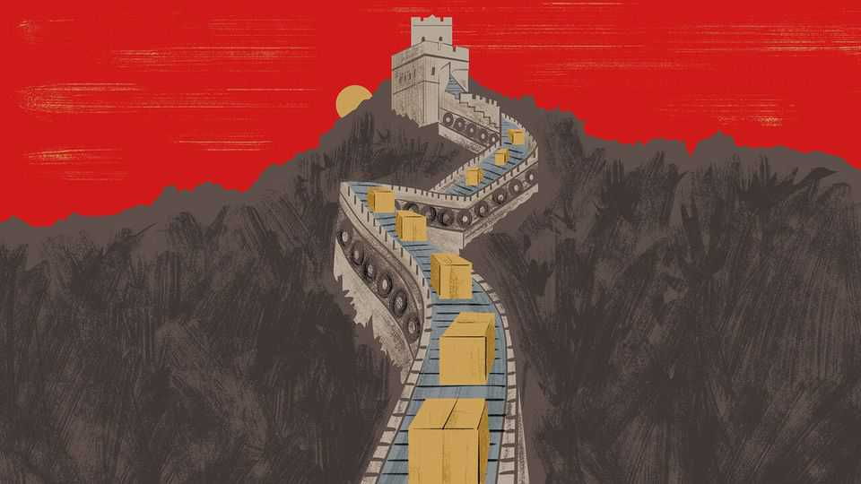

International | The Telegram
A made-in-China plan for world domination
Donald Trump is failing to stop China’s rise as a manufacturing superpower
September 25th 2025

CHINA’S INDUSTRIAL might is hard to capture in numbers. The country accounts for more than 30% of global manufacturing, or more than America, Germany, Japan and South Korea combined. That figure understates the growing terror that Chinese-made stuff inspires in foreign competitors and governments alike. Chinese goods are cheap and getting cheaper, because firms there are both efficient and locked in a domestic price war of epic brutality. After nearly three years of continuous falls in factory-gate prices, many firms are bleeding money and desperate to sell into foreign markets, where margins are fatter. Chinese export growth is impressive when measured by value. It is

positively fantastical when measured by volume. Just before the covid-19 pandemic, a third of all containers carrying exports around the world contained stuff assembled, grown or processed in China. Today China’s share of global export containers is over 36%, though the country represents around a fifth of world GDP. A foreign business boss in China foresees a reckoning: “There will come a point in time when China and the world simply cannot absorb more Chinese goods, and I think that point is approaching.”

Meanwhile, valuable markets in China are being walled off. New rules limit imports of computer chips, medical devices and more, as the Communist Party puts economic and national security above short-run growth. Though exports to America have plunged, hit by President Donald Trump’s ever- changing tariffs, China’s overall trade surplus is on track to exceed $1trn this year, with record-setting shipments to Africa, Asia, Europe and Latin America. From Brasília to Berlin and Bangkok, politicians hear calls to protect established industries from Chinese competition. Yet many of the same politicians want Chinese investors to help them build industries of the future, by opening plants to make batteries, say. That limits their desire to confront China.

China knows it has too many loss-making factories. The supreme leader, Xi Jinping, worries aloud about “disorderly” competition, as manufacturers cut prices to survive. Local governments have been told to stop propping up doomed firms. The authorities have launched schemes to promote domestic demand, and consumption has duly risen. Industrial output has grown faster, though, leaving exports to pick up the slack. Most importantly, Mr Xi continues to praise manufacturing as a source of economic and geopolitical power. In the words of a Chinese economist, his country’s leaders and most citizens believe that “China’s share of the world total of manufacturing is appropriate” and may indeed grow. Behind closed doors, party bosses and technocrats are hard at work on China’s next five-year plan, covering the period 2026 to 2030. Previews suggest that the plan will include redoubled efforts to become a “science and technology powerhouse” and a focus on “disruptive” made in China innovation to combat “containment and suppression by the US-led West”.

Officials give no ground when European and other foreign leaders trek to Beijing to plead for their companies to be treated more fairly, or for China to rebalance its economy, notably by putting more money in the pockets of Chinese consumers. Instead, says a Western diplomat, Chinese hosts combine words of sympathy about Mr Trump’s bullying ways with threats of reprisals, if foreign governments curb flows of Chinese goods. When asked to stop supplying drone parts used by Russia to kill Ukrainians, they offer denials. China’s leaders appear “extraordinarily emboldened”, the diplomat reports. They believe they are winning important battles against Mr Trump, if not the whole trade war.

Until August Sarah Beran was a senior American career diplomat, specialising in China. Both America and China are “overconfident” about their trade war, she worries. China has reasons to be pleased. In contrast to the past, including during Mr Trump’s first presidency, the second Trump administration is not demanding structural changes to China’s economic model. “There is not the concerted effort to address overcapacity or to level the playing field for US companies,” she says. This time, American negotiators are more focused on “things important to the president”. That includes selling soyabeans and Boeing airliners and creating an America- only version of TikTok, a Chinese social-media app, perhaps by licensing its underlying technology to American investors. Ms Beran, now at Macro Advisory Partners, a consultancy, thinks that China was surprised when its move to curb exports of rare-earth minerals and permanent magnets proved “wildly successful”, panicking manufacturers worldwide. Against that, China should worry that its actions will prompt countries to seek diversified sources of vital inputs, she suggests.

China is confident of its leverage over America. That swagger is hard for trade partners to take. But its intransigence has still deeper roots. China’s rulers like their plan to dominate the commanding heights of global manufacturing, and do not wish to change.

Reform-minded Chinese share foreigners’ fears that this manufacturing drive is unsustainable. But party bosses see Mr Trump’s adoption of Chinese-style industrial policies, including government demands for stakes in leading companies, as an endorsement of their own approach. Equally, they feel vindicated in their obsession with self-reliance. Their distrust of

America is now near-total, after Mr Trump’s attempts to choke off China’s access to American technologies, interspersed with campaigns to sell China more of them. America “made a huge mistake”, says the Chinese economist. It “woke up China”, but could not prevent the country from developing world-beating industries.

Mr Trump came to power promising a manufacturing boom for the ages. It would be awkward if he succeeds, but in China. ■

Subscribers to The Economist can sign up to our Opinion newsletter, which brings together the best of our leaders, columns, guest essays and reader correspondence.

This article was downloaded by zlibrary from https://www.economist.com//international/2025/09/23/a-made-in-china-plan-for-world- domination

Business

The individual usurps the firm as the leading actor in business The perverse consequence of America’s $100,000 visa fees Nvidia’s $100bn bet on OpenAI raises plenty of questions A fast-growing German coffee chain causes a stir How AI is changing the office Novo Nordisk v Eli Lilly: return of the weight-loss wars