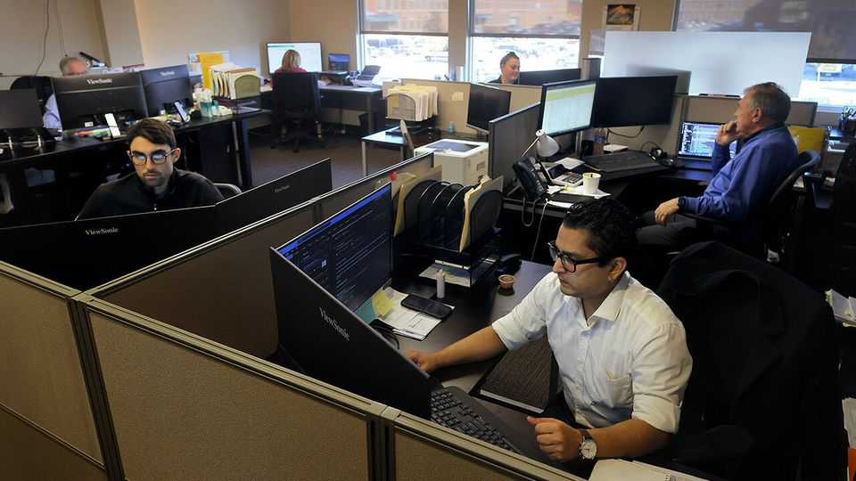
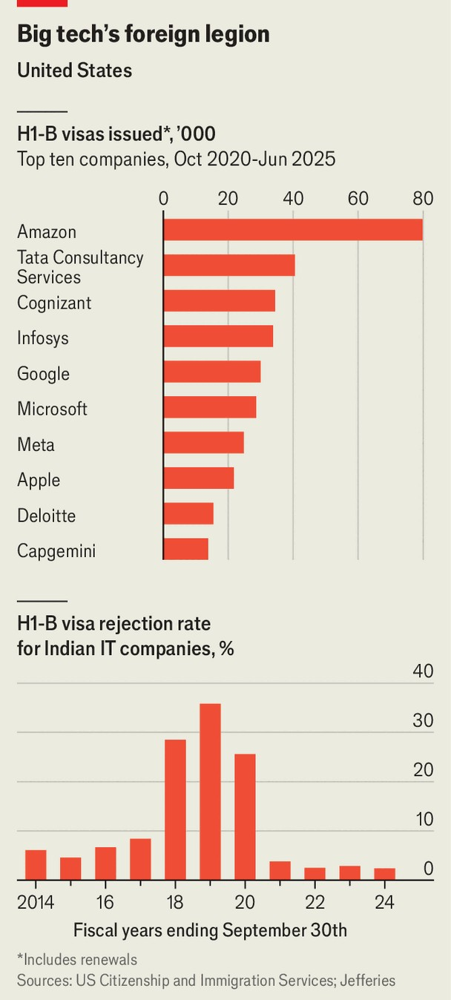

Business | H-1B sting
The perverse consequence of America’s $100,000 visa fees
Offshoring to India and other countries could accelerate
September 25th 2025

“You graduate from a college, I think you should get, automatically as part of your diploma, a green card [permanent residence in the United States],” promised Donald Trump on the campaign trail last year. As president, on September 19th, Mr Trump headed in the opposite direction. He proposed a charge of $100,000 on new applications for H-1B visas, a favourite of technology firms hiring foreign graduates. Each year 85,000 are issued by lottery (demand far outstrips that quota). Hitherto the cost of securing one has been about $2,500 in legal and filing fees. Big tech firms dominate the visas (see top chart). Amazon alone received more than 14,000 approvals in 2025 (renewals do not count against the

85,000 quota). Indian IT-services giants such as Infosys and Tata Consultancy Services (TCS) also routinely rank among the top sponsors. And Indian citizens scoop most of the visas—about three-quarters of them in 2023. Apart from China, with 12%, no other country secures more than 2%. Many of Mr Trump’s supporters complain that this means jobs that could go to talented Americans go to Indian graduates instead. But the effects of the new charge may be more complicated than they expect.

Over the weekend many of America’s tech giants scrambled to advise employees on H-1B visas not to leave the country until the rules are clarified; whether exemptions will be made for some groups remains uncertain. The announcement has been most keenly felt, though, in India. In August Mr Trump imposed a 50% tariff on Indian goods, sparing only essentials such as electronics and pharmaceuticals. Now he has hit the country’s most successful sector.

According to Goldman Sachs, services exports grew from $53bn to $338bn between 2005 and 2023, almost twice the global rate. That growth was driven by a boom in India’s population of engineers, particularly in computer science. The IT firms relied on sending engineers to America under the H-1B programme to serve clients, a cornerstone of their business

model. For decades H-1Bs offered Indian techies a route to better-paid jobs in America. That path now looks far less certain.

For India’s IT-services firms, which employ more than 5m people, the visa fees are an added headache. The rise of artificial intelligence has already unsettled the industry. Generative-AI tools threaten to erode demand for some of their bread-and-butter work. Gartner, a research firm, reckons that by 2029 more than half of people’s interactions with business applications, a big source of revenue, will be automated by AI. Some companies have already started trimming staff. In July TCS announced plans to cut 12,000 employees, about 2% of its workforce, citing a “skill mismatch”.

Yet the industry is better placed to adapt than in the past. In Mr Trump’s first term, scrutiny of visa applications was tightened, and rejection rates for Indian IT firms rose more than four-fold (see bottom chart). Many responded by reducing their use of the visas, shifting more work offshore and recruiting more locals. Only about 8% of Infosys’s staff are now based in the Americas. Since 2018 more than 90% of its hires there have been locals. Investors, too, seemed relaxed: the NIFTY IT index, a benchmark of leading services firms, fell by just 3% on September 22nd, the first full trading day after the news.

India’s tech workers, too, have alternatives beyond the big outsourcing firms. “Global capability centres” (GCCs), set up by multinationals to offshore everything from data analysis to research and development, have become a pillar of India’s services sector. Eli Lilly, an American drugs firm, and Rolls-Royce, a British engine-maker, are among those making use of them for increasingly complex work. According to NASSCOM, an industry body, the number of GCCs has grown from 700 in 2010 to more than 1,700 last year. Together they generated $64bn in revenue and employed 1.9m people.

The new fee could thus accelerate multinationals’ expansion of operations in India (though some MAGA types would like to curb offshoring too). Research by Britta Glennon of the Wharton School, examining restrictions introduced in 2004, found that firms heavily reliant on H-1Bs increased their employment abroad by about a quarter compared with those less dependent

on them. R&D-intensive jobs were among the first to move. The beneficiaries: Canada, China—and India. ■

To stay on top of the biggest stories in business and technology, sign up to the Bottom Line, our weekly subscriber-only newsletter.

This article was downloaded by zlibrary from https://www.economist.com//business/2025/09/22/the-perverse-consequence-of- americas-100000-visa-fees