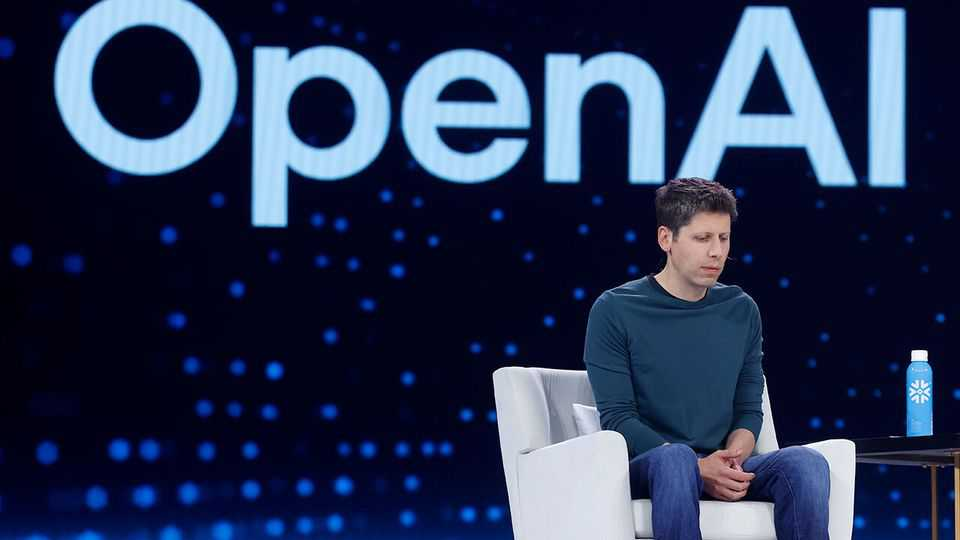

Business | Circular thinking
Nvidia’s $100bn bet on OpenAI raises plenty of questions
Meanwhile, the building of AI data-centres gathers pace
September 25th 2025

ONE THING is clear about the announcement on September 22nd that Nvidia may invest up to $100bn in OpenAI in order to help the maker of ChatGPT buy 4m-5m of Nvidia’s artificial-intelligence (AI) chips. Silicon Valley is becoming more incestuous than ever. Just days before, Nvidia had said it would invest $5bn in Intel, as part of a deal to boost its beleaguered chipmaking rival. The proposed partnership with OpenAI, due to start in the second half of 2026, is yet more eye- popping. It also makes today’s AI-driven stockmarket rally increasingly dependent on the intertwined fortunes of the world’s most valuable firm and

America’s biggest private tech firm. For good measure, OpenAI is also deeply entangled with Microsoft, the world’s second-richest company.

Nvidia’s share price climbed by almost 4% after the OpenAI announcement, raising its value to close to $4.5trn (it later fell back a bit). Jensen Huang, Nvidia’s chief executive, said the deal would add to its sales of graphics- processing units (GPUs), which probably buoyed the stock. He also said an extra 5m GPUs would be roughly equal to all Nvidia’s GPU shipments this year. There was another unspoken benefit. The deal would make OpenAI more reliant on Nvidia’s chips, reducing the incentive to build its own.

It was also apparent that Nvidia would fund the GPU sales via the $100bn it is proposing to invest in OpenAI, which will increase in $10bn increments for every gigawatt (GW) of Nvidia-supported data-centre capacity that OpenAI builds—up to 10GW. Some Nvidia bulls celebrated the proposed investment as an expedient way for the chipmaker to fund sales. In effect, said Pierre Ferragu of New Street Research, a firm of IT analysts, Nvidia would invest $10bn for every $35bn of GPUs that OpenAI buys, meaning OpenAI will pay 71% in cash and 29% in shares.

But some also expressed concerns. In an interview with CNBC, Stacy Rasgon of Bernstein, an investment firm, acknowledged that the deal would exacerbate worries about the “circular dynamics” of Nvidia investing in companies that it supplies with GPUs. Its size will “clearly start to raise some questions”, he said.

Moreover, OpenAI’s use of its privately held shares as currency may also deepen concerns about its cash constraints as it makes ever-bigger spending pledges. It has struck a $300bn deal with Oracle, a data firm, to build 4.5GW of data-centre capacity over five years starting in 2027—the main contributor to Oracle’s blowout earnings projections this month. Oracle launched a bumper $18bn bond sale on September 24th to help finance its data-centre construction boom.

Sam Altman, OpenAI’s boss, said the financing for the $400bn or so involved in the projects had been worked out. But his firm’s payment capacity remains uncertain. Though ChatGPT has more than 700m weekly active users, making it by far the most popular AI application, the response

to GPT-5, the research lab’s latest family of models, has been underwhelming. For now, the sums OpenAI is promising to spend dwarf its revenues, which run at close to $13bn a year.

Moreover, cash is not its only constraint. Additional power capacity of 10GW is almost half of the 22GW of utility-scale electricity generation added in America in the first half of this year—or the equivalent of ten nuclear power plants. Even with a laxer infrastructure-permitting regime, that could take years to bring online.

Yet Mr Altman is as bullish as ever. In Abilene, Texas, on September 23rd, alongside Clay Magouyrk, Oracle’s new co-chief executive, he unveiled progress on Stargate, an ambitious AI project President Donald Trump announced in January. In little over a year, a vast, sloping dirt field has become an expansive complex with over 6,000 workers. Two roads had to be built to overcome three-hour traffic jams as people came to the site each morning.

The first data-centre building, with capacity of over 100MW, is already operational, with another due online soon. By September 2026 eight, totalling some 900MW, should be up and running. The concrete foundations and steel skeletons of the last two are already in place, suggesting a speed of building not typical outside China. Power will be supplied at first from gas turbines on site. Eventually a giant GW-scale substation will give access to the grid of windswept, sun-soaked west Texas.

There are plans to expand onto land nearby, adding another 600MW. What can be seen now, declares Mr Altman, is just “a small fraction of what this will eventually be, which is a small fraction of what we’ll build elsewhere”, and that in turn is just a small fraction of what ChatGPT will need in future. He identified five further places where his firm, with Oracle, Japan’s SoftBank and others, will build. All told, OpenAI’s plans run to around 7GW.

When announcing his agreement with Nvidia, Mr Altman laid out three priorities. One was pushing the frontiers of AI research. The second was building products that entice users. The third was the “unprecedented infrastructure challenge”, such as obtaining chips and power supply. A lot of

interconnected wealth is riding on the hope that he can solve all three challenges simultaneously. Despite the progress at Abilene, none is proving as easy as getting his well-heeled friends in Silicon Valley to believe his promises. ■

To stay on top of the biggest stories in business and technology, sign up to the Bottom Line, our weekly subscriber-only newsletter.

This article was downloaded by zlibrary from https://www.economist.com//business/2025/09/25/nvidias-100bn-bet-on-openai-raises- plenty-of-questions