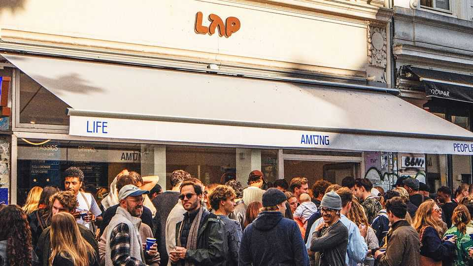

Business | LAPping it up
A fast-growing German coffee chain causes a stir
Cheap, decent coffee isn’t to everyone’s taste
September 25th 2025

NEW Coffee shops rarely make the evening news anywhere. But this month LAP Coffee was featured on Tagesthemen, one of Germany’s most-watched broadcasts. It added its first outlet in Hamburg, in the trendy Schanzenviertel, to the 16 outlets in Berlin and four in Munich that it has opened in just two years. Why is LAP—Life Among People, founded by Ralph Hage and Tonalli Arreola, two veterans of the Berlin startup scene—making waves? For its fans, who are mostly in their 20s and 30s, it is a hip place with great coffee at low prices. LAP sells an espresso for just €1.50 ($1.78), a cappuccino for €2.50 and a flat white for €3. Its fancy specials (current offer: blueberry matcha, yuzu lemonade, protein coffee) are popular with young customers.

“We want to be a lifestyle brand for coffee to go,” says Mr Hage, who grew up in Lebanon, where social life revolved around coffee houses. He is also keen to foster a community of “bike couriers, Gen-Z students and artists” in the Kiez (neighbourhood) by opening his shops for yoga classes, concerts, book presentations and exhibitions by local painters.

But LAP is not everyone’s cup of tea. For its detractors, who are especially virulent online, it is a symbol of urbane turbo-capitalism, promoting gentrification, undercutting older coffee houses and pushing them into bankruptcy. They have sprayed graffiti on LAP shops and insulted staff. Mr Hage thinks LAP’s foes have never been to one of his shops. With sparse seating in small spaces, they don’t invite people to linger and so don’t poach coffee-house customers, who might stay for hours.

Messrs Hage and Arreola picked a tough market. In the decades after the second world war most Germans drank Blümchenkaffee, coffee so thin that you could see the little flowers (Blümchen) painted inside the cups. They are still a parsimonious lot, who shop at Aldi, Lidl and other discounters. They guzzle around 90% of their coffee at home or the office (Italians drink only 70% of theirs at home).

Mr Hage would like to lure more stay-at-home Germans. He says he keeps prices down, while turning a profit, by providing just the essentials, making coffee in fully automated machines with staff frothing the milk by hand. At LAP on Kantstrasse in Berlin, your correspondent’s drink-in cappuccino came in a cup with no saucer or spoon. It tasted good and the price was roughly half that at three chic cafés nearby. Had she wanted to linger a little, though, she’d have gone to one of them. ■

To stay on top of the biggest stories in business and technology, sign up to the Bottom Line, our weekly subscriber-only newsletter.

This article was downloaded by zlibrary from https://www.economist.com//business/2025/09/25/a-fast-growing-german-coffee-chain- causes-a-stir