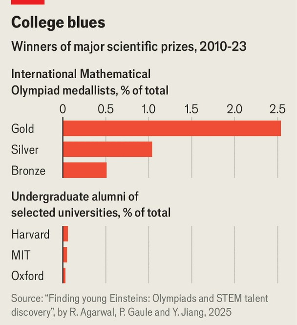

Finance & economics | Invisible talent
How to spot a genius
In an age of artificial intelligence, the human kind is increasingly important
September 25th 2025

Ervin Macic was despondent. While in school he twice won medals at the International Mathematical Olympiad and researched artificial intelligence, trying to speed up how models make predictions. He dreamed of one day joining an AI lab to make the technology safe. Yet the 19-year-old Bosnian prodigy was unable to take a place at the University of Oxford: its fees of £60,000 a year were five times his family’s annual income. So he went to the University of Sarajevo, where he sat programming exams on a decades-old computer. Mr Macic’s case is far from unique. Around the world vast amounts of talent go to waste. Economists speak of “lost Einsteins” who might have produced

transformative work had they been identified and nurtured. Nowhere are the consequences clearer than in AI, where the scarcity of top researchers allows a tiny cadre to command CEO-level pay. Governments that lavish billions on semiconductors to win the AI race neglect the talent that drives progress. Brains, treated with the same urgency as chips, could prove a better longer- term investment. What might an industrial policy for talent look like?

At present such policy amounts to procurement, not production. Governments focus on the last step: enticing existing superstars. The contest is fiercest between China and America. China’s Thousand Talents Plan, set up in 2008, aims to lure back citizens trained on elite foreign programmes; it will soon add a flexible K-visa to attract STEM specialists. America counters with the O-1A visa and EB-1A green card, both reserved for individuals of “extraordinary ability”. Other countries dabble. Japan has announced a $700m package to recruit top researchers. The EU’s “Choose Europe” scheme promises to make it a “magnet for researchers”.

A more extreme scarcity mindset about superstar talent drives the scramble among firms—and explains the premium placed on brains. As they race to build ever-larger models, individual researchers are seen as capable of unlocking breakthroughs worth billions. Sam Altman, boss of OpenAI, a superstar startup, once quipped about “10,000x engineer/researchers”, ultra- productive coders whose output can transform a field; the idea has since become industry lore. Elite researchers command valuations once reserved for companies.

These bidding wars rest on two assumptions. One is that a few elite researchers make outsize contributions; the other is that the supply of such talent is fixed. The first assumption is well founded. Breakthroughs are produced by a small cohort: the top 1% of researchers generate over a fifth of citations. James Watt’s refinements to the steam engine helped launch the Industrial Revolution. More recently, Katalin Karikó’s lonely pursuit of mRNA technology paved the way for covid-19 vaccines. Individuals shift the frontier for all.

The second assumption is less certain, however, for much potential never flowers. Geography is the first barrier. Some 90% of the world’s young live in developing countries, yet Nobel prizes overwhelmingly go to America,

Europe and Japan. According to Paul Novosad of Dartmouth College and co-authors, the average laureate is born in the 95th percentile of global income. Although some disparity is to be expected, the scale suggests much talent does not have a chance to flourish. Similarly, Alex Bell of Georgia State University and co-authors find that American children from the richest 1% of households are ten times more likely to become inventors than those from below-median incomes. They estimate that closing America’s class, gender and race gaps in invention would quadruple the number of innovators, sharply raising the pace of discovery.

Where should governments begin their search for genius? One tempting answer is at the very top of the funnel, increasing the number of children who ever have a chance to develop their abilities. Universal fixes— improved nutrition, better schools, safer neighbourhoods—could help. But the problem is that, given how rare genius is even when better identified, such schemes are by their nature poorly targeted.

A more practical focus is the point at which talent first becomes visible: adolescence. By then stars can be spotted, even if many now slip away. Ruchir Agarwal of Harvard University and Patrick Gaule of the University of Bristol find that maths Olympiad contestants from poorer countries who score as highly as peers from rich ones go on to publish far less as adults, and are only half as likely to earn a doctorate from a leading university. Meanwhile, Philippe Aghion of the Collège de France and co-authors link Finnish conscription-test scores to patent data and find that shifting a high- ability teenager from a median to a high-income family would sharply raise their odds of later inventing something.

Sport shows the potential of systematic scouting. Baseball pioneered “farm systems” in the early 20th century, recruiting teenagers from small towns and developing them in lower-tier teams until they were ready for the big league. By the late 20th century, scouting had gone global. Last year the National Basketball Association featured a record 125 international players from over 40 countries—almost a quarter of the league—because of global academies. The result has been a surge in both the quality and diversity of athletes.

Some brilliance is obvious. Last year Gukesh Dommaraju, an Indian prodigy, became world chess champion at just 18, his rise nurtured by a thriving national chess scene. Earlier this year Hannah Cairo, a 17-year-old who grew up in the Bahamas, startled mathematicians by disproving the Mizohata-Takeuchi conjecture, a problem that had resisted solution for decades. Other promise can be identified at competitions such as the Olympiads, which are remarkably good predictors of future success. One in 40 winners of a gold medal at the International Mathematical Olympiad goes on to secure a big science prize, 50 times the rate of undergraduates at the Massachusetts Institute of Technology (see chart). Guido van Rossum, a bronze medallist, created the Python programming language; half of OpenAI’s founders cut their teeth at Olympiads.

New opportunities for identification may also arise. AI, for instance, is creating markers of its own. A recent paper by Aaron Chatterji of OpenAI and co-authors suggests that a tenth of the world’s adults have now used ChatGPT, with nearly half of messages coming from those aged 25 or younger. Such digital traces could reveal patterns of originality or persistence. A systematic effort to embed scouts—in schools, competitions and even online—would widen the net, ensuring that gifted youngsters are discovered early.

But finding geniuses is not just about discovery—it is also about development. Prodigies need mentors who can sharpen raw ability and open doors. John von Neumann, a Hungarian-born polymath, was tutored intensively in Budapest and later guided by Gabor Szego, a mathematician, who is said to have wept when the 15-year-old explained calculus back to him. Thankfully, mentors need not be geniuses themselves. Research by Ian Calaway of Stanford University, drawing on decades of maths-competition data, shows that when ordinary teachers run clubs and contests, exceptional students are far likelier to be spotted, to attend selective universities and to pursue research careers. In Zarzma, a Georgian town known for its monastery, Orthodox monks built a maths academy that now sends pupils to international junior Olympiads, blending rigorous teaching with close mentoring.

Prodigies also need access to clusters of high-ability peers. A study by Ufuk Akcigit of the University of Chicago, John Grigsby of Princeton University and Tom Nicholas of Harvard finds that America’s golden age of innovation was fuelled by migration: inventors left their home states in search of denser networks. Thomas Edison, born poor in rural Ohio, moved to New Jersey to build Menlo Park laboratory, where inventors could collaborate. In Tamil Nadu, India, chess has taken root so deeply that the state now produces grandmasters at a rate unmatched anywhere else in the country, thanks to local competition and coaching. Without access to stronger ecosystems, raw talent will struggle to flourish. As Tyler Cowen of George Mason University puts it: “You can’t just hire a driver in Togo, point out the window and say, ‘You’re an invisible genius.’ At the very least you have to get the Togo talent to Nigeria.”

Leading universities remain crucial gateways for talent, but their incentives are skewed. Scholarships for exceptional foreign students are scarce. In Britain, for instance, the University of Cambridge offers about 600 awards a year for over 24,000 international students. In America, only a handful of colleges—including Harvard, MIT, Princeton and Yale—are both need-blind and cover all costs for foreigners, and even at these only a few hundred international undergraduates receive substantial aid each year. At most others, international applicants are treated less as future innovators than as fee-payers. This has unfortunate consequences. Although two-thirds of Olympiad participants from poorer countries would like to study in America,

only a quarter end up doing so. According to one estimate, easing immigration by removing financial barriers for such students would raise the scientific output of future cohorts by as much as 50%.

Governments have on occasion made efforts to identify and nurture talent, though rarely at scale. America’s Works Progress Administration, launched during the Depression, gave unemployed artists stipends, studios and performance venues, in effect serving as a scouting network. It supported figures such as Ralph Ellison, author of “Invisible Man”, and Jackson Pollock, an expressionist painter. Singapore has had more recent success grooming talent for its bureaucracy. National exams feed into a scholarship system run by the Public Service Commission, which sends students abroad to elite universities in exchange for years of civil-service work.

Yet today it is mostly philanthropists and charities that spot and cultivate stars. The Global Talent Fund, founded by Messrs Agarwal and Gaule, identifies Olympiad medalists from around the world and funds their studies at leading universities. Among its first cohort in 2024 was Mr Macic, the young Bosnian once stuck in Sarajevo. He is now studying maths and computer science at Oxford. Early results are notable. Imre Leader, a professor at Cambridge, tested his students with a puzzle—whether a triangle can be divided into smaller triangles, no two of the same size. Most of his best students wrestle with it for weeks; perhaps one manages to solve the problem each year. One of the fund’s first-years cracked it with a proof Mr Leader had never seen.

Other schemes take different approaches. Rise, backed by Schmidt Futures and the Rhodes Trust, runs a global competition for teenagers, selecting winners via project pitches and offering scholarships, mentoring and seed funding for ventures such as 3D-printed mind-controlled prosthetic arms. America’s Society for Science oversees the Regeneron Science Talent Search, the country’s most prestigious high-school science competition, which entices some 2,000 entrants each year to submit original research. Past finalists include Frank Wilczek and Sheldon Glashow, both Nobel- prizewinning physicists. Emergent Ventures, established in 2018 by Mr Cowen, offers small grants to gifted youngsters. “Money helps, but the real key is putting young talent with their peers,” says Mr Cowen. “In every field —painting, music, chess, AI—clusters are universal.”

These efforts are not particularly expensive. Governments could easily copy them—and on a much grander scale. Countries that mobilise talent tend to win strategic races. America’s scientific feats, from the Manhattan Project to Apollo, have often relied on deliberate recruitment of foreign scientists. Operation Paperclip alone brought in more than 1,500 German researchers in the 1940s and 1950s. Today, though, America’s ability to recruit is under pressure, as more young scientists head to Australia, Germany and the Gulf; President Donald Trump’s proposed $100,000 fee for a H-1B visa, on which many tech workers arrive, could make recruitment still more difficult. For its part, China is cultivating talent at scale. It now produces far more science graduates than America and a quarter of the world’s top AI researchers. However, it struggles to retain many of its brightest, who still look abroad for doctoral training and jobs.

The stakes are not only geopolitical. Removing barriers to the development of talent could multiply the global pool of innovators several times over. Unlocking such potential would speed the discovery of new medicines, hasten the green transition and propel AI. The result would be healthier, cleaner and more prosperous lives. Squandered talent is the world’s most neglected engine of progress. ■

For more expert analysis of the biggest stories in economics, finance and markets, sign up to Money Talks, our weekly subscriber-only newsletter.

This article was downloaded by zlibrary from [https://www.economist.com//finance-and-economics/2025/09/23/how-to-spot-a-genius](https://www.economist.com//finance-and-economics/2025/09/23/how-to-spot-a-genius)