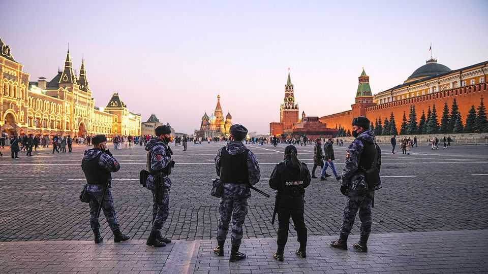
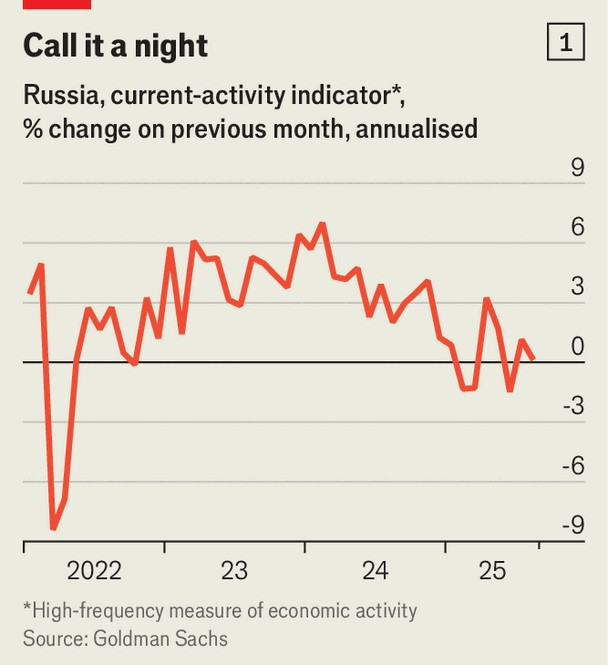
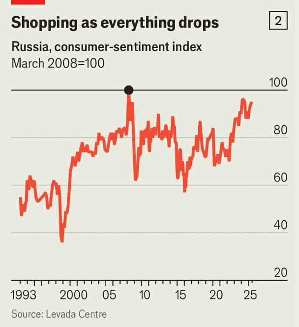

Finance & economics | Race to the death
Russia’s besieged economy is clinging on
The good times have firmly come to an end, but wage growth remains strong
September 25th 2025

SCOTT BESSENT, America’s treasury secretary, recently used a metaphor to describe the state of play in the Russo-Ukrainian war. “We are in a race,” he said. “How long can the Ukrainian military hold up versus how long can the Russian economy hold up.” Tougher sanctions, including tariffs on countries buying oil from Russia, would cause Russia’s economy to undergo a “full collapse”, in turn forcing Vladimir Putin “to the table”, he suggested. Just how vulnerable is Russia? Western policies mean no other country faces more sanctions. The EU has implemented 18 packages of such measures; on September 19th the European Commission proposed a 19th. America has targeted 5,000-odd individuals and entities. And yet, despite the barrage,

predictions of collapse have repeatedly proved wide of the mark. After a brief recession in 2022, the Russian economy boomed in the following two years.

Now it is slowing, almost to a standstill. In July GDP grew by just 0.4% on a year earlier; real-time data tell a similar story (see chart 1). An index based on a survey of purchasing managers suggests that activity has been contracting for some months. Growth in corporate profits is weak, weighing on the stockmarket, while real wages have also decelerated. Politicians and regulators snipe at each other about who is to blame. The economic party of 2023-24 is most definitely over.

It ended in part because Mr Putin’s government took away the fiscal alcohol. A spending boost worth 5% of GDP in 2023 will this year turn into a mild fiscal consolidation. No longer are there enormous increases in spending on infrastructure and the military-industrial complex. Monetary policy is also playing a part. In 2023 and 2024 the central bank sharply raised interest rates to ward off inflation. High borrowing costs have raised the returns to saving money rather than spending it.

The impact of sanctions on the economy is less clear. True, production of oil, a commodity subject to many Western barriers, is falling. From January

to March, Russia exported $96bn-worth of goods, a category dominated by oil-related products, down from $155bn in early 2022. The changing economic context, however, helps explain the decline. Since the start of the year the rouble has appreciated, reducing returns from selling abroad. Global oil prices are low. And high borrowing costs make it difficult to finance extraction.

The eu’s latest salvo could make life harder for Russia. It seeks to punish firms that fuel the war by buying oil in breach of sanctions, as well as those which supply Russia with goods. Yet the experience so far is that sanctions, however designed, can be avoided. A vibrant transshipment industry, moving goods from the West to Russia via non-aligned countries, is hard to police. As Goldman Sachs, a bank, notes when looking at the EU’s attempt to ban imports of products made with Russian crude: “Compliance can be challenging as…multi-port re-exporting [and] limited visibility on refiners’ crude intake complicate tracing the source of crude.” In some cases, Russia has switched to bartering with trading partners (wheat for cars, anyone?) so as to avoid transfers of money.

Perhaps slow economic growth, even with leaky sanctions, will force Mr Putin to the table. That could take some time, however. Although the economy is treading water, its deterioration has not fed through to the labour

market. Real wages are at an all-time high. Unemployment is at all-time lows. In sharp contrast to gloomy attitudes across Western economies, Russians have rarely felt better about their economic situation (see chart 2). At the same time, Ukraine’s finances look increasingly stretched. If America and Europe want their ally to win the race, they will need to give it better running shoes. ■

For more expert analysis of the biggest stories in economics, finance and markets, sign up to Money Talks, our weekly subscriber-only newsletter.

This article was downloaded by zlibrary from https://www.economist.com//finance-and-economics/2025/09/21/russias-besieged- economy-is-clinging-on