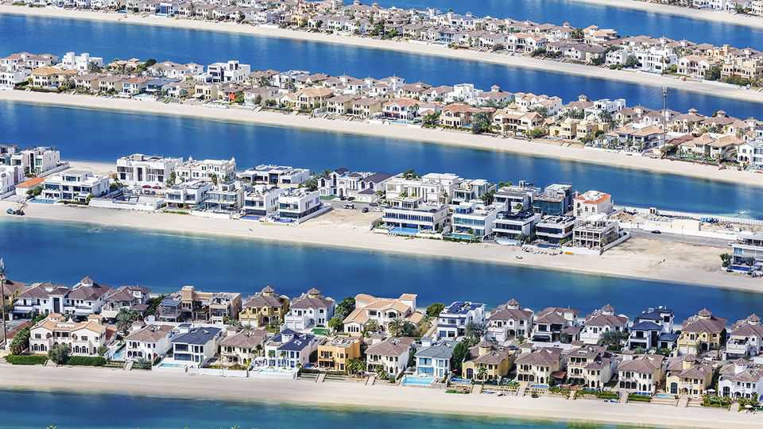
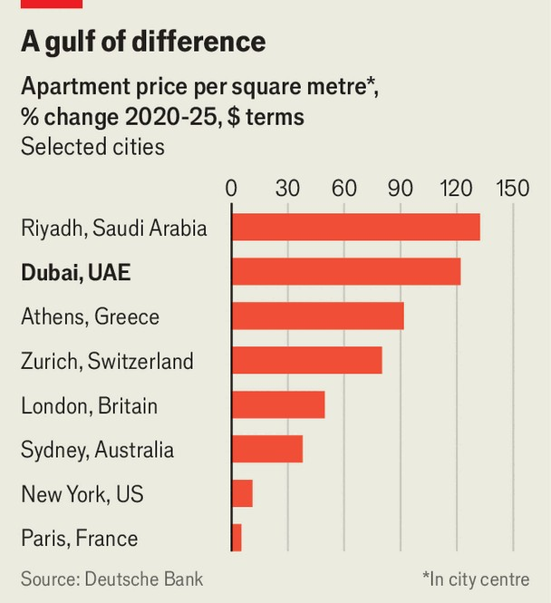

Finance & economics | Do buy
Will Dubai’s super-hot property market avoid a crash?
Despite fears of a reckoning, its fundamentals look solid
September 25th 2025

It is difficult, in Dubai, to avoid the enthusiasm for property. Not a day goes by without the announcement of a new development. Home advertisements are plastered across billboards. The ever-expanding urban sprawl and skyline betray the heady activity. So does the traffic. New arrivals raise prices, and clog the roads. According to Deutsche Bank, the price per square metre of a flat in the heart of the city has risen by 122% in dollar terms over the past five years— second only to Riyadh in the 69 urban areas tracked by the bank. Residential prices are a fifth higher than their previous peak, reached in 2014. In the year to August total property sales came to 441bn dirhams ($120bn), a third

higher than in the same period in 2024. Is this all too good to be true? The record-setting numbers have prompted warnings of imminent price corrections and fears of oversupply. Yet such worries look overblown: demand is sticky and builders have become more disciplined. The emirate’s property market has at last grown up.

Admittedly, with Dubai’s history of epic booms and busts, any crash would have precedent. Property advisers caution that the “low-hanging fruit” which set off the latest boom is no more: Russian billionaires who showed up at the outset of the war in Ukraine are done making purchases; Indian business titans and Bollywood superstars seeking a refuge just hours from Mumbai are numbered; there are only so many newly minted crypto kings. Sharply rising living costs, particularly the increasing price of an imported pint and a sundress, could blunt the appeal of the United Arab Emirates for the not-so- rich.

For the moment, though, demand looks strong. According to provisional estimates by Henley & Partners, a consultancy, the Emirates’ millionaire population will grow by 9,800 this year, more than anywhere else in the world. Indeed, last year Dubai reported a record number of sales of properties worth $10m or more. Yet the biggest driver of rising house prices has been less affluent arrivals. The UAE’s population has reached 11m, up

by a fifth since 2020. New arrivals are better educated and younger than earlier waves, and become homeowners more quickly. Brokers describe their clients as British residents bemoaning a deteriorating quality of life, African entrepreneurs who park themselves in Dubai and do business at home, and Europeans looking for a tax-free haven.

Whereas the uber-rich flit in and out of the Emirates, the new arrivals are actually making a life there. The number of residential electricity and water customers served by DEWA, the local utility, grew by 24% from 2020 to 2024; SALIK, a toll operator, reported a 9% rise in registered vehicles in the first quarter of 2025, against the same period last year. New schools are popping up: Harrow is opening branches in Abu Dhabi and Dubai. Meanwhile, office vacancy rates are at their lowest in over a decade. Savills, a property consultancy, does not expect this trend to slow, forecasting strong growth in office rents.

Despite the price rises, property in Dubai remains relatively affordable. According to Savills, buying, owning and selling a $2m property in the city is cheaper than in Bangkok, London, Mumbai or New York. Mortgages, as a share of income, are among the world’s most affordable. In July Emirati leaders introduced a programme for first-time buyers that will further lower costs, and offer access to new projects.

The new generation of buyers has produced a less speculative market: less than 5% of purchasers now resell their property within a year, compared with 17% in 2014. Larger homebuilders, scarred by previous busts, have also become more sober. Moody’s, a credit-rating agency, notes that many have tweaked their payment schedules in recent years. They now ask for as much as 80% of the value of a property on purchase, up from 50% or so in 2020, which makes their cashflows steadier during construction. At the same time, they have reduced their dependence on loans and mostly focused their investments in up-and-coming neighbourhoods including Al Furjan, Dubai Hills Estate and Jumeirah Village Circle.

Policymakers have also learned lessons from Dubai’s earlier busts. Regulatory changes should help make the city’s property market more stable, even if they dampen demand in the short term. Officials have increased the stringency of anti-money-laundering measures, now require

proof of where funding came from for all-cash purchases and insist that brokers report cash sales which are worth more than 55,000 dirhams. On top of this, escrow accounts for off-plan developments are now mandatory and developers may only tap into the funds after finishing at least part of the project. The old, free-wheeling Dubai is becoming a little more staid. That may, though, be a welcome development for the city’s homeowners. ■

For more expert analysis of the biggest stories in economics, finance and markets, sign up to Money Talks, our weekly subscriber-only newsletter.

This article was downloaded by zlibrary from https://www.economist.com//finance-and-economics/2025/09/24/will-dubais-super-hot- property-market-avoid-a-crash