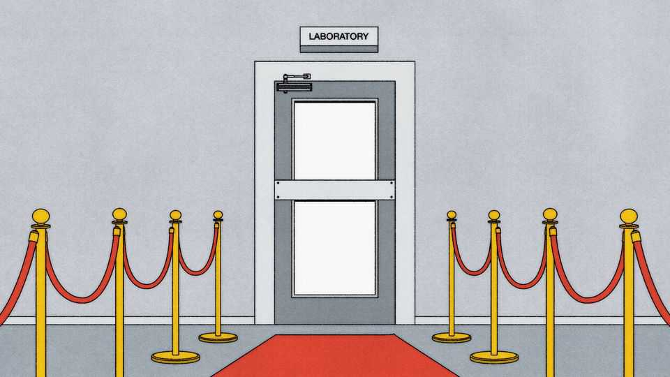

Finance & economics | Free exchange
The AI talent war is becoming fiercer
How other countries hope to challenge America
September 25th 2025

Imagine that you are a talented, young artificial-intelligence researcher weighing two offers. One comes with a fat salary, stock options and a seat in the heart of Silicon Valley; the other offers instant residency, tax-free pay and guaranteed access to state-of-the-art supercomputers in Dubai. Where do you go? For now, most would still pick California. In 2022 over half the world’s elite AI researchers were based there, compared with just one in ten in China. But when you track movers, the picture shifts. Last year only a quarter of migrating AI aces went to America, with Britain, Germany and Canada next in line. Inflows to America have slowed while those to the Gulf have surged: Saudi Arabia and the United Arab Emirates lured 8% more AI researchers in

2024 than the year before, as oil capitals move from rigs to researchers. And that was before President Donald Trump had started making America less attractive to talented foreigners.

What gets an AI researcher to move? A recent survey by Boston Consulting Group found that more than half of hiring managers at leading labs cite remuneration as the decisive factor. In this regard, others are unable to match America. Its AI companies pay roughly double their foreign counterparts, in deals that are further sweetened with stock options, and they are poised to raise pay to even higher levels. Universities matter, too. America has long relied on colleges to feed its talent pipeline: a healthy share of those earning doctorates in AI-related fields come from China and India; most stay on to work at American labs and firms.

Yet there is a more profound source of American strength: clusters. Surveys show that what researchers prize most are career prospects, first-rate colleagues and access to frontier work. In 1890 Alfred Marshall, in his “Principles of Economics”, pointed to three advantages of geographic concentration: a shared labour pool, a network of specialised suppliers and informal knowledge spillovers. Adam Jaffe of Harvard University and co- authors later provided empirical backing that showed the importance of proximity, demonstrating in 1993 that American patents were far more likely to be cited locally than from afar. Ideas travel faster down the hallway than across continents, which matters when you are young and eager and want to learn from the best.

Such agglomerations rarely emerge from human design. Silicon Valley, for instance, grew less from a blueprint than from quirks: a Stanford dean prodding two students, William Hewlett and David Packard, to set up shop; cold war contracts showering money on electronics; and William Shockley’s lab-spawning Fairchild Semiconductor, whose spin-offs launched dozens of firms. Once established, clusters are hard to shift. Paul Krugman later won a Nobel prize for formalising this “new economic geography”, showing how economies of scale and transport costs make clusters self-reinforcing. After an industry reaches critical mass, firms and workers tend to stay put even as rents and wages rise.

But clusters are not immortal. Detroit’s car industry suffered as its incumbents lost dynamism and new technologies were developed elsewhere. Studies of urban decline point to three risks: soaring costs that drive away talent, over-reliance on a single industry and entrenched incumbents that are stuck in their ways. Although California is certainly home to spiralling costs, its tech industry remains diverse and innovative. For the moment, the best that rivals can do is to chip away at its fearsome lead.

China hopes to seize its chance by growing its own talent pool. It has expanded STEM training, tied universities more closely with industry needs through the Chinese Academy of Sciences and established schemes to lure back its diaspora. By 2022 nearly half the world’s elite AI researchers had taken their first degree in China, up from three in ten in 2019. The industry has hubs in Guangzhou and Shenzhen (with another in Hong Kong). To turn these into true magnets, China would have to loosen restrictions on academic exchange, which currently repel foreign researchers.

Europe faces the opposite problem: plenty of appeal, not enough scale. Its universities churn out talent and immigration routes are smooth. Yet researchers still head to California for double the salary and more generous grants. The EU has tried to respond with “super-grants”, a €500m ($590m) “Choose Europe for Science” package and plans for “AI Gigafactories”. But these policies do not tackle deeper flaws. Europe’s research base is poorly tied to industry; the European parliament’s sweeping AI Act has created rules so complex that few firms can comply with them.

The Gulf, meanwhile, is trying to buy its way into the competition. Abu Dhabi has built MBZUAI, a dedicated AI university, while “golden visas” promise foreign researchers long-term residence. Saudi Arabia’s sovereign- wealth fund is pouring money into data centres and model-building, and the country has rolled out an AI curriculum for 6m schoolchildren in an attempt to build a pipeline of domestic talent. Partnerships with companies including Nvidia add computing muscle. Yet even the extravagant sums spent on these efforts may not be enough. Researchers want confidence about data and collaboration, career paths and an interesting place to live. At present, the Gulf is more stopover than home.

For the world’s brightest, the choice remains obvious. A whizz kid weighing Silicon Valley against Dubai, Shenzhen or Zurich will find that California offers the richest mix of colleagues, capital and ideas. Clusters are sticky things, built over decades. And yet they are not indestructible. The rivals’ playbooks show that money can build labs and make a difference at the margin. If flows into these hubs keep growing, they may reach the point when agglomeration starts to feed on itself. Then, the world’s brightest minds will no longer all be buying one-way tickets to San Francisco. ■

Subscribers to The Economist can sign up to our Opinion newsletter, which brings together the best of our leaders, columns, guest essays and reader correspondence.

This article was downloaded by zlibrary from https://www.economist.com//finance-and-economics/2025/09/25/the-ai-talent-war-is- becoming-fiercer

Science & technology

Why AI systems may never be secure, and what to do about it People are using big data to try to predict Nobel laureates In some sports, left-handed athletes seem to have an innate advantage A clever genetic technique may treat a horrible brain condition Are touchscreens in cars dangerous?