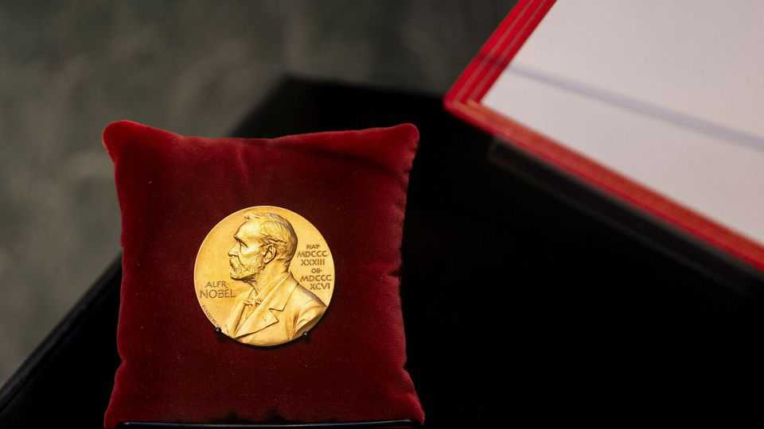
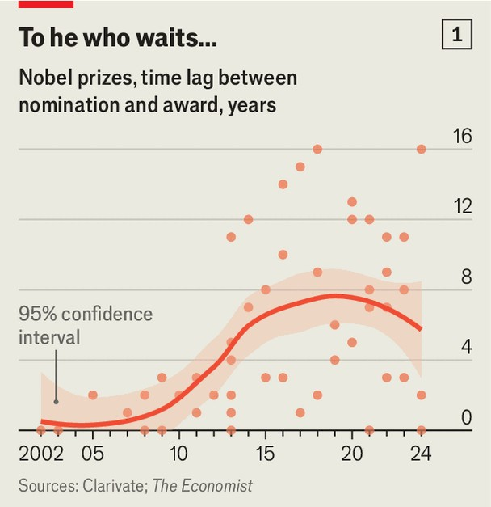
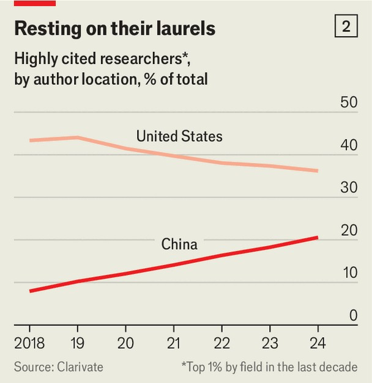

Science & technology | Nobel spoilers
People are using big data to try to predict Nobel laureates
Come back next month to see if they were right
September 25th 2025

IN YEARS GONE by, the wait for the announcement of winners of the Nobel prizes was a period of fun but largely uninformed speculation. The Nobel committees’ processes of choosing winners are so secretive that even the nominations are kept under wraps for 50 years. The prizes are given to people who have brought the greatest benefit to humanity. Making a judgment in areas such as literature and peace is largely subjective—although Donald Trump is unlikely to win the peace prize this year. However in science and economics there are more data to bring to bear on the question of which work has had the greatest benefit.

Each year Clarivate, a firm of analysts, identifies the most highly cited researchers. It filters papers published since 1970 (currently 64m of them) and identifies those cited more than 2,000 times. Using a little human judgment on novelty and impact, the firm nominates “citation laureates”— scientists who they think deserve Nobel prizes. Every year it highlights more good science, though, than can win an award.

Citation laureates do, however, form a basis for further informed speculation. For example, it has been suggested that recent Nobel committees have been more disposed to nominate work of current relevance, such as protein folding, CRISPR and graphene.  Using Clarivate’s data, The Economist calculated a value called Time to Nobel (TTN), the period between being a citation laureate and winning the prize. This suggests recent years have seen a slight dip in the TTN (see chart 1).

If current relevance is a factor then two areas stand out on this year’s list of citation laureates. One is the discovery of ghrelin, a hormone that regulates appetite, energy and metabolism (which foreshadowed the discovery of GLP-1 drugs) by two Japanese researchers, Kangawa Kenji and Kojima Masayasu. The other is in physics, where David DiVincenzo, an American, and Daniel Loss, a Swiss, are contenders for their work on how to create a

quantum computer using the spin of individual electrons as a way of encoding the qubits that are quantum computing’s currency.

Looking back on Clarivate’s previous guesswork over the past decade the chance of anyone nominated this year ever winning a prize is about 21%. And though there has been a spate of awards for some fairly recent discoveries, it generally takes a long time for the Nobel committees to recognise worthy candidates.

One feature of this year’s list is the inclusion, for the first time, of a researcher from mainland China, as opposed to Hong Kong. Zhang Tao of the Dalian Institute of Chemical Physics has developed single-atom catalysis, which permits isolated atoms to be used to enhance catalytic activity, giving better performance and cost effectiveness to chemical reactions.

Whether or not Dr Zhang goes on to win a Nobel this year, or any other, his arrival on the list is a clear sign of the rising quality of Chinese research. That has been mirrored by a decline in the overall percentage of highly cited researchers from America (see chart 2). At this rate, the proportion of China’s highly cited researchers will overtake America’s in three years.

The age of Nobel science laureates is also increasing. Although populations in general are getting older, the growing age of the scientific winners contrasts with those in economics, peace and literature—perhaps because of the increasing complexity of the tools and techniques needed to make scientific discoveries, and the time it takes for the value of a breakthrough to become apparent. ■

Correction (September 25th 2025): In a previous version of this piece we said that Clarivate filters out researchers who over cite themselves. That is not part of their process for identifying citation laureates. Apologies.

Curious about the world? To enjoy our mind-expanding science coverage, sign up to Simply Science, our weekly subscriber-only newsletter.

This article was downloaded by zlibrary from https://www.economist.com//science-and-technology/2025/09/25/people-are-using-big- data-to-try-to-predict-nobel-laureates